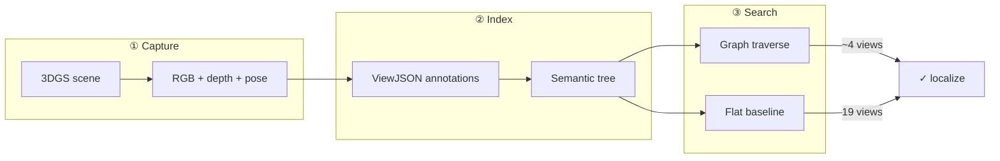

<p align="center">
  
</p>

<h3 align="center">Open-vocabulary object search in 3D Gaussian Splatting scenes<br/>via hierarchical semantic trees &amp; graph-pruned VLM traversal</h3>

<p align="center">
  <a href="https://github.com/LeoPython2006/beyond-proximity"></a>
  <a href="docs/benchmark_graph_vs_flat.md"></a>
  <a href="docs/launch_guide_ru.md"></a>
  <a href="docs/benchmark_results/failure_case_demo.mp4"></a>
</p>

<p align="center">
  
  
  
  
  
  
</p>

<p align="center">
  <a href="#-highlights">Highlights</a> ·
  <a href="#-method">Method</a> ·
  <a href="#-results">Results</a> ·
  <a href="#-demo">Demo</a> ·
  <a href="#-quick-start">Quick Start</a> ·
  <a href="#-citation">Citation</a>
</p>

---

## Overview

**SemanticSplat** navigates large indoor **3D Gaussian Splatting** environments with natural language. A VLM-indexed **semantic tree** prunes the search space before leaf-level confirmation — yielding **4.1×** lower estimated latency and **zero wrong-room failures** on our curated disambiguation suite (flat search fails **2/5**).

```
Query  →  Decompose  →  Tree traverse  →  Leaf VLM  →  2D bbox  →  3D unprojection
         (§7)            (~4 views)        (not 19)
```

<p align="center">
  
</p>

---

## ✨ Highlights

<table>
<tr>
<td align="center" width="25%">
<h3>4.1×</h3>
<sub>faster est. time<br/>graph vs flat</sub>
</td>
<td align="center" width="25%">
<h3>8.5×</h3>
<sub>fewer input tokens</sub>
</td>
<td align="center" width="25%">
<h3>4 / 19</h3>
<sub>views checked<br/>per query</sub>
</td>
<td align="center" width="25%">
<h3>0 / 5</h3>
<sub>wrong-room failures<br/>(graph)</sub>
</td>
</tr>
</table>

| Capability | Description |
|:-----------|:------------|
| **Navigator** | Fly through `.ply` splats in-browser (Spark.js, WASD) |
| **Semantic tree** | Recursive zones/leaves built with Cursor + MCP + VLM |
| **Query Flow** | Live §7 pipeline trace — decomposition → traversal → leaf checks |
| **One-click Ask** | Auto-runs search in backend — no session ID copy-paste |
| **Benchmark suite** | `./run_all_docs.sh` → charts, reasoning traces, demo MP4 |

---

## 🔬 Method



| Stage | Input | Output |
|:------|:------|:-------|
| Capture | `.ply` + user flight | `views/`, `depths/`, poses |
| Analysis | VLM via MCP | `ViewJSON` per view |
| Structure | LLM recursion | `tree/*.json` |
| **Graph search** | NL query | pruned traversal → bbox₃D |
| **Flat search** | NL query | exhaustive → bbox₃D |

**Failure case:** *“Where is the screen in the conference room?”* — flat → lobby screen (**v012**); graph → ballroom stage screen (**v017**).

---

## 📊 Results

<p align="center">
  
  &nbsp;
  
</p>

<p align="center">
  
  &nbsp;
  
</p>

<p align="center">
  <a href="docs/benchmark_graph_vs_flat.md"><b>→ Full benchmark report</b></a>
  &nbsp;·&nbsp;
  scene <code>default</code> · 19 views · 15 nodes · 2026-06-12
</p>

| | Graph | Flat | Δ |
|:--|--:|--:|:--|
| Est. time | **48.7 s** | 197.0 s | 4.1× |
| Tokens | **6,430** | 26,604 | 8.5× |
| Views | **4.0** | 19.0 | 12.5× |
| Wrong-room | **0** | 2 | graph wins |

---

### Demo video — conference-room screen disambiguation

[▶ **Watch failure-case demo (MP4)**](docs/benchmark_results/failure_case_demo.mp4) · graph finds stage screen · flat picks wrong room

| Asset | Link |
|:------|:-----|
| Demo video (MP4) | [`docs/benchmark_results/failure_case_demo.mp4`](docs/benchmark_results/failure_case_demo.mp4) |
| Reasoning traces | [`docs/project_log/runs/2026-06-12_1829/reasoning/`](docs/project_log/runs/2026-06-12_1829/reasoning/) |
| Live UI | `./start_all.sh` → **Query Flow** tab |

---

## 🚀 Quick Start

```bash
chmod +x start_all.sh run_all_docs.sh
./start_all.sh          # → http://localhost:5173
```

| # | Action |
|:-:|:-------|
| 1 | Scene **`default`** → **Set** |
| 2 | Load **`ConferenceHall.ply`** |
| 3 | Fly + press **`R`** to capture views |
| 4 | Type query → **Ask** → open **Query Flow** |

<details>
<summary><b>First-time install</b></summary>

```bash
python3 -m venv .venv && source .venv/bin/activate
pip install -r backend/requirements.txt
cd frontend && npm install && cd ..
```

Add `.ply` files to `scenes/` (not in git).

</details>

<details>
<summary><b>Cursor MCP setup</b></summary>

```json
{
  "mcpServers": {
    "semantic-splat": { "url": "http://127.0.0.1:8001/mcp" }
  }
}
```

File: `.cursor/mcp.json` · enable in Cursor → Settings → MCP

</details>

<details>
<summary><b>Regenerate all docs & benchmarks</b></summary>

```bash
./run_all_docs.sh
```

Outputs: [`docs/README.md`](docs/README.md) · charts · reasoning · demo MP4

</details>

---

## 📁 Structure

```
beyond-proximity/
├── start_all.sh / run_all_docs.sh
├── backend/          api · mcp · query · tree · data/scenes/
├── frontend/           React + Spark.js viewer
├── docs/               reports · assets · project_log
└── scenes/             local .ply (gitignored)
```

---

## 📚 Docs

| Document | Description |
|:---------|:------------|
| [Design spec §7](docs/superpowers/specs/2026-04-05-semantic-3dgs-navigator-design.md) | System architecture |
| [Launch guide 🇷🇺](docs/launch_guide_ru.md) | Full walkthrough |
| [Baselines](docs/baselines_matrix.md) | Comparison matrix |
| [Project log](docs/project_log/) | Experiment history |

---

## 🧪 Tests

```bash
source .venv/bin/activate && PYTHONPATH=. pytest tests/backend/ -v
```

---

## 📖 Citation

```bibtex
@software{semanticsplat2026,
  title  = {SemanticSplat: Language-Grounded Navigation over 3D Gaussian Splats},
  author = {LeoPython2006},
  year   = {2026},
  url    = {https://github.com/LeoPython2006/beyond-proximity}
}
```

Also: [`CITATION.cff`](CITATION.cff)

---

<p align="center">
  
  <br/><br/>
  <sub>Research prototype · graph-pruned semantic 3DGS navigation</sub>
</p>
