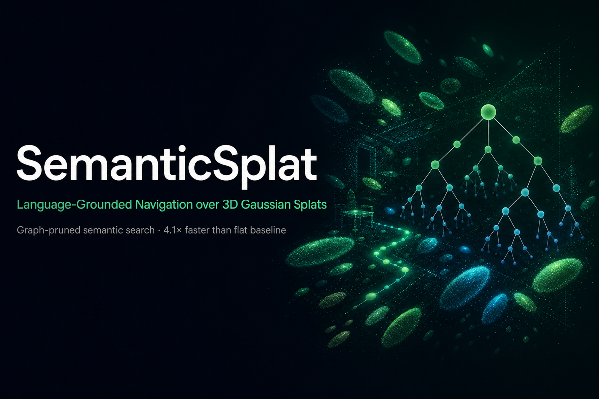
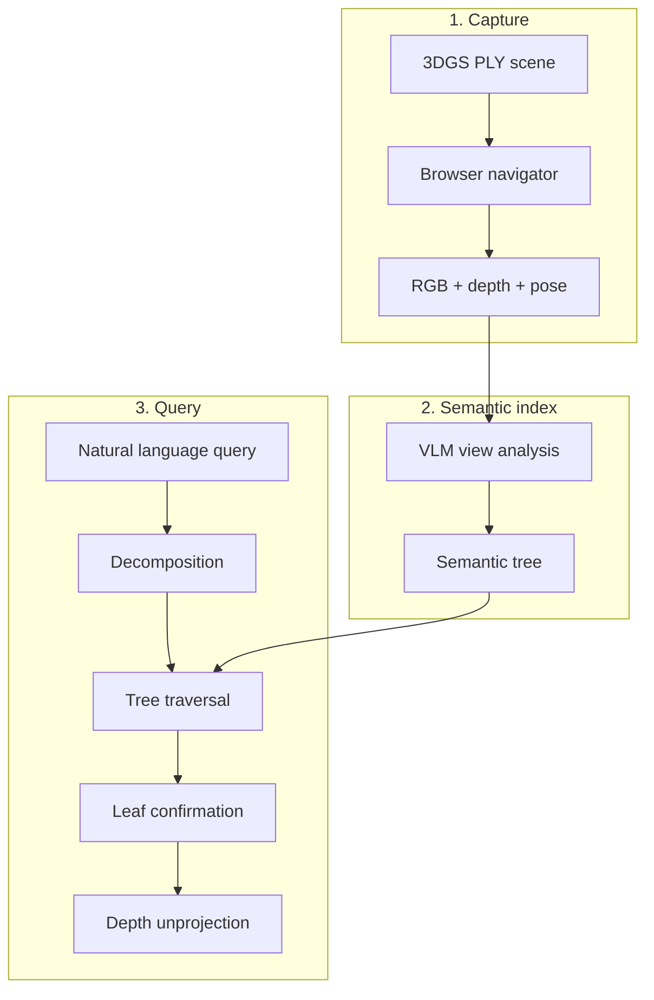

<div align="center">

# SemanticSplat

**Language-grounded object search in 3D Gaussian Splatting scenes**

[](https://github.com/LeoPython2006/beyond-proximity)
[](backend/requirements.txt)
[](backend/api/server.py)
[](frontend/package.json)
[](docs/README.md)

[Quick Start](#quick-start) · [Results](#results) · [Method](#method) · [Demo](#demo) · [Docs](#documentation) · [Citation](#citation)



</div>

---

SemanticSplat is a research prototype for **open-vocabulary object search** in large indoor 3DGS scenes. The system builds a **hierarchical semantic tree** from VLM annotations and runs **graph-pruned top-down traversal** (design spec §7) instead of checking every captured view.

Compared to a flat exhaustive baseline on scene `default` (19 views, 15 tree nodes):

| | Graph search | Flat search |
|:--|--:|--:|
| Est. latency | **48.7 s** | 197.0 s |
| Input tokens | **6,430** | 26,604 |
| Views checked | **4.0** | 19.0 |
| Wrong-room failures (5 cases) | **0** | 2 |

Legacy simulated-demo report: [`docs/benchmarks/benchmark_graph_vs_flat.md`](docs/benchmarks/benchmark_graph_vs_flat.md). Current evaluation status: [`docs/project/final_week3_acceptance.md`](docs/project/final_week3_acceptance.md).

---

## News

- **2026-06-12** — **Ask** button auto-runs the §7 pipeline in the backend ([`live_session.py`](backend/query/live_session.py)); Query Flow polls live steps.
- **2026-06-12** — Benchmark suite + reasoning traces + failure-case demo video under [`docs/benchmark_results/`](docs/benchmark_results/).
- **2026-06-11** — Graph vs flat benchmark: **4.1×** faster, **8.5×** fewer tokens on demo queries.

---

## Method




| Stage | Mechanism | Artifact |
|:------|:----------|:---------|
| Capture | Spark.js viewer, key **R** | `views/`, `depths/`, `transforms.json` |
| Analysis | Cursor + MCP + VLM | `views/v*.json` (ViewJSON) |
| Structure | Recursive zone / leaf tree | `tree/*.json` |
| Graph search | Top-down prune | ~4 leaf checks per query |
| Flat baseline | Exhaustive scan | 19 leaf checks per query |

**Representative failure case:** *"Where is the screen in the conference room?"* — flat returns a lobby screen (`v012`); graph returns the ballroom stage screen (`v017`).

---

## Results

<div align="center">
<table>
<tr>
<td align="center"><br/><sub>Average metrics</sub></td>
<td align="center"><br/><sub>Speedup per query</sub></td>
</tr>
<tr>
<td align="center"><br/><sub>Token usage</sub></td>
<td align="center"><br/><sub>Room disambiguation</sub></td>
</tr>
</table>
</div>

Timing model (fast LLM, no extended thinking): `total_sec ≈ infra + llm_calls×0.35 + tokens/140`. These are estimates from the legacy simulated demo; see its [methodology](docs/benchmarks/benchmark_graph_vs_flat.md#methodology).

---

## Demo

**End-to-end product walkthrough** (~30 s) — navigate, capture, query, pipeline, found location:

**[e2e_product_demo.mp4](docs/benchmark_results/e2e_product_demo.mp4)**

```bash
PYTHONPATH=. python scripts/render_e2e_product_demo.py --query "Find the sofa"
```

**Failure-case video** — conference-room screen disambiguation (graph vs flat):

**[failure_case_demo.mp4](docs/benchmark_results/failure_case_demo.mp4)**

| Resource | Link |
|:---------|:-----|
| E2E demo | [`docs/benchmark_results/e2e_product_demo.mp4`](docs/benchmark_results/e2e_product_demo.mp4) |
| Failure demo | [`docs/benchmark_results/failure_case_demo.mp4`](docs/benchmark_results/failure_case_demo.mp4) |
| Reasoning traces | [`docs/archive/old_notes/project_log/runs/2026-06-12_1829/reasoning/`](docs/archive/old_notes/project_log/runs/2026-06-12_1829/reasoning/) |
| Live UI | `./start_all.sh` → **Ask** → **Query Flow** |

---

## Quick Start

### Run the app

```bash
chmod +x start_all.sh run_all_docs.sh
./start_all.sh
```

Open **http://localhost:5173**

| Step | Action |
|:--:|:-------|
| 1 | Scene ID `default` → **Set** |
| 2 | Load `ConferenceHall.ply` from the dropdown |
| 3 | Navigate with WASD + mouse; press **R** to capture a view |
| 4 | Enter a query → **Ask** → open **Query Flow** |

Services: frontend `:5173` · API `:8000` · MCP `:8001`

### Install dependencies (first time)

```bash
python3 -m venv .venv
source .venv/bin/activate
pip install -r backend/requirements.txt
cd frontend && npm install && cd ..
```

Place `.ply` files in [`scenes/`](scenes/) (gitignored — not shipped with the repo).

<details>
<summary><strong>Cursor MCP configuration</strong></summary>

Create `.cursor/mcp.json`:

```json
{
  "mcpServers": {
    "semantic-splat": {
      "url": "http://127.0.0.1:8001/mcp"
    }
  }
}
```

Enable **semantic-splat** in Cursor → Settings → MCP after starting `./start_all.sh`.

</details>

<details>
<summary><strong>Regenerate benchmarks and documentation</strong></summary>

```bash
./run_all_docs.sh
```

Outputs charts, reasoning markdown, and demo media. New run logs are written under `docs/experiments/stub/demo_runs/`; the curated [`docs/README.md`](docs/README.md) index is preserved.

</details>

---

## Documentation

| Document | Description |
|:---------|:------------|
| [Docs hub](docs/README.md) | Index of reports and runs |
| [Current Week 3 status](docs/project/final_week3_acceptance.md) | Measured results, blocked work, and claim boundaries |
| [Benchmark report](docs/benchmarks/benchmark_graph_vs_flat.md) | Legacy simulated graph-vs-flat analysis |
| [Launch guide (RU)](docs/project/launch_guide_ru.md) | Step-by-step setup and Query Flow |
| [Design spec §7](docs/project/design/specs/2026-04-05-semantic-3dgs-navigator-design.md) | System architecture |
| [Archived demo logs](docs/archive/old_notes/project_log/) | Historical experiment evidence |

---

## Project structure

```
beyond-proximity/
├── start_all.sh              # Launch frontend + backend + MCP
├── run_all_docs.sh           # Benchmark + docs pipeline
├── backend/
│   ├── api/                  # FastAPI REST + WebSocket
│   ├── mcp/                  # MCP tools + prompt templates
│   ├── query/                # Pipeline, benchmark, live_session
│   └── data/scenes/default/  # Views, tree, query sessions
├── frontend/                 # React + Spark.js viewer
├── docs/                     # Project, evaluation, validation, reports, archive
└── scenes/                   # Local .ply files (gitignored)
```

---

## Tests

```bash
source .venv/bin/activate
export PYTHONPATH=.
pytest tests/backend/ -v
```

---

## Citation

If you use this codebase in academic work, please cite:

```bibtex
@software{semanticsplat2026,
  title  = {SemanticSplat: Language-Grounded Navigation over 3D Gaussian Splats},
  author = {LeoPython2006},
  year   = {2026},
  url    = {https://github.com/LeoPython2006/beyond-proximity}
}
```

GitHub citation widget: [`CITATION.cff`](CITATION.cff)

---

## License

See repository license. Scene `.ply` assets are not included — add your own under `scenes/`.

---

<div align="center">
<sub>SemanticSplat · graph-pruned semantic 3DGS navigation · scene <code>default</code></sub>
</div>
