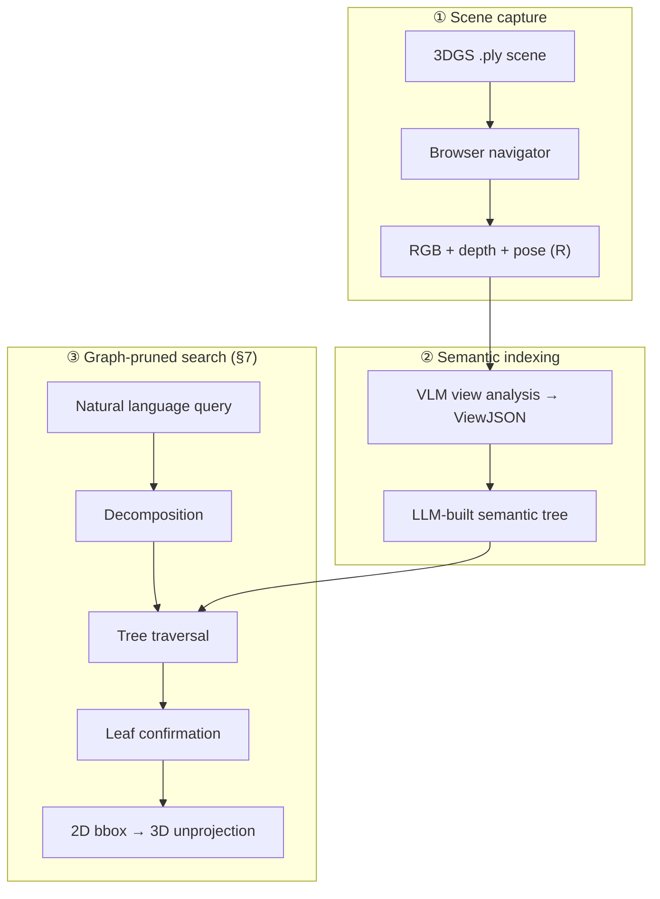

<p align="center">
  
</p>

<p align="center">
  <a href="https://github.com/LeoPython2006/beyond-proximity"></a>
  <a href="docs/benchmark_graph_vs_flat.md"></a>
  <a href="docs/launch_guide_ru.md"></a>
</p>

<p align="center">
  
  
  
  
  
  
</p>

---

**SemanticSplat** is an interactive research prototype for **open-vocabulary object search** in large indoor 3D Gaussian Splatting scenes. Instead of scanning every captured view, the system builds a **hierarchical semantic tree** and runs **graph-pruned top-down traversal** — reducing tokens, latency, and room-disambiguation errors compared to flat exhaustive search.

> **Repository:** [github.com/LeoPython2006/beyond-proximity](https://github.com/LeoPython2006/beyond-proximity)

<table>
<tr>
<td width="50%">

### Why graph search?

| | **Graph** | **Flat** |
|:--|--:|--:|
| Est. time | **48.7 s** | 197.0 s |
| Input tokens | **6.4k** | 26.6k |
| Views checked | **4** | 19 |
| Wrong-room (5 cases) | **0** | 2 |

</td>
<td width="50%">

### What you get

- Browser **Navigator** over `.ply` splats (Spark.js)
- **Semantic tree** built with VLM + MCP tools
- **Query Flow** — live §7 pipeline visualization
- **Ask** button — auto-runs search (no Cursor copy-paste)
- Full **benchmark suite** + reasoning traces

</td>
</tr>
</table>

<p align="center">
  
  <br/>
  <sub><a href="docs/benchmark_graph_vs_flat.md">Full benchmark report</a> · scene <code>default</code> · 19 views · 15 tree nodes</sub>
</p>

---

## Abstract

We combine **3D Gaussian Splatting** rendering, **VLM-produced view annotations**, and a **recursive semantic tree** to support natural-language queries such as *“Where is the screen in the conference room?”* or *“Find the piano.”* Query handling follows design spec **§7**: decomposition → tree traversal → leaf confirmation → 2D bbox → depth unprojection.

**Key insight:** spatial structure acts as a **hard prune** before expensive leaf-level VLM calls. On our conference-hall demo scene, graph search checks **~4 views** instead of **19**, with **zero wrong-room failures** on the curated failure-case suite (flat search fails twice).

<p align="center">
  
  &nbsp;&nbsp;
  
</p>

---

## Method



| Stage | Mechanism | Output |
|:------|:----------|:-------|
| **Capture** | Spark.js viewer, WASD fly-through | `views/`, `depths/`, `transforms.json` |
| **Analysis** | Cursor + MCP + VLM | Per-view `ViewJSON` (objects, relations) |
| **Structure** | Recursive zone/leaf tree | `tree/*.json` with summaries |
| **Search (graph)** | Top-down traversal, prune siblings | ~4 leaf checks / query |
| **Search (flat)** | Exhaustive per-view confirmation | 19 leaf checks / query |
| **Localize** | Depth unprojection | `bbox_3d` in scene coordinates |

**Failure case (flat loses, graph wins):** *“Where is the screen in the conference room?”* — flat returns a lobby screen (**v012**); graph returns the ballroom stage screen (**v017**). [Demo video →](docs/benchmark_results/failure_case_demo.mp4)

---

## Quick start

### One command

```bash
chmod +x start_all.sh run_all_docs.sh
./start_all.sh
```

Opens **http://localhost:5173** · backend **:8000** · MCP **:8001**

| Step | Action |
|:-----|:-------|
| 1 | Scene ID `default` → **Set** |
| 2 | Load `ConferenceHall.ply` from dropdown |
| 3 | Fly (WASD + mouse), press **R** to capture |
| 4 | Type a query → **Ask** → watch **Query Flow** tab |

### First-time setup

```bash
python3 -m venv .venv && source .venv/bin/activate
pip install -r backend/requirements.txt
cd frontend && npm install && cd ..
```

Put `.ply` files in `scenes/` (gitignored — not shipped with repo).

<details>
<summary><b>MCP in Cursor</b></summary>

Create `.cursor/mcp.json`:

```json
{
  "mcpServers": {
    "semantic-splat": { "url": "http://127.0.0.1:8001/mcp" }
  }
}
```

Start `./start_all.sh`, enable **semantic-splat** in Cursor → Settings → MCP. Use for view analysis and tree building.

</details>

<details>
<summary><b>Windows</b></summary>

See `start_all.cmd` or `SemanticSplat_—_подробная_инструкция_по_запуску_Windows.pdf`.

</details>

---

## Benchmark & reproducibility

Regenerate metrics, charts, reasoning traces, and demo video:

```bash
./run_all_docs.sh
```

| Artifact | Path |
|:---------|:-----|
| **Docs hub** | [`docs/README.md`](docs/README.md) |
| **Full report** | [`docs/benchmark_graph_vs_flat.md`](docs/benchmark_graph_vs_flat.md) |
| **Latest run** | [`docs/project_log/runs/2026-06-12_1829/README.md`](docs/project_log/runs/2026-06-12_1829/README.md) |
| **Project log** | [`docs/project_log/`](docs/project_log/) |
| **Demo MP4** | [`docs/benchmark_results/failure_case_demo.mp4`](docs/benchmark_results/failure_case_demo.mp4) |

Timing model: `total_sec ≈ infra + llm_calls×0.35 + tokens/140` (fast LLM, no extended thinking). See [methodology →](docs/benchmark_graph_vs_flat.md#methodology).

---

## Project layout

```
beyond-proximity/
├── start_all.sh              # App launcher (Mac/Linux)
├── run_all_docs.sh           # Benchmark + docs pipeline
├── backend/
│   ├── api/                  # FastAPI REST + WebSocket
│   ├── mcp/                  # MCP tools + prompt templates
│   ├── query/                # §7 pipeline, benchmark, live_session
│   └── data/scenes/default/  # Views, tree, query sessions
├── frontend/                 # React + Spark.js
├── docs/                     # Reports, charts, assets, project log
├── scenes/                   # Local .ply files (gitignored)
└── tests/backend/
```

---

## Research context

This repo implements ideas from open-vocabulary 3D scene understanding (LEGS, LERF, ConceptFusion) in a **pragmatic tree + VLM** architecture rather than per-Gaussian language fields. Related reading is collected under [`markdown-papers/`](markdown-papers/).

| Document | Description |
|:---------|:------------|
| [Design spec §7](docs/superpowers/specs/2026-04-05-semantic-3dgs-navigator-design.md) | Full system design |
| [Baselines matrix](docs/baselines_matrix.md) | Comparison to alternative approaches |
| [Launch guide (RU)](docs/launch_guide_ru.md) | Step-by-step walkthrough |

---

## Tests

```bash
source .venv/bin/activate
export PYTHONPATH=.
pytest tests/backend/ -v
```

---

## Citation

If you use this codebase in academic work, please cite:

```bibtex
@software{semanticsplat2026,
  title  = {SemanticSplat: Language-Grounded Navigation over 3D Gaussian Splats},
  author = {LeoPython2006},
  year   = {2026},
  url    = {https://github.com/LeoPython2006/beyond-proximity}
}
```

See also [`CITATION.cff`](CITATION.cff) for GitHub's citation widget.

---

## License

See repository license. Scene `.ply` assets are not included — add your own to `scenes/`.

<p align="center">
  <sub>Built for semantic 3DGS navigation research · graph search demo scene: <code>default</code></sub>
</p>
