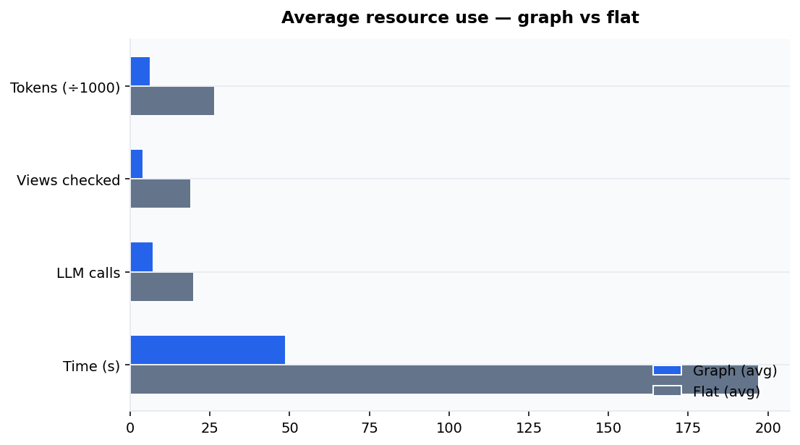
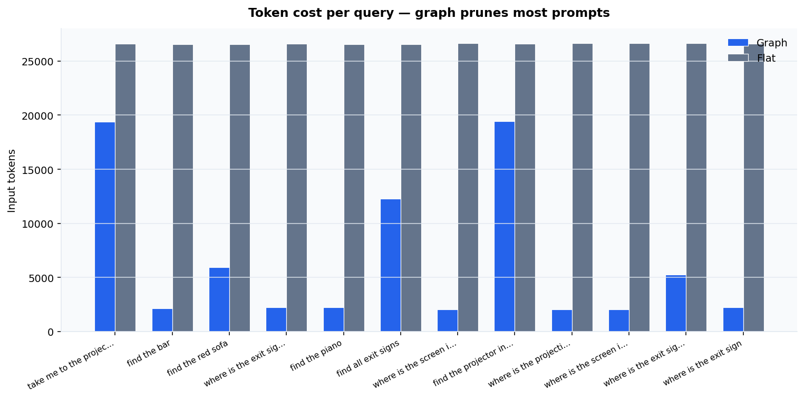
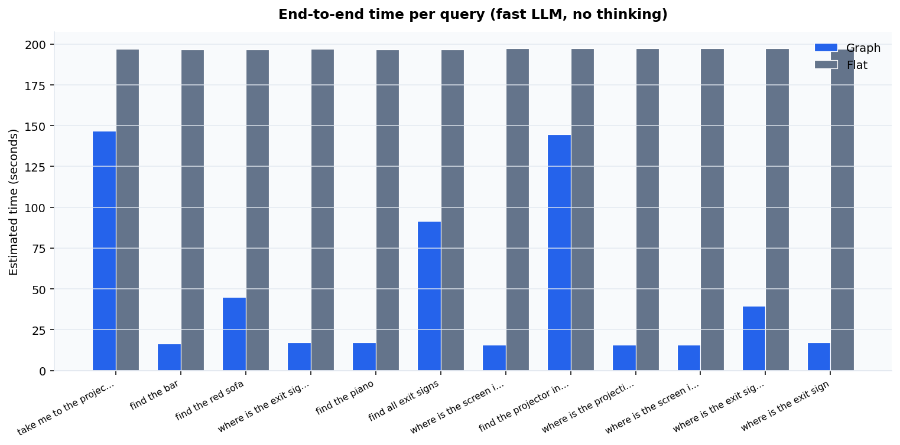
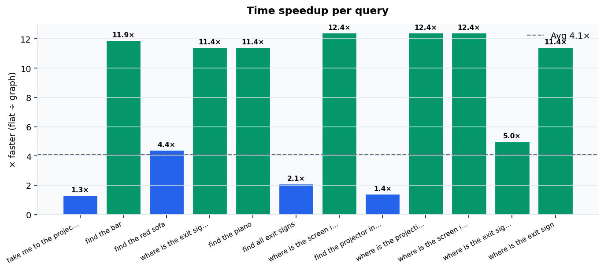
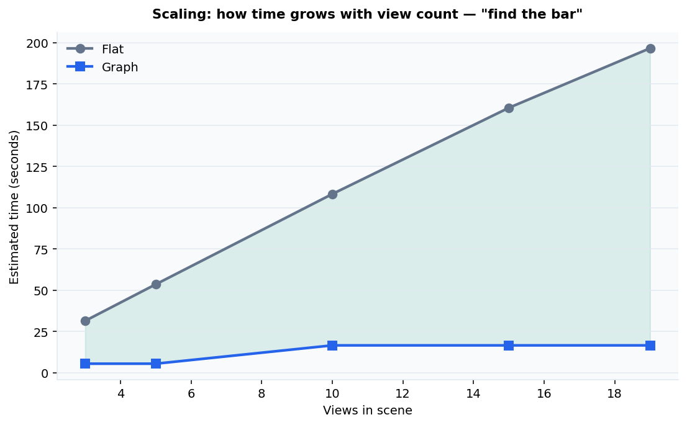
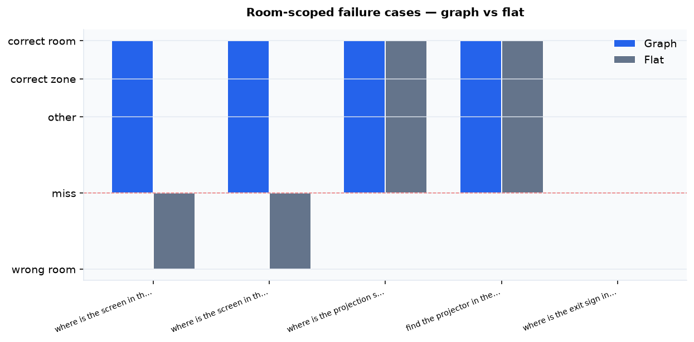

# Graph vs Flat — Benchmark Report

> Semantic tree traversal (graph) compared to exhaustive view search (flat).
> **Scene:** `default` · **Generated:** 2026-06-12 18:29 UTC

**Navigation:** [Docs hub](README.md) · [Run dashboard](project_log/runs/2026-06-12_1829/README.md) · [Project log](project_log/README.md)

## Contents

- [At a glance](#at-a-glance)
- [Scene & semantic graph](#scene--semantic-graph)
- [Timing model](#timing-model)
- [Per-query results](#per-query-results)
- [What drives speed?](#what-drives-speed)
- [Failure cases](#failure-cases--room-disambiguation)
- [Methodology](#methodology)

---

## At a glance

| | Graph | Flat | Advantage |
|--|------:|-----:|----------:|
| Input tokens | 6,430 | 26,604 | **8.5×** less |
| Views checked | 4.0 | 19 | **12.5×** faster |
| LLM calls | 7.2 | 20 | **3.8×** less |
| **Time (est.)** | **48.65 s** | **197.04 s** | **4.1×** faster |

The graph search checks **fewer views and sends fewer tokens** to the LLM, so queries finish in a fraction of the time.



---

## Scene & semantic graph

| Property | Value |
|----------|------:|
| Captured views | 19 |
| Tree nodes | 15 |
| Tree depth | 2 |
| Leaf nodes | 10 |
| Zone nodes | 4 |
| Views mapped in tree | 19 |

The semantic graph groups views into zones and regions. Traversal prunes irrelevant branches before any leaf-level view confirmation runs.

---

## Timing model

Speed is reported in **seconds**. We measure local prompt assembly and estimate LLM latency for a **fast model without extended thinking**:

```
total_sec = infra_sec + llm_calls*0.35 + input_tokens/140
```

| Parameter | Value |
|-----------|------:|
| Overhead per LLM call | 0.35 s |
| Throughput | 140 tok/s |

### Oracle path (real logged LLM traversal)

When a saved query session exists, we replay the exact branch choices the LLM made:

| | Oracle | Flat | Advantage |
|--|-------:|-----:|----------:|
| Input tokens | ~4,630 | 26,604 | **24.2×** less |
| Views checked | ~2.8 | 19 | **11.2×** faster |
| LLM calls | ~5.7 | 20 | **5.3×** less |

---

## Per-query results





| Query | Graph tok | Flat tok | × less | Views G/F | Graph s | Flat s | × faster |
|-------|----------:|---------:|-------:|----------:|--------:|-------:|---------:|
| take me to the projector | 19,379 | 26,587 | 1.4× | 13/19 | 146.99 | 196.93 | 1.3× |
| find the bar | 2,114 | 26,547 | 12.6× | 1/19 | 16.5 | 196.64 | 11.9× |
| find the red sofa | 5,950 | 26,567 | 4.5× | 4/19 | 44.95 | 196.78 | 4.4× |
| where is the exit sign? | 2,225 | 26,587 | 11.9× | 1/19 | 17.29 | 196.92 | 11.4× |
| find the piano | 2,217 | 26,547 | 12.0× | 1/19 | 17.24 | 196.64 | 11.4× |
| find all exit signs | 12,278 | 26,567 | 2.2× | 8/19 | 91.56 | 196.78 | 2.1× |
| where is the screen in the conference room located | 2,034 | 26,667 | 13.1× | 1/19 | 15.93 | 197.5 | 12.4× |
| find the projector in the ballroom | 19,413 | 26,627 | 1.4× | 13/19 | 144.62 | 197.21 | 1.4× |
| where is the projection screen in the ballroom | 2,034 | 26,667 | 13.1× | 1/19 | 15.93 | 197.49 | 12.4× |
| where is the screen in the conference room | 2,030 | 26,647 | 13.1× | 1/19 | 15.9 | 197.35 | 12.4× |
| where is the exit sign in the lobby | 5,257 | 26,647 | 5.1× | 3/19 | 39.65 | 197.35 | 5.0× |
| where is the exit sign | 2,225 | 26,587 | 11.9× | 1/19 | 17.29 | 196.92 | 11.4× |



---

## What drives speed?

| Factor | Flat search | Graph search |
|--------|-------------|--------------|
| **View count** | **Primary** — +10.33 s per extra view | Weak — only relevant leaves |
| **Graph size** | No effect (tree unused) | Moderate — depth 2, 10 leaves |
| **Scene / PLY size** | No effect | No effect |



Scaling sweep on *"find the bar"* — vary how many views exist in the scene:

| Views | Flat (s) | Graph (s) | × faster | Flat views chk | Graph views chk | Graph nodes |
|------:|---------:|----------:|---------:|---------------:|----------------:|------------:|
| 3 | 31.37 | 5.39 | 5.8× | 3 | 0 | 3 |
| 5 | 53.51 | 5.39 | 9.9× | 5 | 0 | 3 |
| 10 | 108.26 | 16.5 | 6.6× | 10 | 1 | 3 |
| 15 | 160.52 | 16.5 | 9.7× | 15 | 1 | 3 |
| 19 | 196.64 | 16.5 | 11.9× | 19 | 1 | 3 |

**Takeaway:** Flat time grows ~linearly with view count (checks every view). Graph time grows slowly — dominated by tree depth (~2 levels, 10 leaves) and query-specific branches, not total views.

---

## Failure cases — room disambiguation

Queries where the same object exists in **multiple rooms**. Flat search scans all views and may return the first keyword match in the **wrong room**. Graph traversal scopes to the correct zone first.

| | Graph room-correct | Flat room-correct | Flat **wrong room** | Graph wins |
|--|-------------------:|------------------:|--------------------:|-----------:|
| Count | 4/5 | 2/5 | **2** | 2 |

> **Demo query:** *"where is the screen in the conference room"* — flat returns a ballroom-floor screen (v012); graph returns the conference-room stage screen (v017).



| Query | Graph view | Verdict | Flat view | Verdict | Tokens G/F | Time G/F |
|-------|------------|---------|-----------|---------|------------|----------|
| where is the screen in the conference room | v017 | correct_room | v012 | **wrong_room** | 2,030/26,647 | 15.9/197.35 s |
| where is the screen in the conference room located | v017 | correct_room | v012 | **wrong_room** | 2,034/26,667 | 15.93/197.49 s |
| where is the projection screen in the ballroom | v017 | correct_room | v012 | **correct_room** | 2,034/26,667 | 15.93/197.49 s |
| find the projector in the ballroom | v013 | correct_room | v013 | **correct_room** | 19,413/26,627 | 144.62/197.21 s |
| where is the exit sign in the lobby | — | miss | — | **miss** | 5,257/26,647 | 39.65/197.35 s |

### Why this matters for the product

**where is the screen in the conference room**

- Target room: Conference room / stage (presentation end)
- Multiple projection screens exist in the hall. Flat search returns the first keyword match (often v012 — ballroom floor through doors) without respecting the room constraint. Graph traversal enters the stage/screen leaf and confirms v017/v018.

**where is the screen in the conference room located**

- Target room: Conference room / stage (presentation end)
- Same room constraint with natural phrasing ('located'). Tests whether filler words break matching and whether graph still scopes correctly.

### Demo video

[Download / play `failure_case_demo.mp4`](benchmark_results/failure_case_demo.mp4) — flat vs graph side-by-side.

### Reasoning traces

[Open run dashboard](project_log/runs/2026-06-12_1829/README.md) — all cases with links.

### Reasoning traces

Auto-generated traversal reasoning (graph + flat) for each failure case:

- [where is the screen in the conference room](project_log/runs/2026-06-12_1829/reasoning/01_where_is_the_screen_in_the_c.md)
- [where is the screen in the conference room located](project_log/runs/2026-06-12_1829/reasoning/02_where_is_the_screen_in_the_c.md)
- [where is the projection screen in the ballroom](project_log/runs/2026-06-12_1829/reasoning/03_where_is_the_projection_scre.md)
- [find the projector in the ballroom](project_log/runs/2026-06-12_1829/reasoning/04_find_the_projector_in_the_ba.md)
- [where is the exit sign in the lobby](project_log/runs/2026-06-12_1829/reasoning/05_where_is_the_exit_sign_in_th.md)

Session JSON: `backend/data/scenes/default/queries/auto_*_graph.json`


---

## Methodology

- **Graph mode** — query decomposition → semantic tree traversal with branch pruning → leaf confirmation only on visited leaves.
- **Flat mode** — same decomposition, then leaf confirmation on **every** captured view (no tree).
- **Oracle mode** — graph traversal replayed from saved session logs (real LLM branch choices).
- **Queries:** 12 (defaults + saved session logs).

---

## Reproduce

```bash
PYTHONPATH=. .venv/bin/python scripts/run_full_benchmark.py
# or one command from project root:
./run_all_docs.sh
```

Raw data: [`benchmark_results/benchmark_default.json`](benchmark_results/benchmark_default.json)

Session log: [`project_log/README.md`](project_log/README.md) (auto-updated each run)
