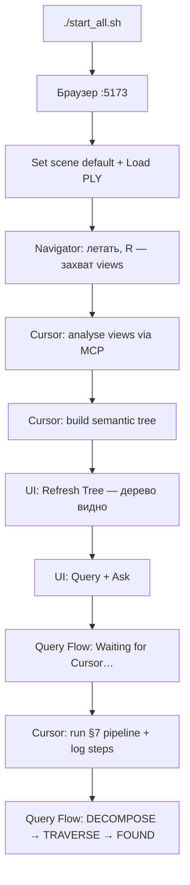

# SemanticSplat — полный путь запуска

> Пошаговое руководство: какие команды запускать, что происходит внутри, что ожидать в терминале и где искать результат.

---

## Два режима работы

| Режим | Команда | Нужен браузер? | Нужен Cursor? | Что получаешь |
|-------|---------|:--------------:|:-------------:|---------------|
| **Live-приложение** | `./start_all.sh` | ✅ | для query pipeline | 3D-навигация, дерево, Query Flow |
| **Offline benchmark + docs** | `./run_all_docs.sh` | ❌ | ❌ | MD-отчёты, графики, MP4, reasoning |

**Важно:** `./run_all_docs.sh` **не** запускает UI и **не** заполняет Query Flow live-шагами. Это симуляция graph vs flat + генерация документации.

---

## Предварительные требования

### macOS / Linux

| Что | Зачем |
|-----|-------|
| Python 3.11+ | backend, benchmark |
| Node.js 18+ | frontend (Vite) |
| `.ply` в `scenes/` | 3D-сцена в браузере (не в git) |

Первый запуск `./start_all.sh` сам создаст `.venv`, поставит `pip`/`npm` зависимости.

### Cursor (для live query pipeline)

Файл `.cursor/mcp.json` в корне проекта:

```json
{
  "mcpServers": {
    "semantic-splat": {
      "url": "http://127.0.0.1:8001/mcp"
    }
  }
}
```

MCP работает **только** когда `./start_all.sh` уже поднял сервер на `:8001`.

---

## 1. `./start_all.sh` — live-приложение

### Команда

```bash
chmod +x start_all.sh run_all_docs.sh   # один раз
./start_all.sh
```

### Что происходит внутри (по порядку)

```
start_all.sh
├── проверка / создание .venv
├── pip install -r backend/requirements.txt  (если нет fastapi)
├── npm install в frontend/                  (если нет node_modules)
├── mkdir scenes/
├── копирование scenes/input-data/*.ply → scenes/  (если есть)
├── python -m backend.api.server     → порт 8000
├── python -m backend.mcp.server     → порт 8001
└── npm run dev в frontend/          → порт 5173
```

### Ожидаемый вывод в терминале

**1. Установка (только первый раз):**

```
Создаю Python-окружение...
Устанавливаю Python-зависимости...
Устанавливаю frontend-зависимости...
```

**2. Запуск сервисов:**

```
Запускаю Backend API (8000), MCP (8001), Frontend (5173)...

> semantic-splat-frontend@1.0.0 dev
> vite

  VITE v5.x.x  ready in ~200 ms
  ➜  Local:   http://localhost:5173/
```

Backend и MCP пишут свои логи в тот же терминал (uvicorn, fastmcp).

**3. Баннер (главная подсказка):**

```
==============================================
  SemanticSplat запущен
==============================================

  ОТКРОЙ В БРАУЗЕРЕ (главный адрес):
  -> http://localhost:5173

  В интерфейсе:
    Scene ID: default  ->  Set
    PLY URL:  /scenes/ConferenceHall.ply  ->  Load

  3D-сцены найдены: N файл(ов) в scenes/
  (или ВНИМАНИЕ: нет .ply — 3D будет пустым)

  Служебные адреса:
    Backend health: http://127.0.0.1:8000/api/health
    MCP (только Cursor): http://127.0.0.1:8001/mcp

  Benchmark + docs:
    ./run_all_docs.sh

  Ctrl+C — остановить все сервисы
==============================================
```

На macOS через ~2 с браузер откроется сам (`open http://localhost:5173`).

**4. Остановка:** `Ctrl+C` → `Останавливаю сервисы...`

### Проверка что всё живо

```bash
curl http://127.0.0.1:8000/api/health
```

Ожидаемый JSON:

```json
{
  "status": "ok",
  "scenes_dir": ".../scenes",
  "ply_files": ["ConferenceHall.ply"]
}
```

| URL | Назначение |
|-----|------------|
| http://localhost:5173 | **Главный UI** — сюда заходить |
| http://127.0.0.1:8000/api/health | Проверка backend |
| http://127.0.0.1:8001/mcp | MCP для Cursor (не открывать в браузере) |

---

## 2. UI после `./start_all.sh`

### Вкладки

| Вкладка | Что делает |
|---------|------------|
| **Navigator** | 3D-полёт (WASD + мышь), захват view (**R**) |
| **Semantic Tree** | Визуализация дерева |
| **Query Flow** | История query-сессий и шаги pipeline |

### Панель управления (верх)

| Элемент | Действие | Ожидаемый результат |
|---------|----------|---------------------|
| **Scene ID** + Set | `default` | Статус: `Scene "default" ready` |
| **3D Scene** + Load | выбрать `.ply` | Сцена загружается в Navigator |
| **↻ Refresh Tree** | перечитать дерево | `Tree refreshed` или `No tree found — build it via Cursor AI MCP tools` |
| **Query** + **Ask** | ввести запрос | Создаётся session → переход на Query Flow |

### Полный live-workflow (от нуля до query)



---

## 3. Query Flow и «Waiting for next step from Cursor…»

### Что означает это сообщение

Кнопка **Ask** только **создаёт пустую сессию** на диске:

```
backend/data/scenes/default/queries/{session_id}.json
```

Пока Cursor не запишет шаги через API, UI показывает:

```
● Running
Waiting for next step from Cursor…
```

Это **нормально** — UI ждёт агента.

### Что написать в Cursor (после Ask)

Подставь свой `session_id` из статус-бара UI:

```
Run the §7 query pipeline for scene default, session XXXXXXXX.
Query: "Find the sofa"
Log every step to query-log API so Query Flow updates live.
```

### Что появится в Query Flow когда pipeline идёт

| Шаг | Карточка | Содержимое |
|-----|----------|------------|
| §7.2 | **DECOMPOSE** | structured_plan (target, room, query_type) |
| §7.3 | **TRAVERSE** | node, children, descend_into, reasoning |
| §7.4 | **FOUND / MISS** | view_id, bbox, explanation |
| финал | **RESULT** | found / not found, view, 3D bbox |

Polling каждые ~1.5 с — обновляется автоматически.

### Готовые демо-сессии (без Cursor)

После `./run_all_docs.sh` в Query Flow слева появятся сессии **`auto_*_graph`** / **`auto_*_flat`**.

Кликни, например, `auto_00910838_graph` — там уже есть полный trace запроса вроде *"where is the exit sign in the lobby"*.

---

## 4. `./run_all_docs.sh` — benchmark + документация

### Команда

```bash
./run_all_docs.sh
# или с другой сценой:
./run_all_docs.sh --scene default
```

**Backend/UI не нужны.** Скрипт сам активирует `.venv` и вызывает `scripts/run_full_benchmark.py`.

### Что происходит внутри

```
run_all_docs.sh
└── scripts/run_full_benchmark.py
    ├── run_scene_benchmark()        — graph vs flat, 12+ queries
    ├── run_failure_suite()          — 5 room-disambiguation cases
    ├── record_failure_demo.py       — MP4 ~22 s
    ├── write_benchmark_reasoning()  — MD traces + auto_* JSON sessions
    ├── write_report()               — benchmark_graph_vs_flat.md + PNG
    ├── write_project_log()          — experiments/stub/demo_runs/YYYY-MM-DD_HHMM_benchmark.md
    ├── write_docs_hub()             — docs/README.md
    └── write_run_dashboard()        — experiments/stub/demo_runs/runs/{timestamp}/README.md
```

### Ожидаемый вывод в терминале

**1. Заголовок:**

```
==============================================
  SemanticSplat — full docs pipeline
  Command: ./run_all_docs.sh
==============================================
```

**2. Таблица метрик (~115 символов ширины):**

```
===================================================================================================================
  BENCHMARK (resources & speed) — scene 'default' (19 views)
===================================================================================================================

  GRAPH SIZE:
    N nodes  |  depth D  |  L leaves  |  Z zones  |  19 views in tree

  TIMING MODEL (fast LLM, no thinking):
    total_sec = infra + llm
    0.35 s/call + 140 tok/s

  AVERAGE — graph vs flat:
    Tokens:      6,430 vs 26,604  →  8.5× less
    Views:       ~4 vs 19  →  ~4× faster
    Time (est):  ~48 s vs ~197 s  →  ~4× faster

  Query                        Graph tok   Flat tok   ...
  -------------------------------------------------------------------------------------------------------------------
  find the red sofa                 ...       ...      ...
  ...
```

**3. Failure cases:**

```
Failure cases: flat wrong-room 2/5 · graph wins 2
```

**4. Ссылки (главное — Cmd+click в Terminal):**

```
========================================================================
  START HERE — click file:// links (Cmd+click in Terminal)
========================================================================

  🏠 DOCS HUB (one page — everything linked)
    file:///.../docs/README.md

  📋 RUN DASHBOARD (this run — reasoning + charts)
    file:///.../docs/experiments/stub/demo_runs/runs/2026-06-12_1829/README.md

  📊 BENCHMARK REPORT
    file:///.../docs/benchmarks/benchmark_graph_vs_flat.md

  📝 PROJECT LOG
    file:///.../docs/experiments/stub/demo_runs/2026-06-12_1829_benchmark.md

  🧠 REASONING (5 cases with file:// links)

  🎬 DEMO VIDEO
    file:///.../docs/benchmark_results/failure_case_demo.mp4

  🌐 LIVE UI (if ./start_all.sh running): http://localhost:5173 → Query Flow
========================================================================
```

### Что создаётся на диске

```
docs/
├── README.md                              ← hub (START HERE после run)
├── benchmark_graph_vs_flat.md             ← полный отчёт + встроенные PNG
├── benchmark_results/
│   ├── benchmark_default.json             ← сырые метрики
│   ├── failure_case_demo.mp4              ← демо wrong-room
│   ├── tokens_*.png, time_*.png, ...      ← графики
│   └── reasoning_default.json             ← bundle reasoning
└── experiments/stub/demo_runs/
    ├── README.md                          ← история всех прогонов
    ├── YYYY-MM-DD_HHMM_benchmark.md       ← лог этого прогона
    └── runs/YYYY-MM-DD_HHMM/
        ├── README.md                      ← dashboard прогона
        └── reasoning/01–05_*.md           ← graph vs flat по каждому case

backend/data/scenes/default/queries/
├── auto_*_graph.json                      ← демо для Query Flow
└── auto_*_flat.json
```

---

## 5. Отдельные скрипты

| Команда | Когда использовать | Output |
|---------|-------------------|--------|
| `python scripts/run_full_benchmark.py` | То же что `./run_all_docs.sh` | см. выше |
| `python scripts/run_full_benchmark.py --scene default` | Другая сцена | `benchmark_{scene}.json` |
| `python scripts/record_failure_demo.py` | Только пересобрать MP4 | `docs/benchmark_results/failure_case_demo.mp4` |
| `pytest tests/backend/ -v` | Проверка backend | pass/fail в терминале |

---

## 6. Windows

| Файл | Роль |
|------|------|
| `start_all.cmd` | 3 отдельных окна: API, MCP, Frontend |
| `start_backend.cmd` / `.ps1` | только API :8000 |
| `start_mcp.cmd` / `.ps1` | только MCP :8001 |
| `start_frontend.cmd` / `.ps1` | только Vite :5173 |

Подробнее: `SemanticSplat_—_подробная_инструкция_по_запуску_Windows.pdf` в корне репо.

Ожидаемый вывод `start_all.cmd`:

```
========================================
 SemanticSplat — starting all services
========================================
  API       http://127.0.0.1:8000
  MCP       http://127.0.0.1:8001
  Frontend  http://localhost:5173
========================================

Launched 3 windows. Close each window to stop that service.
```

---

## 7. Карта файлов запуска

```
beyond-proximity/
├── start_all.sh              ← Mac/Linux: всё в одном терминале
├── run_all_docs.sh           ← benchmark + docs (offline)
├── start_all.cmd             ← Windows: 3 окна
│
├── backend/api/server.py     ← FastAPI :8000  (python -m backend.api.server)
├── backend/mcp/server.py     ← MCP :8001      (python -m backend.mcp.server)
├── frontend/                 ← Vite :5173     (npm run dev)
│
├── scripts/
│   ├── run_full_benchmark.py ← ядро run_all_docs
│   └── record_failure_demo.py← MP4 демо
│
├── scenes/                   ← .ply файлы (локально)
├── backend/data/scenes/      ← views, tree, query sessions
└── docs/                     ← всё что генерит run_all_docs
```

---

## 8. Частые проблемы

| Симптом | Причина | Решение |
|---------|---------|---------|
| Пустой 3D | нет `.ply` в `scenes/` | положить файл, перезагрузить |
| `Backend не отвечает` | `./start_all.sh` не запущен | запустить скрипт |
| Query Flow пустой после Ask | Cursor не запускал pipeline | написать агенту в Cursor (§7) |
| Клик по session — ничего | пустая сессия (0 steps) | выбрать `auto_*_graph` или запустить pipeline |
| `No tree found` | дерево не построено | Cursor: build semantic tree |
| MCP tools не видны | нет `mcp.json` или MCP не запущен | `./start_all.sh` + настройка Cursor |
| `run_all_docs` долго | benchmark + ffmpeg MP4 | нормально, ~1–3 мин |

---

## 9. Шпаргалка «что запускать когда»

| Цель | Команда | Куда смотреть результат |
|------|---------|-------------------------|
| Показать 3D + дерево | `./start_all.sh` | http://localhost:5173 |
| Задать query live | `./start_all.sh` + Ask + Cursor | Query Flow tab |
| Отчёт для Mousatat / paper | `./run_all_docs.sh` | `docs/README.md` |
| Демо wrong-room без LLM | `./run_all_docs.sh` | `failure_case_demo.mp4` |
| Посмотреть reasoning offline | `./run_all_docs.sh` | `docs/experiments/stub/demo_runs/runs/*/reasoning/` |
| Unit-тесты | `pytest tests/backend/ -v` | терминал |

---

## Связанные документы

- [README.md](../../README.md) — quick start (EN)
- [docs/README.md](../README.md) — hub после benchmark
- [benchmark_graph_vs_flat.md](../benchmarks/benchmark_graph_vs_flat.md) — метрики graph vs flat
- [repo_setup_notes.md](repo_setup_notes.md) — детали setup
