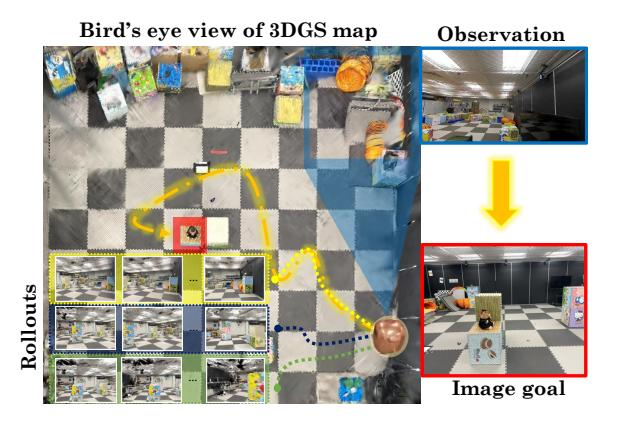
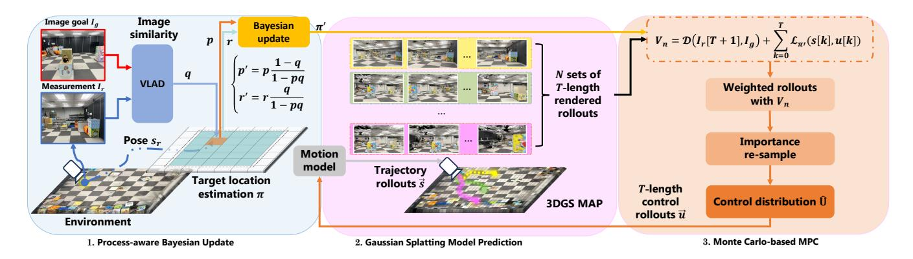
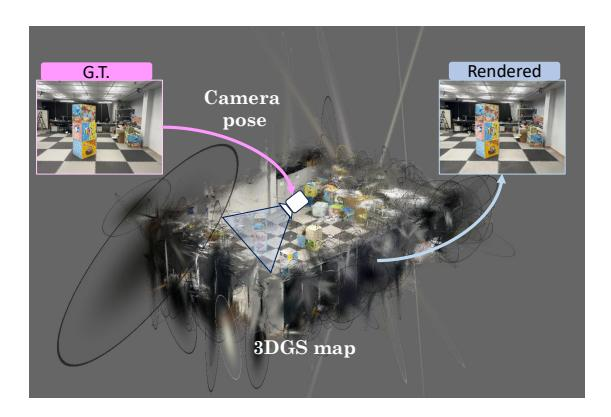
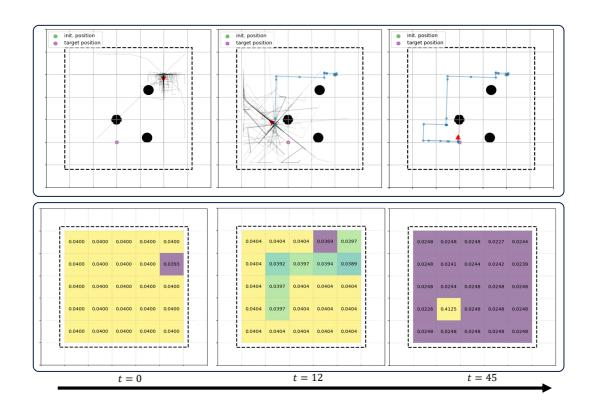
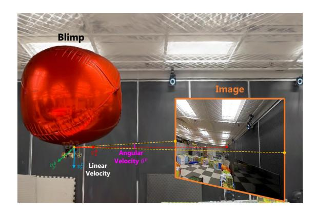
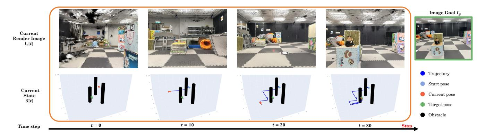
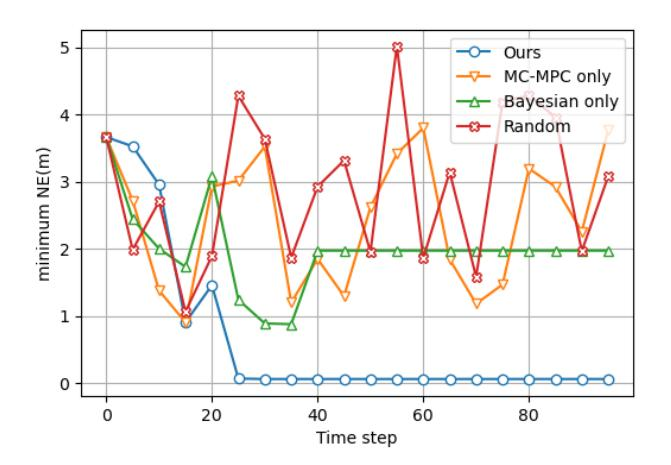
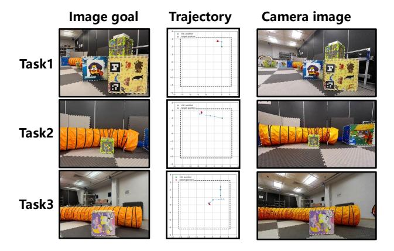

# BEINGS: Bayesian Embodied Image-goal Navigation with Gaussian Splatting

Wugang Meng, Tianfu Wu, Huan Yin and Fumin Zhang

*Abstract*— Image-goal navigation enables a robot to reach the location where a target image was captured, using visual cues for guidance. However, current methods either rely heavily on data and computationally expensive learning-based approaches or lack efficiency in complex environments due to insufficient exploration strategies. To address these limitations, we propose Bayesian Embodied Image-goal Navigation Using Gaussian Splatting, a novel method that formulates ImageNav as an optimal control problem within a model predictive control framework. BEINGS leverages 3D Gaussian Splatting as a scene prior to predict future observations, enabling efficient, real-time navigation decisions grounded in the robot's sensory experiences. By integrating Bayesian updates, our method dynamically refines the robot's strategy without requiring extensive prior experience or data. Our algorithm is validated through extensive simulations and physical experiments, showcasing its potential for embodied robot systems in visually complex scenarios. Project Page: **<www.mwg.ink/BEINGS-web>**.

## I. INTRODUCTION

Visual images serve as a natural language for navigation, enabling humans to reach a target more effectively than through textual descriptions [1]. In robotics, this concept is represented in Image-goal navigation (ImageNav), where visual perception guides a robot to the location where a target image was originally captured [2], [3]. Robotic ImageNav encounters significant challenges in real-world and complex environments, particularly when the target is out of sight or when obstacles are present. An effective ImageNav model must enable a robot not only to navigate directly to a target but also to explore efficiently in search of it [4]. Due to its potential applications in search and rescue operations and home service robotics, ImageNav has garnered considerable attention.

Existing studies for ImageNav can be broadly classified into two categories: *1) Learning-based ImageNav* methods, such as OVRL [2] and PoliFormer [5], utilize end-to-end reinforcement learning frameworks to train robots in exploration and navigation policies. These approaches typically require highly realistic simulators [6], [7] and millions of training trials, resulting in high computational costs and poor generalization to unseen environments. Although modular networks like NSNR [8] and RNR-Map [9] attempt to reduce simulator dependency by training on offline datasets,

The work described in this paper was fully supported by grants AoE/E-601/24-N, 16203223, and C6029-23G from the Research Grants Council of the Hong Kong Special Administrative Region, China.

The authors are with the Department of Electronic and Computer Engineering, Hong Kong University of Science and Technology, Hong Kong SAR. E-mail: wugang.meng@connect.ust.hk, tianfu.wu@connect.ust.hk, eehyin@ust.hk, eefumin@ust.hk

Corresponding author: Fumin Zhang



Fig. 1. A schematic diagram of BEINGS. The bird's eye view shows a 3DGS map that the robot uses to navigate toward a target image. The robot estimates the target's location using Bayesian principles, based on the similarity between its current observation (top right) and the image goal (bottom right). The yellow, blue, and green dotted lines show predicted rollouts, with images in corresponding color blocks showing potential future observations rendered by 3DGS (left lower). The orange dash-dotted line represents the optimal rollout selected for navigation.

they continue to struggle with overfitting and generalization capabilities. *2) Exploration-based ImageNav* methods, in contrast, reduce data dependency and improve adaptability to new environments with minimal or no reliance on data-driven modules. However, these approaches have their drawbacks. Classical methods, such as Frontier [10] and Stubborn [11], lack learning mechanisms that enable robots to refine their navigation strategies based on past experiences. Advanced methods, like MOPA [12] and GaussNav [13], maintain an informative semantic map of the explored area to enhance decision-making. However, as environments become increasingly complex, these semantic maps can lead to reduced navigation efficiency and higher ImageNav costs.

These limitations underscore a critical gap in ImageNav research: the need for a method that combines the efficiency of learning-based approaches with the robustness and adaptability of exploration-based strategies, without relying on extensive prior experience data. To address this gap, we introduce Bayesian embodied ImageNav with Gaussian splatting (BEINGS), in which the ImageNav is re-formulated as an optimal control problem. Specifically, BEINGS leverages the view synthesis function of 3D Gaussian Splatting (3DGS) [14] as a scene prior. Image similarities between rendered and observed images are integrated into a model predictive control (MPC) framework. The insights are twofold: first, 3DGS enables the robot to render potential future observations, informing action selection in the MPC framework to



Fig. 2. System overview of BEINGS for image-goal navigation. When the robot acquires a new image as a measurement, BEINGS updates its estimate of the target image location's distribution  $\pi$  by utilizing the image similarity between the measurement and the image goal, adhering to Bayesian principles. Subsequently, it executes Monte Carlo-based MPC by sampling N control sequences from the current control distribution. Using the robot's motion model and the 3DGS map, it generates N image sequences of length T. Each image sequence is scored, and the control distribution is resampled based on these scores, incrementally approximating the optimal control distribution to guide the robot toward the target image.

efficiently navigate to the target; second, Bayesian updates refine the robot's strategy with each observation and past information, thus enhancing the ImageNav without external experiences. Intuitively, BEINGS is "embodied" because it bases navigation on real-time sensory data and the robot's interactions with its environment. It enables the robot to render future views from different positions, akin to human cognitive processes of "imagination" and "memory", and make navigation decisions dynamically informed by real-time visual perception. Overall, our key contributions are:

- Reformulating ImageNav as an optimal control problem and solving it using a Monte Carlo-based MPC.
- Introducing 3D Gaussian Splatting (3DGS) as a scene prior to enable efficient prediction of future observations and enhance ImageNav.
- Reducing data dependency and allowing dynamic adjustment of ImageNav strategies using Bayesian updates informed by real-time data.

#### II. PROBLEM FORMULATION

Inspired by our previous study [15], we formulate the ImageNav as an optimal control problem. Assume that the motion model  $\mathcal{F}$  and the measurement model  $\mathcal{H}$  are known, we define the search space  $\mathbb{S}$  as a continuous, closed, and bounded Borel set. The goal image  $I_g$  is captured from the pose  $s_g \in \mathbb{S}$ , which indicates the source location for the goal image in the search space. We can derive the overall cost during the control sequence as a discrete Hamilton-Jacobi-Bellman (HJB) equation, stated as follows:

<span id="page-1-1"></span>
$$J_{\pi}(s[0], U_T) = \mathcal{D}(I_r[T+1], I_g) + \sum_{k=0}^{T} \mathcal{L}_{\pi}(s[k], u[k]) \quad (1)$$

where  $\mathcal{D}(I_r, I_g)$  is the dissimilarity between the goal image  $I_g$  and the image captured in terminal robot pose  $I_r$ , and  $\mathcal{L}_{\pi}(s[k], u[k])$  signifies the one-step exploration cost [16] incurred by implementing u[k] at pose s[k], given that the distributional estimation of the source location is  $\pi$ . To present  $\pi$ , the search area is divided into cells of equal volume  $\{\mathbb{S}_1, \ldots, \mathbb{S}_M\}$ , with each cell being treated as a Borel

subset of the search space  $\mathbb S$ . Since the measure of a specific pose is 0 in the 4DoF continuous space, we use the image similarity as a criterion for judging whether a robot navigates to a goal or not, and a threshold  $\epsilon$  is established. The successful navigation is determined by the robot reaching the space of poses that generate similar images, denoted as  $\mathbb S_{\text{sim}} = \{s_r \in \mathbb S | \mathcal D(I_g, I_r) < \epsilon\}$ . This subset can be conceptualized as a similarity manifold surrounding the target pose, and the probability mass of s[i] can be denoted as:

$$\mathcal{P}_{\pi}(s[k]) = P_{\pi}(\mathbb{S}_{\text{sim}} \subset \mathbb{S}_{i}), \quad s_{k} \in \mathbb{S}_{i}$$
$$= p_{i}[k]$$
 (2)

In the optimal search theory [17]–[20], given a movement cost function  $\{\mathcal{C}(\cdot,\cdot):\mathbb{S}\times\mathbb{S}\mapsto[0,\infty]\}$  and a priori success rate for the search target in the Borel subset  $\{\mathcal{Q}(\cdot):\mathbb{S}\mapsto[0,1]\}$ , the optimal search strategy at each time step is to minimize the one-step exploration cost, stated as:

<span id="page-1-0"></span>
$$\mathcal{L}_{\pi}(s[k], u[k]) = \frac{\mathcal{C}(s[k], u[k])}{\mathcal{P}_{\pi}(s[k+1])\mathcal{Q}(s[k+1])}$$
(3)

Finally, the ImageNav problem can be formulated by finding the optimal control sequence  $U_T^*$  that minimizes the overall cost at terminal time T start from state s[0]:

$$U_T^* = \arg\min_{U_T} J(s[0], U_T)$$
 (4)

The distributional estimation of the target location  $\pi$  must be updated as new measurements are collected. Also, the target cost equation neither exhibits a gradient nor is necessarily convex. To address these, we consider utilizing BEINGS to identify a feasible solution in practice.

#### III. METHODOLOGY

#### A. Process-aware Bayesian Update

The first phase of the BEINGS is utilizing new measurements to estimate the target location distribution  $\pi$  of the Image-Goal. We refer to this approach as the process-aware Bayesian update [15]. With the provided definitions in Equation (3), we can update the distribution estimate  $\pi$  of the



Fig. 3. Renderable radiance field map using Gaussian splatting. Given arbitrary camera pose, 3DGS can render an image that closely resembles the real image that captured at the given pose.

<span id="page-2-2"></span>source location using Bayesian search theory [21] when new measurements are obtained. At each time step k, if the robot in the Borel subset  $\mathbb{S}_i$  observes an image but no similarity manifold is found, the revised probability mass of this subset is determined by:

<span id="page-2-0"></span>
$$p_i[k+1] = p_i[k] \frac{1 - q_i[k]}{1 - p_i[k]q_i[k]}$$
(5)

And for any of other subsets, if its prior probability is r[k], the posterior probability mass is calculated as:

<span id="page-2-1"></span>
$$r[k+1] = r[k] \frac{1}{1 - p_i[k]q_i[k]}$$
(6)

In the Equation (5) and (6),  $q_i$  presents the success rate of finding the target in the subset i. Numerous studies in the field of visual place recognition (VPR) [22]–[24] have demonstrated that the higher the similarity between images in the feature space, the greater the probability that their corresponding camera poses are close. Thus, we use the image similarity between the target image and the image observed in subset i to approximate  $q_i$ . And we defined  $\{Q(\cdot): \mathbb{S} \mapsto [0,1]\}$  as:

$$Q(s[k]) = 1 - \mathcal{D}(I_a, \mathcal{H}(s[k])) = q_i[k] \tag{7}$$

where  $\mathcal{D}$  is the distance between the descriptors that generated by VLAD [22], which is a classical VPR method.

At the end of each perception phase, the one-step exploration cost, which relies on the image-goal position estimate, is updated upon receiving new measurements, and this updated function remains constant until the subsequent measurement is received.

#### B. Gaussian Splatting Model Prediction

In order to fully leverage the scene prior for exploration and navigation, we build a 3DGS as the scene prior, and a monocular camera model  $\mathcal{H}$  is used to generate novel view synthesis in 3DGS. As illustrated in Figure 3, the 3DGS map can dynamically predict and render the images that the camera captures in real-time for any given camera pose [9].

$$I_r[k] = \mathcal{H}(s[k]) \tag{8}$$



<span id="page-2-5"></span>Fig. 4. **ImageNav process using BEINGS.** The process shows the Monte Carlo-base MPC process (Top) and the probability of the target allocated in each  $\mathbb{S}_i$  is changing with process-aware Bayesian update (Bottom).

then he motion function  $\mathcal{F}$  as shown in Equation (9) can predict the robot's state in next time step.

<span id="page-2-3"></span>
$$s^{n}[k+1] = \mathcal{F}(s^{n}[k], u^{b}[k])$$
 (9)

With a given horizon K, the model predictive can forecast N pairs of K-length trajectories  $(S^1_{1:K},\ldots,S^N_{1:K})$  and image sequences  $(I^1_{1:K},\ldots,I^N_{1:K})$  by sampling the control rollouts  $(U^1_{1:K},\ldots,U^N_{1:K})$  from a distribution  $\hat{\mathbf{U}}$ . So, at a specific time step k, we can calculate the overall cost (in Equation (1)) of the rollout i with the corresponding predictive trajectory  $S^i_{k+1:K+k}$  and image sequence  $I^i_{k+1:K+k}$  by:

$$\mathcal{J}_{\pi}(s[k], k+K) = \mathcal{D}(I_{K+k}^{i}, I_g) + \sum_{t=k}^{k+K-1} \mathcal{L}_{\pi}(s^{i}[t], u^{i}[t])$$
(10)

in which  $s^i[k]=s[k]$ . For each rollout, we define its unnormalized weight by  $w^k_i=e^{-\mathcal{J}_\pi(s[k],k+K)}$ .

#### C. Monte Carlo-based MPC

We employ a Monte Carlo method to determine the optimal control policy that minimizes the value of HJB by approximating the control distribution  $\hat{\mathbf{U}}$  from which we sample control rollouts to match the optimal distribution represented by  $\mathbf{U}^*$ . Therefore, we first redefine the optimal objective in its stochastic form:

<span id="page-2-4"></span>
$$U_T^* = \arg\min_{U_T} E_{\hat{\mathbf{U}}}[J(s[0], U_T)]$$
 (11)

where  $E_{\hat{\mathbf{U}}}[\cdot]$  means the expectation HJB cost of the distribution  $\hat{\mathbf{U}}$ . And, instead of directly solving this stochastic Equation (11), we address the minimization problem by adjusting the probability distribution of the controls  $\hat{\mathbf{U}}$  towards the optimal probability distribution  $\mathbf{U}_T^*$  and use the control sequence with the lowest cost-to-go as the numerical approximation of  $U_T^*$  [25]:

$$\mathbf{U}^* = \arg\min_{\hat{\mathbf{U}}} D_{KL} (\mathbf{U}_T^* \parallel \hat{\mathbf{U}})$$

$$U_T^* = \min U \qquad U \sim \mathbf{U}^*$$
(12)

in which  $D_{KL}(\cdot||\cdot)$  stands for the Kullback–Leibler divergence (KL divergence) between two distributions. Although, the HJB equation is updated with the robot perceptions, we note that the entire image-goal navigation follows Bellman optimality [26], ensuring satisfies with:

<span id="page-3-0"></span>
$$\mathcal{V}(s[0], T) = \mathcal{V}(s[0], k) + \mathcal{V}(s[k+1], T) \quad \forall k \in (0, T)$$
 (13)

Therefore, at each time step k, our focus is on minimizing the global cost by reducing the KL divergence between  $\hat{\mathbf{U}}_{k:k+K}$  and  $\mathbf{U}_{k:k+K}^*$  through sequential importance resampling [27], [28]. Assume we draw N independent samples from  $\hat{\mathbf{U}}_{k-1:k+K-1}$  then we obtain the Monte Carlo approximation of  $\hat{\mathbf{U}}_{k:k+K}$  as:

$$\hat{\mathbf{U}}_{k:k+K} = \sum_{i=1}^{N} W_i \delta_{U_{k:k+K}^i}$$
 (14)

where  $\delta_{U^i_{k:k+K}}$  denotes the Dirac delta mass located at rollout  $U^i_{k:k+K}$  and normalised weight of the rollouts are:

<span id="page-3-3"></span>
$$W_i^k = \frac{w_i^k}{\sum_{i=1}^N w_i^k}$$
 (15)

To obtain approximate samples from  $\mathbf{U}_{k:k+K}^*$ , we simply samples from the Monte Carlo approximation  $\hat{\mathbf{U}}_{k:k+K}$ ; specifically, we select  $\hat{\mathbf{U}}_{k+1:k+K+1}$  with probability  $W_i^k$ . For each time step, based on Equation (13), the optimal policy u is the first control input of  $U_T^*$ . By implementing the control input u at the current time step and resampling after receiving new observations, our approach can quickly approximate the target distribution.

In practice, we introduce random noise to prevent trajectory degeneracy. The complete approach of BEINGS is briefly outlined in Algorithm 1. A demonstration of BEINGS is shown in Figure 4. In the top image, the black solid lines represent rollouts sampled based on the distribution  $\hat{\mathbf{U}}$ . In the bottom image, the number at the center of each cell  $\mathbb{S}_i$  indicates the probability mass of the target appearing in that cell, and all probability masses collectively form the estimate  $\pi$  of the target location. It can be observed that as the robot searches the environment and gradually approaches the target location, both  $\hat{\mathbf{U}}$  and  $\pi$  progressively converge.

#### IV. EXPERIMENTS

#### A. Experiment Setup

We conduct experiments on image-goal navigation in real-world scenes, verifying the proposed BEINGS on a miniature blimp robot flying in an indoor test field. The test field measures 10 meters in length, 10 meters in width, and 2 meters in height, offering ample space for navigation.

1) Robot Platform: The blimp robot is equipped with a monocular camera for real-time image capture and a digital image transmitter that sends image stream to computer for processing. Figure 5 showcases our blimp robot operating in the indoor test field. Theoretically, the motion  $\mathcal{F}$  is characterized by nonlinearity and is coupling between translational

## **Algorithm 1: BEINGS**

```
Input: s[0], I_q
 1 Initialize the target distribution \pi;
 2 Initialize the control distribution U;
 s \leftarrow s[0];
 4 while task not completed do
         I \leftarrow \texttt{camera}(s);
         \pi \leftarrow \text{update}(I, s); // \text{Equation}(5), (6)
 6
 7
         W \leftarrow \mathbf{0}_{1:N};
 8
         for Monte Carlo rollouts n = 1, ..., N do
              s'[0] \leftarrow s;
 9
              for MPC horizon k = 0, ..., K do
10
                   sample u[k] from U;
11
                  s'[k+1] \leftarrow \mathcal{F}(s[k], u[k]);

V' \leftarrow \mathcal{J}_{\pi}(s[k], k+1);

W[n] \leftarrow W[n] + \exp(-V');
12
13
14
15
16
         end
         Normalize W;
                                               // Equation (15)
17
18
         \mathbf{U} \leftarrow \text{Importance resample}(\mathbf{U}, W);
         Gets the best sequence U;
19
         Apply the first input U[0];
20
21 end
```

<span id="page-3-1"></span>

Fig. 5. **Miniature blimp robot.** In this study, the body frame is set as the camera frame, and control commands are applied to the body frame for navigation.

<span id="page-3-2"></span>and rotational motions [30]. Our recent studies [31], [32] simplify the discrete motion function as:

$$\begin{pmatrix}
x[k+1] \\
y[k+1] \\
z[k+1] \\
\theta[k+1]
\end{pmatrix} = \begin{pmatrix}
x[k] \\
y[k] \\
z[k] \\
\theta[k]
\end{pmatrix} + \begin{pmatrix}
\mathbf{R}(\theta[k]) & \mathbf{0} \\
\mathbf{0} & \mathbf{1}
\end{pmatrix} \begin{pmatrix}
\nu_x[k] \\
\nu_y[k] \\
\nu_z[k] \\
\omega[k]
\end{pmatrix} (16)$$

where  ${\bf 0}$  and  ${\bf 1}$  represent the second-order zero matrix and the identity matrix, respectively. The matrix  ${\bf R}(\theta[k])$  represents the state-dependent transformation from the body frame b to the inertial frame n. The state  $s^n=(x^n,y^n,z^n,\theta^n)$  of the blimp includes the coordinates in the inertial frame and the yaw angle. The control input  $u^b=(\nu_x^b,\nu_y^b,\nu_z^b,\omega^b)$  consists of linear velocities along the X,Y, and Z axes in the body frame, as well as the angular velocity around the Z axis. The

TABLE I EXPERIMENTAL RESULTS WITH DIFFERENT EVALUATION METRICS AND TASKS

<span id="page-4-0"></span>

| Scene Priors           | Exploration Strategies | Easy   |     |      |        | Medium |     |      |        | Hard   |     |      |        |
|------------------------|------------------------|--------|-----|------|--------|--------|-----|------|--------|--------|-----|------|--------|
|                        |                        | SR(%)↑ | NS↓ | SPC↑ | NE(m)↓ | SR(%)↑ | NS↓ | SPC↑ | NE(m)↓ | SR(%)↑ | NS↓ | SPC↑ | NE(m)↓ |
| VPR Database [23]      | Directly               | 11     | 1   | 0.71 | 2.16   | 68     | 4   | 0.07 | 2.88   | 64     | 6   | 0.00 | 2.61   |
|                        | FB [10]                | 100    | 5   | 0.87 | 2.16   | 100    | 37  | 0.56 | 2.88   | −      | −   | −    | −      |
| Semantic Grid Map [12] | Directly               | 2      | 1   | 0.00 | 0.20   | 2      | 5   | 0.03 | 0.20   | 2      | 7   | 0.00 | 0.20   |
|                        | FB [10]                | 34     | 22  | 0.36 | 0.36   | 46     | 40  | 0.34 | 0.20   | −      | −   | −    | −      |
|                        | Stubborn [11]          | 25     | 22  | 0.21 | 0.28   | 34     | 35  | 0.28 | 0.24   | −      | −   | −    | −      |
|                        | Uniformly [12]         | 26     | 18  | 0.22 | 0.22   | 56     | 42  | 0.17 | 0.24   | −      | −   | −    | −      |
| 3DGS [29]              | Directly               | 38     | 1   | 0.28 | 2.55   | 6      | 2   | 0.03 | 2.75   | 5.11   | 5   | 0.00 | 4.25   |
|                        | BEINGS(ours)           | 100    | 2   | 0.98 | 1.91   | 100    | 7   | 0.73 | 2.52   | 78     | 12  | 0.53 | 2.55   |

input constraint specifies that at any given moment, only one variable among ν b x , ν b y , ν b z , and ω b can be non-zero.

- *2) Metrics:* To evaluate performance quantitatively, we define success of ImageNav as: the task is successful if the robot enters the Last-Mile stage [33] within 50 steps, meaning the target is in view. The normal movement cost for the blimp is defined as 50 times the distance moved, while a collision incurs a cost of 1000. We assess different ImageNav methods using success rate, efficiency, and cost. Specifically, we report results with Success Rate (SR), Success-weighted Path Cost (SPC), absolute average Navigation Error (NE), and minimum Number of Steps (NS). Note that SPC is a strict metric derived from SPL (Success-weighted Path Length) [34]. Even if collisions occur, the robot is considered to have successfully completed navigation, but with a penalty to the total cost.
- *3) Tasks by Difficulty:* We validate the BEINGS at three difficulty levels. Easy. No obstacles exist between the robot and the target image, requiring only orientation adjustments to locate the target. Medium. One 1.5m high, 0.25<sup>2</sup> obstacle is placed between the robot and the target image. The robot can either bypass the obstacle or adjust its altitude to see the target. Hard. In this long-distance scenario, the robot is required to navigate past three 1.5m high, 0.25<sup>2</sup>obstacles and then adjust its orientation to search the target image. All navigation strategies are tested 50 times from a given initial pose in each task. Repetitive tests are conducted in the 3DGS map on a PC server, and real-world verification is also performed through field tests.

# *B. Comparisons*

We compare BEINGS with advanced exploration-based methods to demonstrate its superiority in unlearned environment, considering the combinations of different scene priors and exploration strategies.

*1) Scene priors:* VPR Database. We collect 534 RGB images at a resolution of 1920 × 1440, along with the position and pose information of the phone during capture, using an iPhone with markers attached in an OptiTrackequipped room. These 534 images are then converted into a 1024-dimensional vector database using the AnyLoc-VLAD-DINO [23] method. For any image goal, the VPR Database can provide the pose of the most similar image retrieved from the database [35]. Semantic Grid Map. As proposed in MOPA [12], the map is a 2D top-down grid map, where each cell is a square spanning 0.2 2 and contains the semantic label of the objects present at that location. The semantic labels for each grid cell are manually annotated. 3DGS. Generated from the 534 images and camera poses collected in the VPR Database.

*2) Exploration Strategies:* Directly Approach. Most straightforward exploration strategy, it estimates the most likely waypoint and navigates directly to it. Frontier-based (FB). [10] A traditional heuristic exploration method that directs the robot to the nearest unexplored point with the highest probability. Stubborn. [11] An exploration strategy based on fixed rules, guiding the robot to explore the four corners of a square area sequentially, expanding that area if the target is not found. Uniformly. [12] A composite exploration strategy where the robot samples an exploration goal uniformly on a top-down 2D map. A new exploration goal is resampled if the robot does not reach the target within a specific time step.

## *C. Experimental Results*

The quantitative results are presented in Table [I.](#page-4-0) Semantic grid map-based methods achieve high navigation accuracy (NE < 1m) due to the fine-grained grid map. However, there is no such thing as a free lunch. The cost of excessively dense grid maps is the high NS metric, i.e., a low exploration efficiency. When using heuristic exploration strategies on this grid map, the ImageNav task cannot be completed within 50 steps in hard tasks [10]–[12]. Regarding navigation efficiency, the direct approaches require the fewest steps to navigate to the target point but with a low navigation success rate [36]. In environments with obstacles, the collision penalties result in a very low SPC, approximately equal to 0 when rounded to two decimal places. Overall, our proposed BEINGS is demonstrated to complete tasks within 50 steps with a high probability across all difficulty levels while maintaining an SPC above 0.5, especially on hard tasks where other methods' performances are unsatisfactory. The results demonstrate that BEINGS can navigate to the target with a high success rate SR (≥ 70%) in a limited number of steps NS (≤ 50), while ensuring that the movement cost remains within an acceptable range (SPC > 0.5).

Figure [6](#page-5-0) presents a case study of long-distance ImageNav using BEINGS. We replace the real visual measurements, Ir, with the rendered images from the current robot pose in the 3DGS map. The BEINGS method successfully guides the



<span id="page-5-0"></span>Fig. 6. One hard case study for image-goal Navigation. The robot states and rendered images are displayed from left to right.



<span id="page-5-1"></span>Fig. 7. Ablation study. The minimum value of navigation error NE in the hard scenarios for each method. Our method of using both Bayesian updating and MC-MPC converges to the nearest pose to the target in the shortest number of steps.

robot to explore the environment, navigate around obstacles, and reach the target finally.

# *D. Ablation Study*

To validate the modules, we evaluate performance with either the Bayesian estimator or the Monte Carlo step disabled on challenging tasks. As shown in Figure [7,](#page-5-1) performance declines whenever one of these modules is turned off, with the minimum navigation error achieved when both modules function together. When the Bayesian estimator is disabled, the MC-MPC relies solely on image similarity for resampling, causing the robot to struggle to converge to a specific location. Although using only the Bayesian estimator allows for convergence without resampling, it leads to convergence at an incorrect location, resulting in a higher navigation error. The Random approach illustrated in Figure [7](#page-5-1) represents the scenario where both the Bayesian estimator and MC-MPC are disabled, executing rollouts randomly.

# *E. Real-world Demonstrations*

To further verify our proposed system, we conduct a realworld experiment on our blimp robot and the OptiTrack system is utilized for robot pose tracking. We pre-traine



<span id="page-5-2"></span>Fig. 8. Real-world case studies. Blimp explores the environment driven by the BEINGS algorithm (Middle) from the initial pose to the pose captured by the target image (Left) and true images viewed by the camera when algorithm converged (Right).

a 3DGS model, leveraging metric-scaled poses and RGB images from a handheld camera. The experimental setup consisted of a blimp equipped with a 1920×1080 monocular webcam, transmitting images to a ground station equipped with an i7-13700KF CPU and RTX 4080 GPU via a 60Hz real-time onboard digital image transmission system. The real-world experimental results are presented in Figure [8.](#page-5-2) The exploration trajectories are shown as the see. To demonstrate that the robot converged to the correct pose, the captured image at the final pose provided by camera and compared it with the corresponding target image.

# V. CONCLUSION

We introduced BEINGS, a novel approach for Imagegoal navigation that addresses the limitations of existing methods by combining the strengths of learning-based and exploration-based strategies. Our experimental results demonstrate it outperforms existing methods, achieving improved navigation efficiency and adaptability with reduced computational and data requirements. We demonstrate its feasibility on a real-world robotic platform. Future work will explore adaptive particle filtering for self-localization [37], extend BEINGS to outdoor environments, and leverage GPU acceleration to enhance computational efficiency.

### REFERENCES

- [1] E. A. Maguire, N. Burgess, J. G. Donnett, R. S. Frackowiak, C. D. Frith, and J. O'Keefe, "Knowing where and getting there: a human navigation network," Science, vol. 280, no. 5365, pp. 921–924, 1998.
- [2] K. Yadav, A. Majumdar, R. Ramrakhya, N. Yokoyama, A. Baevski, Z. Kira, O. Maksymets, and D. Batra, "Ovrl-v2: A simple state-of-art baseline for imagenav and objectnav," arXiv preprint arXiv:2303.07798, 2023.
- [3] Q. Wu, J. Wang, J. Liang, X. Gong, and D. Manocha, "Image-goal navigation in complex environments via modular learning," IEEE Robotics and Automation Letters, vol. 7, no. 3, pp. 6902–6909, 2022.
- [4] J. Kim, F. Zhang, and M. Egerstedt, "A provably complete exploration strategy by constructing voronoi diagrams," Autonomous Robots, vol. 29, pp. 367–380, 2010.
- [5] K.-H. Zeng, Z. Zhang, K. Ehsani, R. Hendrix, J. Salvador, A. Herrasti, R. Girshick, A. Kembhavi, and L. Weihs, "Poliformer: Scaling onpolicy rl with transformers results in masterful navigators," arXiv preprint arXiv:2406.20083, 2024.
- [6] A. Szot, A. Clegg, E. Undersander, E. Wijmans, Y. Zhao, J. Turner, N. Maestre, M. Mukadam, D. Chaplot, O. Maksymets, A. Gokaslan, V. Vondrus, S. Dharur, F. Meier, W. Galuba, A. Chang, Z. Kira, V. Koltun, J. Malik, M. Savva, and D. Batra, "Habitat 2.0: Training home assistants to rearrange their habitat," in Advances in Neural Information Processing Systems (NeurIPS), 2021.
- [7] J. Straub, T. Whelan, L. Ma, Y. Chen, E. Wijmans, S. Green, J. J. Engel, R. Mur-Artal, C. Ren, S. Verma et al., "The replica dataset: A digital replica of indoor spaces," arXiv preprint arXiv:1906.05797, 2019.
- [8] M. Hahn, D. S. Chaplot, S. Tulsiani, M. Mukadam, J. M. Rehg, and A. Gupta, "No rl, no simulation: Learning to navigate without navigating," Advances in Neural Information Processing Systems, vol. 34, pp. 26 661–26 673, 2021.
- [9] O. Kwon, J. Park, and S. Oh, "Renderable neural radiance map for visual navigation," in Proceedings of the IEEE/CVF Conference on Computer Vision and Pattern Recognition, 2023, pp. 9099–9108.
- [10] B. Yamauchi, "A frontier-based approach for autonomous exploration," in Proceedings 1997 IEEE International Symposium on Computational Intelligence in Robotics and Automation CIRA'97.'Towards New Computational Principles for Robotics and Automation'. IEEE, 1997, pp. 146–151.
- [11] H. Luo, A. Yue, Z.-W. Hong, and P. Agrawal, "Stubborn: A strong baseline for indoor object navigation," in 2022 IEEE/RSJ International Conference on Intelligent Robots and Systems (IROS). IEEE, 2022, pp. 3287–3293.
- [12] S. Raychaudhuri, T. Campari, U. Jain, M. Savva, and A. X. Chang, "Mopa: Modular object navigation with pointgoal agents," in Proceedings of the IEEE/CVF Winter Conference on Applications of Computer Vision (WACV), January 2024, pp. 5763–5773.
- [13] X. Lei, M. Wang, W. Zhou, and H. Li, "Gaussnav: Gaussian splatting for visual navigation," arXiv preprint arXiv:2403.11625, 2024.
- [14] B. Kerbl, G. Kopanas, T. Leimkuhler, and G. Drettakis, "3d gaussian ¨ splatting for real-time radiance field rendering." ACM Trans. Graph., vol. 42, no. 4, pp. 139–1, 2023.
- [15] Y. Li, T. Liu, E. Zhou, and F. Zhang, "Bayesian learning model predictive control for process-aware source seeking," IEEE Control Systems Letters, vol. 6, pp. 692–697, 2021.
- [16] Y. Li, M. Hou, E. Zhou, and F. Zhang, "Integrated task and motion planning for process-aware source seeking," in 2023 American Control Conference (ACC). IEEE, 2023, pp. 527–532.
- [17] D. Assaf and S. Zamir, "Optimal sequential search: a bayesian approach," The Annals of Statistics, vol. 13, no. 3, pp. 1213–1221, 1985.
- [18] D. Blackwell, "Discounted dynamic programming," The Annals of Mathematical Statistics, vol. 36, no. 1, pp. 226–235, 1965.
- [19] F. Kelly, "On optimal search with unknown detection probabilities," Journal of Mathematical Analysis and Applications, vol. 88, no. 2, pp. 422–432, 1982.
- [20] D. Matula, "A periodic optimal search," The American Mathematical Monthly, vol. 71, no. 1, pp. 15–21, 1964.
- [21] H. R. Richardson and L. D. Stone, "Operations analysis during the underwater search for scorpion," Naval Research Logistics Quarterly, vol. 18, no. 2, pp. 141–157, 1971.
- [22] S. Hausler, S. Garg, M. Xu, M. Milford, and T. Fischer, "Patch-netvlad: Multi-scale fusion of locally-global descriptors for place recognition,"

- in Proceedings of the IEEE/CVF Conference on Computer Vision and Pattern Recognition, 2021, pp. 14 141–14 152.
- [23] N. Keetha, A. Mishra, J. Karhade, K. M. Jatavallabhula, S. Scherer, M. Krishna, and S. Garg, "Anyloc: Towards universal visual place recognition," IEEE Robotics and Automation Letters, 2023.
- [24] S. Schubert, P. Neubert, S. Garg, M. Milford, and T. Fischer, "Visual place recognition: A tutorial," IEEE Robotics & Automation Magazine, 2023.
- [25] G. M.-B. Chaslot, M. H. Winands, I. Szita, and H. J. van den Herik, "Cross-entropy for monte-carlo tree search," Icga Journal, vol. 31, no. 3, pp. 145–156, 2008.
- [26] M. Sniedovich, "A new look at bellman's principle of optimality," Journal of optimization theory and applications, vol. 49, pp. 161–176, 1986.
- [27] A. Doucet, A. M. Johansen et al., "A tutorial on particle filtering and smoothing: Fifteen years later," Handbook of nonlinear filtering, vol. 12, no. 656-704, p. 3, 2009.
- [28] G. Williams, P. Drews, B. Goldfain, J. M. Rehg, and E. A. Theodorou, "Aggressive driving with model predictive path integral control," in 2016 IEEE International Conference on Robotics and Automation (ICRA), 2016, pp. 1433–1440.
- [29] C. Xu, J. Kerr, and A. Kanazawa, "Splatfacto-w: A nerfstudio implementation of gaussian splatting for unconstrained photo collections," arXiv preprint arXiv:2407.12306, 2024.
- [30] Q. Tao, M. Hou, and F. Zhang, "Modeling and identification of coupled translational and rotational motion of underactuated indoor miniature autonomous blimps," in 2020 16th International Conference on Control, Automation, Robotics and Vision (ICARCV). IEEE, 2020, pp. 339–344.
- [31] Q. Tao, J. Wang, Z. Xu, T. X. Lin, Y. Yuan, and F. Zhang, "Swingreducing flight control system for an underactuated indoor miniature autonomous blimp," IEEE/ASME Transactions on Mechatronics, vol. 26, no. 4, pp. 1895–1904, 2021.
- [32] W. Meng, T. Wu, Q. Tao, and F. Zhang, "A hybrid controller design for human-assistive piloting of an underactuated blimp," arXiv preprint arXiv:2406.10558, 2024.
- [33] J. Wasserman, K. Yadav, G. Chowdhary, A. Gupta, and U. Jain, "Lastmile embodied visual navigation," in Conference on Robot Learning. PMLR, 2023, pp. 666–678.
- [34] P. Anderson, A. Chang, D. S. Chaplot, A. Dosovitskiy, S. Gupta, V. Koltun, J. Kosecka, J. Malik, R. Mottaghi, M. Savva et al., "On evaluation of embodied navigation agents," arXiv preprint arXiv:1807.06757, 2018.
- [35] J. Johnson, M. Douze, and H. Jegou, "Billion-scale similarity search ´ with GPUs," IEEE Transactions on Big Data, vol. 7, no. 3, pp. 535– 547, 2019.
- [36] S. Bansal, V. Tolani, S. Gupta, J. Malik, and C. Tomlin, "Combining optimal control and learning for visual navigation in novel environments," in Conference on Robot Learning. PMLR, 2020, pp. 420–429.
- [37] W. Meng, T. Wu, H. Yin, and F. Zhang, "Nurf: Nudging the particle filter in radiance fields for robot visual localization," arXiv preprint arXiv:2406.00312, 2024.