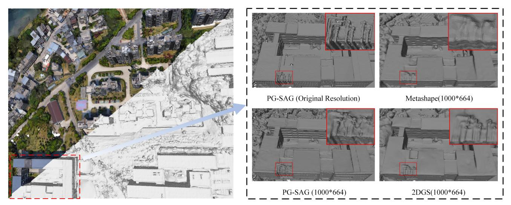
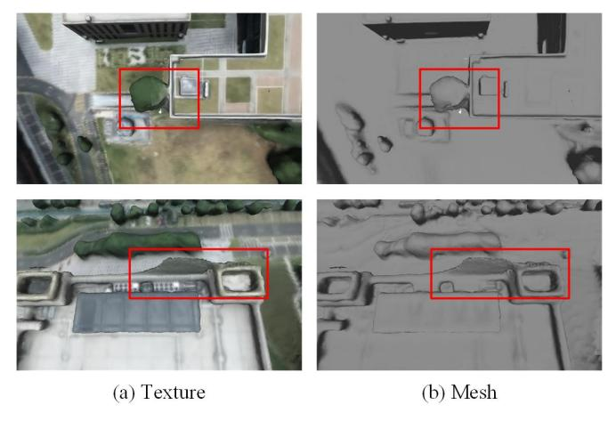
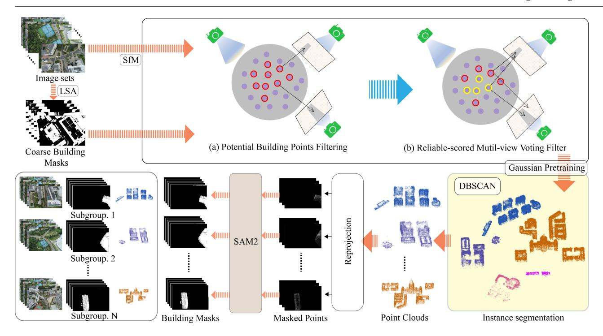
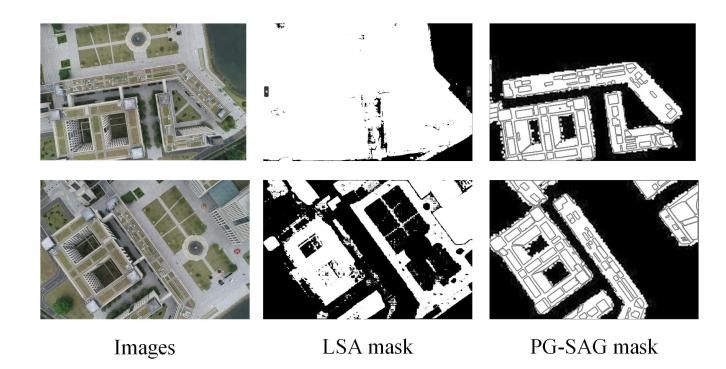
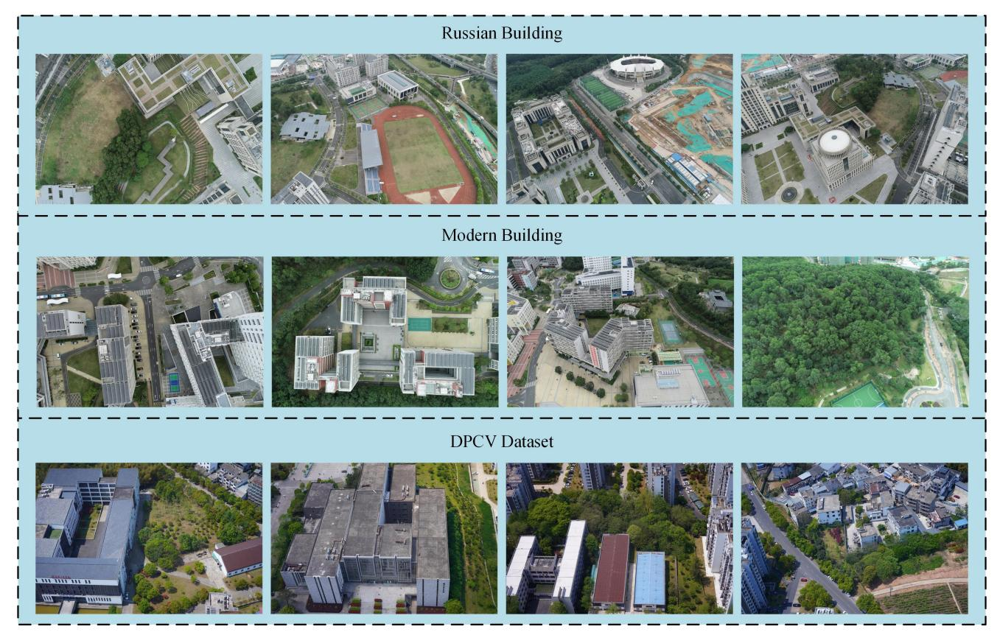
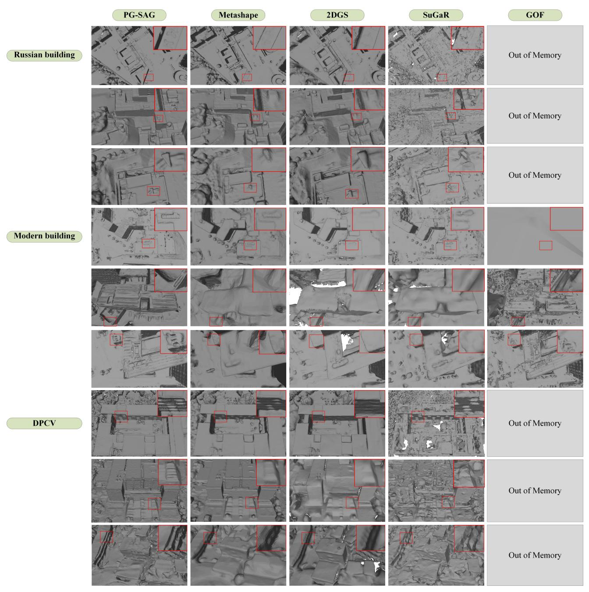
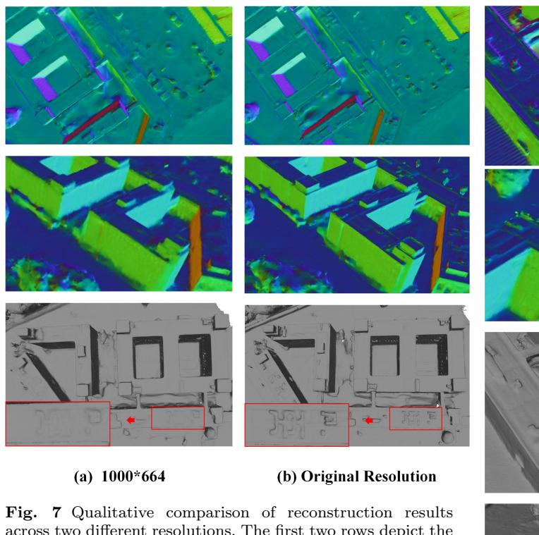
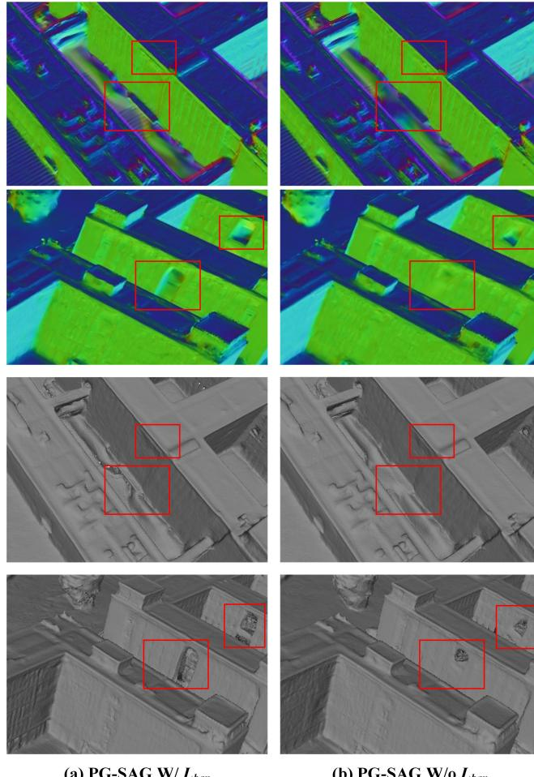
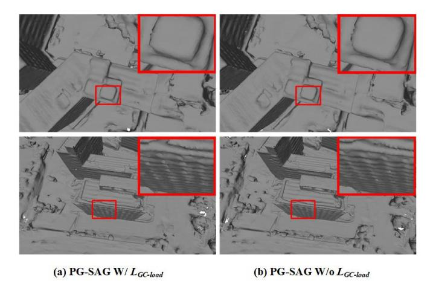

# PG-SAG: Parallel Gaussian Splatting for Fine-Grained Large-Scale Urban Buildings Reconstruction via Semantic-Aware Grouping

Tengfei Wang1 · Xin Wang1,\* · Yongmao Hou1 · Yiwei Xu1 · Wendi Zhang1 · Zongqian Zhan1

Received: date / Accepted: date

Abstract 3D Gaussian Splatting (3DGS) has emerged as a transformative method in the field of real-time novel synthesis. Based on 3DGS, recent advancements cope with large-scale scenes via spatial-based partition strategy to reduce video memory and optimization time costs. In this work, we introduce a parallel Gaussian splatting method, termed PG-SAG, which fully exploits semantic cues for both partitioning and Gaussian kernel optimization, enabling fine-grained building surface reconstruction of large-scale urban areas without downsampling the original image resolution. First, the Cross-modal model - Language Segment Anything is leveraged to segment building masks. Then, the segmented building regions is grouped into sub-regions according to the visibility check across registered images. The Gaussian kernels for these sub-regions are optimized in parallel with masked pixels. In addition, the normal loss is re-formulated for the detected edges of masks to alleviate the ambiguities in normal vectors on edges. Finally, to improve the optimization of 3D Gaussians, we introduce a gradient-constrained balance-load loss that accounts for the complexity of the corresponding scenes, effectively minimizing the thread waiting time in the pixel-parallel rendering stage as well as the reconstruction lost. Extensive experiments are tested on various urban datasets, the results demonstrated the superior performance of our PG-SAG on building surface reconstruction, compared to several stateof-the-art 3DGS-based methods. Project Web: [https:](https://github.com/TFWang-9527/PG-SAG) [//github.com/TFWang-9527/PG-SAG](https://github.com/TFWang-9527/PG-SAG).

SI on Sino-German P&RS cooperation: Application, Methodology, Reviews

Keywords Large-scale Urban Reconstruction · 3D Gaussian Splatting (3DGS) · Building · Mesh Generation

# 1 Introduction

Large-scale urban scene surface reconstruction has been extensively studied across various fields, such as photogrammetry [Huang et al.](#page-12-0) [\(2022\)](#page-12-0); [Gao et al.](#page-12-1) [\(2021\)](#page-12-1); [Adam et al.](#page-11-0) [\(2023\)](#page-11-0); [Buyukdemircioglu et al.](#page-11-1) [\(2018\)](#page-11-1), computer vision [Faugeras et al.](#page-12-2) [\(1998\)](#page-12-2); [Laveau et al.](#page-12-3) [\(1995\)](#page-12-3); [Vandekerckhove et al.](#page-14-0) [\(1998\)](#page-14-0). Among these studies, building reconstruction is a key focus and gains a wide range of applications, especially in road planning [Leotta et al.](#page-12-4) [\(2019\)](#page-12-4) and digital city [Schrotter and](#page-13-0) [H¨urzeler](#page-13-0) [\(2020\)](#page-13-0). Traditional approaches generally involve a series of complex processes, including structure from motion (SfM) [Ozye¸sil et al.](#page-13-1) ¨ [\(2017\)](#page-13-1), stereo dense matching [Stathopoulou and Remondino](#page-13-2) [\(2023\)](#page-13-2) and multiple-view fusion [Sankaranarayanan and Chel](#page-13-3)[lappa](#page-13-3) [\(2008\)](#page-13-3), dense point cloud generation and filtering [Zhang et al.](#page-14-1) [\(2018\)](#page-14-1), mesh generation [Newman and](#page-13-4) [Yi](#page-13-4) [\(2006\)](#page-13-4); [Kazhdan and Hoppe](#page-12-5) [\(2013\)](#page-12-5); [Peters et al.](#page-13-5) [\(2022\)](#page-13-5). In the last few years, NeRF [Mildenhall et al.](#page-13-6) [\(2021\)](#page-13-6) have emerged as a promising implicit 3D scene representation, and its variants [Turki et al.](#page-13-7) [\(2022\)](#page-13-7); [Tan](#page-13-8)[cik et al.](#page-13-8) [\(2022\)](#page-13-8); [Xu et al.](#page-14-2) [\(2024\)](#page-14-2) have shown potential in large-scale scene novel view synthesis. The relevant NeRF-based surface reconstruction works [Wang et al.](#page-14-3) [\(2021,](#page-14-3) [2023\)](#page-14-4); [Yariv et al.](#page-14-5) [\(2021\)](#page-14-5); [Fu et al.](#page-12-6) [\(2022\)](#page-12-6) have also exhibited notable capabilities for object-level reconstruction; however, their prohibitive training costs limit their practical applicability to larger-scale scenes. More recently, newly developed 3DGS methods [Kerbl](#page-12-7) [et al.](#page-12-7) [\(2023\)](#page-12-7) have shown exceptional training efficiency

\* Corresponding author( E-mail: xwang@sgg.whu.edu.cn)

1School of Geodesy and Geomatics, Wuhan University, 129 Luoyu Road, Wuhan 430072, People's Republic of China

Fig. 1 Overall surface reconstruction results on the DPCV dataset, along with comparisons to other methods and our method using high-resolution images.Our PG-SAG with original resolution generates the most detailed meshes. Moreover, comparing to others of lower resolution, we again clearly perform better.

and high fidelity in novel view synthesis tasks, sparking a wave of advancements in surface reconstruction leveraging 3DGS principles [Mihajlovic et al.](#page-13-9) [\(2024\)](#page-13-9); [Kerbl](#page-12-7) [et al.](#page-12-7) [\(2023\)](#page-12-7); [Li et al.](#page-12-8) [\(2024\)](#page-12-8).

Fig. 2 Incorrect building meshes using PGS[RChen et al.](#page-11-2) [\(2024a\)](#page-11-2). Due to the interference from the background (nonbuilding areas) on the foreground (building areas) when optimizing 3D Gaussians, erroneous reconstruction of building edges are produced, as shown by the highlighted details within the red boxes.

Recent developments in 3DGS-based methods have demonstrated significant potential for high-quality surface reconstruction [Yu et al.](#page-14-6) [\(2024\)](#page-14-6); [Gu´edon and Lep](#page-12-9)[etit](#page-12-9) [\(2024\)](#page-12-9); [Chen et al.](#page-11-2) [\(2024a\)](#page-11-2); [Wolf et al.](#page-14-7) [\(2024\)](#page-14-7); [Wu et al.](#page-14-8) [\(2024\)](#page-14-8). However, most of the methods remain confined to object-centric targets and small-scale scenes. When extended to large-scale urban scenes, several challenges are posed: First, limited computational resources. Synchronously optimizing all Gaussian kernels for large-scale urban scenes is typically impractical due to computational resource constraints [Xiong](#page-14-9) [et al.](#page-14-9) [\(2024a\)](#page-14-9). For instance, a single RTX 4090 GPU with 24GB can handle approximately 8.25 million 3D Gaussians, yet even a relatively small dataset like Garden [Barron et al.](#page-11-3) [\(2022\)](#page-11-3), covering less than 100m2 already needs about 5.8 million 3D Guassians for highfidelity rendering. One commonly adopted solution is to partition the large scene into multiple sub-blocks of smaller regions based on spatial locations, as seen in methods like Citygaussian [Liu et al.](#page-12-10) [\(2024a\)](#page-12-10), Vastgaussian [Lin et al.](#page-12-11) [\(2024\)](#page-12-11), and Gigagaussian [Chen et al.](#page-11-4) [\(2024b\)](#page-11-4), while simultaneously downsampling input images to accommodate memory requirement. However, as Fig[.1](#page-1-0) shows, the use of low-resolution images can hinder the precise pixel guidance required to optimize Gaussians, ultimately resulting in inaccurate reconstruction of the building surface. Second, fine-grained building reconstruction. Buildings are among the most complex and highly scrutinized components in urban environments, making efficient fine-grained surface modeling particularly challenging. As Fig[.2](#page-1-1) illustrates, the amalgamation and ambiguity of foreground (building) and background (non-building) during 3D Gaussian optimization can introduce noise, especially along edges [Wang et al.](#page-14-10) [\(2024a\)](#page-14-10), resulting in interference from nonbuilding elements. This effect contributes to instability during training, particularly without sufficient iterations, and is even more pronounced in large-scale urban scenes.

To address these challenges, we propose PG-SAG, the approach leveraging 3DGS for fine-grained building reconstruction within large-scale urban scenes. More specifically, to manage computational constraints, unlike [Liu et al.](#page-12-10) [\(2024a\)](#page-12-10); [Chen et al.](#page-11-4) [\(2024b\)](#page-11-4); [Lin et al.](#page-12-11) [\(2024\)](#page-12-11), we introduce a semantic-aware grouping method to partition the large-scale urban scene. Coarse masks of buildings are generated using Language Segment Anything (LSA) [Medeiros](#page-13-10) [\(October, 2024\)](#page-13-10), followed by a reliability-scored multi-view voting filter that refines these masks to ensure multi-view consistency. The visibility among cameras and the correlation between cameras and sparse points are explored to group the building area of the entire scene into sub-groups,each encompassing its associated sparse points, cameras, and masks. Each sub-group can be independently optimized in parallel. Notably, due to the use of masked pixels, our PG-SAG accepts original high-resolution images directly without downsampling. In addition, the ambiguity of normal vectors along the building boundaries is addressed, recognizing that the referenced normal vector is not a real ground truth at these boundaries. Thus, based on the boundaries derived from the detected masks, we reformulate the normal loss [Chen](#page-11-2) [et al.](#page-11-2) [\(2024a\)](#page-11-2) into a boundary-aware normal loss, applying a balanced weight to the normal loss at the boundaries of the buildings. Lastly, to further reduce the training time caused by thread waiting during pixelparallel rendering while minimizing the reconstruction lost, for each sub-group, we integrate a gradient-constrained balance-load loss, which take the complexity of the scenes into account. The more complexity scene typically yields more gradient information and needs a higher number of 3DGS for alpha blending, therefore, the balance load [Wang et al.](#page-14-11) [\(2024b\)](#page-14-11) is weighted by the constraints of gradient information.

In summary, our contributions are as follows:

- To the best of our knowledge, our PG-SAG is the among the first 3DGS-based methods dedicated to fine-grained building reconstruction for large-scale urban areas.
- We fully exploit the sematic cues for the partition of large-scale urban scenes and 3DGS optimization. Namely, a semantic-aware group partitioning strategy is proposed to address the limited computational resources, and the masked pixels are employed for 3D Gaussian optimization.
- We present two improved losses, i.e., boundary-aware normal vector loss and gradient-constrained balanceload loss, to efficiently generate fine-grained building surface meshes of large-scale urban area.

# 2 Related work

#### 2.1 Multi-view Surface Reconstruction

Over the last decades, multi-view surface reconstruction has been a classical and fundamental topic in computer vision, computer graphics, and photogrammetr[yXu and](#page-14-12) [Zhang](#page-14-12) [\(2022\)](#page-14-12); [Wang and Gan](#page-14-13) [\(2024\)](#page-14-13). Traditional methods take the results of SfM as input, followed by multiview stereo (MVS) methods that include voxel-based [Romanoni et al.](#page-13-11) [\(2017\)](#page-13-11), surface evolution-based [Heise](#page-12-12) [et al.](#page-12-12) [\(2015\)](#page-12-12), depth-map-based approaches [Heise et al.](#page-12-12) [\(2015\)](#page-12-12). These methods typically involve complex processes and are susceptible to matching error[sLocher et al.](#page-13-12) [\(2016\)](#page-13-12). Subsequently, learning-based techniques have been explored to improve the performance of MVS and reconstructio[nHuang et al.](#page-12-13) [\(2024b\)](#page-12-13); [Yao et al.](#page-14-14) [\(2018\)](#page-14-14); However, the generalization might be limited when images from different domain are use[dChang et al.](#page-11-5) [\(2022\)](#page-11-5).

NeRF and its variants [Fridovich-Keil et al.](#page-12-14) [\(2022\)](#page-12-14); [M¨uller et al.](#page-13-13) [\(2022\)](#page-13-13); [Barron et al.](#page-11-6) [\(2021\)](#page-11-6); [Martin-Brualla](#page-13-14) [et al.](#page-13-14) [\(2021\)](#page-13-14); [Barron et al.](#page-11-3) [\(2022\)](#page-11-3); [Mildenhall et al.](#page-13-6) [\(2021\)](#page-13-6); [Zhang et al.](#page-14-15) [\(2020\)](#page-14-15) have been presented for novel view synthesis with an implicit encoding for the 3D scene, offering an alternative for surface reconstruction. NeuS [Wang et al.](#page-14-3) [\(2021\)](#page-14-3) and VolSDF [Yariv et al.](#page-14-5) [\(2021\)](#page-14-5) reformulate the inherent rendering volume as signed distance field (SDF) to represent object surfaces and appearances, enabling smooth and accurate reconstructions of object-centric scenes. Neuralangelo [Li et al.](#page-12-15) [\(2023\)](#page-12-15) further advances surface reconstruction by integrating the representational power of multiresolution 3D hash grids with neural surface rendering. Despite their success, these methods are predominantly suitable for small-scale scenes, and the substantial computational overhead associated with volumetric rendering poses challenges for scaling to large-scale scene reconstructions.

By leveraging 3D Gaussian primitives to explicitly model the appearance and geometry, 3DGS presents a considerable promise for surface reconstruction. One of the pioneering works, SuGaR [Gu´edon and Lepetit](#page-12-9) [\(2024\)](#page-12-9), generates meshes by constraining Gaussian spheres to align with surface features. 2DGS [Huang et al.](#page-12-16) [\(2024a\)](#page-12-16) simplifies 3D Gaussians into directional 2D disks, improving both the geometric accuracy of the central target surface and computational efficiency. GOF [Yu et al.](#page-14-6) [\(2024\)](#page-14-6) investigate the gaussian opacity fields, enhancing scene completeness in reconstruction compared to 2D Gaussian Splatting (2DGS). PGSR [Chen et al.](#page-11-2) [\(2024a\)](#page-11-2) enhances overall scene reconstruction accuracy by incorporating geometric and appearance consistency across multiple views. In addition, [Wu et al.](#page-14-8) [\(2024\)](#page-14-8) trains

neural implicit networks to approximate moving least squares (MLS) function in local regions, facilitating more accurate SDF from Gaussian spheres for mesh extraction.Unlike prior methods that directly extract scene geometry from Gaussian properties. GS2Mesh [Wolf et al.](#page-14-7) [\(2024\)](#page-14-7) derives geometry using a pre-trained stereo-matching model, mitigating the negative influence of noise originated from the individual depth profiles. While Gaussianbased methods have shown significant advantages in reconstruction speed and accuracy, their high memory demands limit the scalability for large-scale scene reconstruction[sLin et al.](#page-12-11) [\(2024\)](#page-12-11); [Xiong et al.](#page-14-9) [\(2024a\)](#page-14-9).

#### 2.2 Large Scale Scene Reconstruction

Comparing to object-centric or small-scale scenes, largescale scene reconstruction normally needs to take into account time efficiency and memory constraints, where partitioning strategy and parallel processing techniques play crucial roles [Agarwal et al.](#page-11-7) [\(2011\)](#page-11-7); [Furukawa et al.](#page-12-17) [\(2010\)](#page-12-17). Two popular traditional approaches have laid the groundwork in this area: Building Rome in a Day [Agarwal et al.](#page-11-7) [\(2011\)](#page-11-7), presented a novel distributed pipeline for parallel image matching and SfM, allowing the reconstruction of city-scale scenes. Similarly, [Fu](#page-12-17)[rukawa et al.](#page-12-17) [\(2010\)](#page-12-17) decompose image collections into overlapping subsets that are processed in parallel to generate dense point clouds. These works enlighten subsequent large-scale scene reconstruction based on NeRF and 3DGS

Currently, large-scale NeRF and 3DGS focus primarily on novel view rendering tasks. For example, Block-NeRF [Tancik et al.](#page-13-8) [\(2022\)](#page-13-8) and Mega-NeRF [Turki et al.](#page-13-7) [\(2022\)](#page-13-7) adopt a divide-and-conquer strategy by partitioning scenes into smaller blocks, with each block trained on a separate NeRF model. Grid-NeRF [Xu et al.](#page-14-16) [\(2023\)](#page-14-16) further integrates this strategy with feature grids, achieving notable improvements in rendering quality. In the domain of 3DGS, VastGaussian [Lin et al.](#page-12-11) [\(2024\)](#page-12-11) employs a progressive partitioning and decoupled appearance modeling, which can reduce visual discrepancies during rendering. CityGaussian [Liu et al.](#page-12-10) [\(2024a\)](#page-12-10) partitions the scene into blocks and introduces a Level-of-Detail (LoD) strategy, enabling fast rendering across multiple scales. In the context of large-scale scene 3D reconstruction, two concurrent related works explore 3DGS-based approaches. CityGaussianV2 [Liu et al.](#page-13-15) [\(2024b\)](#page-13-15) advances CityGaussian based on 2DGS, implementing a decomposed-gradient-based densification and depth regression for eliminating floaters and expediting convergence. GigaGS [Chen et al.](#page-11-4) [\(2024b\)](#page-11-4) concentrates on large scene surface reconstruction, it divides the scene

based on mutual visibility of spatial regions, and multiview photometric and geometric consistency is explored to improve surface quality.

#### 3 Preliminaries

In our work, the 3DGS framework [Kerbl et al.](#page-12-7) [\(2023\)](#page-12-7) is applied for optimizing 3D scene representation, leveraging the relevant unbiased depth rendering to estimate depth maps and obtain surface normal maps. In addition, to achieve fine-grained building surface reconstruction, we rely on the language segment-anything model (LSA) [Medeiros](#page-13-10) [\(October, 2024\)](#page-13-10) to mask building regions. To make this paper more self-contained, we shall provide an overview of the significance of these techniques as basics.

# 3.1 3DGS and Unbiased Depth Rendering

3DGS. 3DGS represents the 3D scene using a set of Gaussian spheres with multiple attributes, including spatial position, anisotropic variance, multi-order spherical harmonics to represent color, and transparency. For rendering, each 3D Gaussian sphere is transformed into a 2D Gaussian based on the viewing direction of each camera and then projected onto different image tiles. The 2D Gaussians are subsequently sorted and α-blended to synthesis the output image:

$$C = \sum_{i \in M} \mathbf{c}_i \alpha_i T_j, T_j = \prod_{j=1}^{i-1} (1 - \alpha_j)$$
 (1)

all the encoded parameters are optimized by comparing to the referenced posed images using differentiable rendering.

Unbiased Depth Rendering. Inspired by 2DGS [Huang et al.](#page-12-16) [\(2024a\)](#page-12-16) and SuGaR [Gu´edon and Lepetit](#page-12-9) [\(2024\)](#page-12-9), to approximate the true surface, PGSR [Chen](#page-11-2) [et al.](#page-11-2) [\(2024a\)](#page-11-2) flattens the 3D Gaussian ellipsoids into planes via minimizing the aligned scale factors, proposing an unbiased depth rendering method.The final normal map with current viewpoint is estimated via αblended:

$$\mathbf{N} = \sum_{i \in M} \mathbf{R}_c n_i \alpha_i T_i \tag{2}$$

where Rc denotes the rotation from world system to the camera system, ni is the normal vector of the i-th 3D Gaussian that passes through the ray which exhibits ambiguity at edges. The distance from the camera center to the flattened Gaussian plane is also rendered via α-blended:

$$\mathbf{D} = \sum_{i \in M} d_i \alpha_i T_i \tag{3}$$

in which, di = (RT c (µi −TC ))RT c n T i is the distance from the camera center to the i-th 3D Gaussian. Given the normal map and distances, PGSR calculates the corresponding depth map via the intersections between the rays and the planes, formulating depth that can precisely reflect the actual surfaces:

$$\mathfrak{D}(p) = \frac{\mathbf{D}}{\mathbf{N}(p)K^{-1}\tilde{p}} \tag{4}$$

where p is the 2D position on the image, ˜p indicates the homogeneous coordinate of p, and K is the intrinsic matrix.

#### 3.2 Language Segment Anything

In general, the LSA integrates two components of advanced models, GroundingDINO [Liu et al.](#page-12-18) [\(2023\)](#page-12-18) and SAM2 [Ravi et al.](#page-13-16) [\(2024\)](#page-13-16). GroundingDINO is an openset object detector that merges language and vision models, enabling object recognition within an image based on language prompts. SAM2, a versatile image and video segmentation model, supports multiple prompting and interaction modes. Driven by both visual and linguistic modalities, LSA yields superior segmentation performance that utilizes language prompts to segment images effectively, which enables efficient large-scale scene reconstruction with precise semantic segmentation.

# 4 Method

Large-scale scene reconstruction presents several key challenges, including limited computational resources and the need for fine-grained building surface mesh generation. In this paper, we introduce PG-SAG, a novel approach that leverages 3D Gaussian Spheres to achieve detailed building reconstruction in large-scale urban scenes. Section [4.1](#page-4-0) elaborates the semantic-aware grouping approach, which partitions buildings with contextually relevant segmentation. Section [4.2](#page-6-0) details a boundaryaware normal vector loss to reduce edge ambiguities, and Section [4.3](#page-6-1) introduces a gradient-constrained balancedload loss. Finally, we explain the process of extracting and merging meshes.

#### 4.1 Semantic-Aware Data Grouping

We begin by apply the pre-trained LSA model to perform an initial, coarse segmentation of buildings and other objects within an image. Then, we refine these masks using a reliability-scored multi-view voting filter, enhancing segmentation accuracy and consistency across multiple views. Finally, we group the building regions of the entire scene into sub-groups based on camera visibility and the correlation between cameras and sparse points; each sub-group encompassing its associated sparse points, cameras, and refined masks. The pipeline of our semantic-aware data grouping strategy is shown in Fig[.3.](#page-5-0)

Initial Segmentation. To generate initial building masks, we use LSA's batch processing mode to segment multiple images synchronously, with text prompt "buildings" to predict the mask for building areas. At this stage, a relatively low promote threshold t is selected to capture all building content as much as possible within the mask. Non-building areas are designated as "Background". Additionally, SAM2 [Ravi et al.](#page-13-16) [\(2024\)](#page-13-16) is applied to obtain a fine-grained segmentation mask for the entire image, covering both building and non-building regions.

Let I denote the input image, and pbuilding represent the text prompt "buildings". The initial building mask Mbuilding is derived by setting a threshold t:

$$M_{\text{building}} = \text{LSA}(I, p_{\text{building}}, t)$$
 (5)

where a small value t is typically chosen to ensure that the mask Mbuilding includes all regions potentially associated with buildings.

#### Reliability-scored Multi-view Voting Filter.

To address initial coarse masks that stemmed from extraneous and false predicted building pixels, we propose a heuristic reliability-scored multi-view voting filter to refine the masks and achieve consistent, precise building masks across multiple views. First, the SfM sparse points are re-projected to each coarsely masked image, and for each point, we then count the frequency it locates in a masked region across all images. Point pi with the frequency value greater than zero is identified as a potential building point pp:

$${p_p = p_i \mid \sum_{j=1}^{N} \mathbb{I}(p_i \in M_j) > 0}$$
 (6)

where, N is the number of input images, Mj represents the mask for the j-th image, I(pi ∈ Mj ) is an indicator function that returns 1 if pi lies within the masked region Mj of the j-th image, and 0, otherwise.

For each potential building point, we calculate an "unreliability score (US)", defined as the number of

Fig. 3 Semantic-Aware Data Grouping Pipeline. The top-left part shows the coarse masks of buildings within the input images using LSA. The top-right parts illustrates a multi-view voting filtering, only points with high confidence, appearing in multiple building masks, are retained. The bottom part, from right to left, involves the usage of pre-trained Gaussian point-assisted point cloud instance segmentation, followed by reprojection to obtain mask points. In the final step, SAM2 is applied to extract refine building masks.

times the point appears in the image but outside the corresponding mask. A potential building point is considered as a reliable building point if its US is below a predefined tolerance (τ ), which is empirically selected depending on the degree of image overlapping information.

$$US(p_p) = \sum_{j=1}^{N} \mathbb{I}(p_p \in \text{Image}_j \setminus M_j)$$
 (7)

where Imagej \ Mj represents regions outside the mask Mj in the j-th image, I is an indicator function that equals 1 if pi lies within Imagej \ Mj , and 0 otherwise.

After determining reliable building points, we extend them using pre-trained Gaussian points which are projected onto the fine-grained segmentation mask as point-based queries. Then, based on SAM2, we generate a new refined mask with accurate building boundaries RBM, as well as the edges of the internal building object. Some segmentation comparison are shown in the Fig[.4.](#page-5-1)

Building Grouping. We use the DBSCAN algorithm [Ester et al.](#page-12-19) [\(1996\)](#page-12-19) to group building regions based on geographic proximity, clustering nearby buildings into subgroups that each contain the corresponding sparse point cloud, original images, and already refined

Fig. 4 Comparison of different segmentation methods. LSA (lang-segment-anything) confuses the ground with buildings, resulting in inaccurate masks. PG-SAG can not only obtain complete building masks, but also obtain fine boundaries.

masks (see Fig[.6](#page-9-0) for an example). These subgroups are then independently optimized in parallel with the original image resolution. For non-building objects, we use a similar geographic partitioning approach, as in Vast-Gaussian, to divide areas outside the building masks into geographic blocks.

# 4.2 Boundary-Aware Normal Loss

The original 3DGS optimizes the Gaussian kernels via photometric image reconstruction, but it often falls into local overfitting minima, causing 3D Gaussian to misalign with the actual surface. To address this, the PGSR [Chen et al.](#page-11-2) [\(2024a\)](#page-11-2) extends 3DGS by incorporating the Local Plane Assumption, which enforces local consistency in depth and normals by approximating each pixel and its neighbors as a planar region. This assumption handles non-local planarity at the edges through the gradient-base regularization.

However, as Fig[.8](#page-10-0) shows, the Local Plane Assumption struggles in fine-grained building surfaces. While effective on flat areas, it deteriorates near building edges, where sharp depth changes and uncertain normal vectors occur (see equation [\(2\)](#page-3-0)). Thus, we leverage the refined masks to extract more accurate building masked boundaries, noted as MB, and propose a boundaryaware normal loss. Specifically, in computing the loss between the normals derived from depth map and rendered normals, we apply adaptive weighting at masked boundaries to reduce the ambiguous impact of normal loss.

Let ndepth denote the normal vector computed from the depth map using four neighboring points, and nrendered denote the normal vector obtained from the rendering process. The boundary-aware normal loss Lban is defined as:

$$\mathcal{L}_{\text{ban}} = \sum_{i} w_i \|\mathbf{n}_{\text{depth},i} - \mathbf{n}_{\text{rendered},i}\|^2$$
 (8)

where wi is a weight factor that varies depending on whether pixel i lies on the building boundary. Specifically, for pixel(i) ∈ RBM, wi is assigned a small value OF 0.1 to reduce the influence of normal ambiguity in these regions/ Otherwise, wi = 1.

# 4.3 Gradient-constrained Balance-load Loss

The 3DGS performs point-based rendering, where each pixel's color is calculated in parallel through Gaussian rasterization, with each pixel mapped to a distinct GPU thread. However, load imbalances arise due to different number of Gaussians across pixels and limits the efficiency. To further reduce training time within each subgroup by minimizing thread idle periods during parallel pixel rendering, referring to AdR-Gaussian [Wang](#page-14-11) [et al.](#page-14-11) [\(2024b\)](#page-14-11), the balance-load loss is advertised. Basically, this loss constrains the number of Gaussians per pixel, promoting consistent workload distribution across threads. Nonetheless, directly enforcing this loss risks compromising reconstruction fidelity, as more intricate scenes typically generate additional gradient information and necessitate a higher density of 3D Gaussians and Splatting operation to support better α-blending.

Therefore, we propose a Gradient-Constrained Load Balancing Loss that accounts for scene complexity to balance Gaussian distribution while preserving reconstruction quality. This approach aims to expedite training by adapting the number of Gaussian spheres according to scene complexity. The Gradient-Constrained Load Balancing Loss LGC-load is defined as follows:

$$\mathcal{L}_{GC\text{-load}} = std_{i \in HW}(g_i/w_i), \tag{9}$$

where wi is a gradient-dependent weight ∇I for pixel i, gi denotes the number of Gaussian spheres contributing to pixel i, std represents the standard deviation over all pixels the grid of H × W. Higher gradients indicate a more complex scene, which allows for a higher variance in the number of Gaussian spheres to reduce reconstruction loss.

For 3DGS optimization, we adopt the multi-view consistency geometric loss and photometric consistency loss from PGSR, denoted as Lmvgeo, Lmvrgb, and the flattening 3D Gaussian loss Ls. But, only the refined building masks RBM are involved in these losses. In addition, our boundary-aware normal loss Lban. is also incorporated. We define the geometric loss LPG-geo as follows:

$$\mathcal{L}_{\text{PG-geo}} = \mathcal{L}_{\text{rgb}} + \lambda_1 \mathcal{L}_{\text{mvgeo}} + \lambda_2 \mathcal{L}_{\text{mvrgb}} + \lambda_3 \mathcal{L}_s + \lambda_4 \mathcal{L}_{\text{ban}}$$
(10)

Then, the overall loss L is defined as:

$$\mathcal{L} = (1 - \lambda)\mathcal{L}_{PG-geo} + \lambda\mathcal{L}_{GC-load}$$
 (11)

where the weighting coefficients are set as follows: λ = 0.41, λ1 = 0.05, λ2 = 0.2, λ3 = 100, and λ4 = 0.01.

## 4.4 Mesh Extraction and Merge

For the buildings of large-scale scene, by incorporating with our PG-SAG, a parallel group-based training solution is adopted to efficiently facilitate the building mesh generation from the optimized Gaussians. While the background regions are trained using a partitionbased approach similar to vast-Gaussian. Subsequently, we generate depth maps for both buildings and background from multiple perspectives. For overlapping regions within the depth maps, mean fusion is applied, followed by mesh extraction from the depth map using the Truncated Signed Distance Function (TSDF) method [Zeng et al.](#page-14-17) [\(2017\)](#page-14-17).

#### 5 Experiments

## 5.1 Experimental Setup

Datasets and Metrics To validate the performance of our PG-SAG, particularly on the buildings in largescale scenes, the GauU-Scene dataset [Xiong et al.](#page-14-18) [\(2024b\)](#page-14-18) is employed, which provides ground-truth point clouds for quantitative comparison. Specifically, we select the Russian Building and Modern Building scenes for both geometric evaluation and qualitative analysis. These two scenes consist of 713 and 563 images, respectively, and feature a variety of building types with a resolution of 5468 × 3636. Additionally, we conduct further qualitative analysis using the self-generated DPCV dataset collected from Huangshan China, which comprises 735 images with a resolution of 4745 × 3164. The flight height is 120 meters, covering an area of 1.7×1.7 km2 . The sample images are shown in Fig[.5](#page-8-0)

For the geometric evaluation metrics of the mesh, we follow the approach outlined in [Knapitsch et al.](#page-12-20) [\(2017\)](#page-12-20); [Mazzacca et al.](#page-13-17) [\(2023\)](#page-13-17). First, surface sampling is performed on the reconstructed mesh, followed by the calculation of the corresponding F1 score, precision, and recall. To ensure a fair comparison and account for memory limitations, the maximum edge length of all images is downsampled to 1000 pixels.

Baselines and Implementation. We compare our method with several state-of-the-art geometric reconstruction methods, including the 3DGS-based methods GOF, 2DGS, and SuGaR, as well as the advanced traditional photogrammetry software Metashap[eLLC](#page-13-18) [\(2022\)](#page-13-18). All methods, including ours, are executed on four RTX 4090 GPUs. For the data partitioning, following the approach of VastGaussian, all datasets are divided into a 3×3 grids. In the qualitative evaluation, each block is trained for 30,000 iterations, with sparse point clouds and camera poses generated using COLMAP [Schon](#page-13-19)[berger and Frahm](#page-13-19) [\(2016\)](#page-13-19), and default parameters are used for all methods. In the quantitative evaluation, we align with the settings of CityGaussianV2 for comparison. While CityGaussianV2 uses 60,000 iterations for training, we maintain a training duration of 30,000 iterations due to the advantages of our data partitioning strategy.

# 5.2 Comparison with SOTA Methods

Quantitative evaluation. Table[.1](#page-7-0) compares our method to the state-of-the-art methods regarding to the evaluation metrics of Precision, Recall, and F1 score on the GauU-Scene dataset (including Russian Building and Modern Building). For quantitative evaluation, the

Table 1 Performance Comparison on GauU-Scene.The best results are highlighed in bold

| Methods   | Precision ↑ | Recall ↑ | F1 ↑  |
|-----------|-------------|----------|-------|
| GOF       | 0.370       | 0.290    | 0.374 |
| 2DGS      | 0.553       | 0.446    | 0.491 |
| SuGaR     | 0.570       | 0.292    | 0.377 |
| Metashape | 0.604       | 0.368    | 0.458 |
| PG-SAG    | 0.671       | 0.467    | 0.551 |

surface sampling point density and the downsampling density of the ground truth point cloud are both set to 0.35m, with a distance threshold of 0.6m. It can be seen that our PG-SAG significantly outperforms the other methods (including the commercial package - Metashape) on obtaining the best results of all metrics, meaning more accurate meshes are generated by employing our refined building masks, improved boundary loss and gradient constraint balance loss. The other methods have receded results, which might be stemmed from the noise of background and inaccurate normals of boundaries [Gu´edon and Lepetit](#page-12-9) [\(2024\)](#page-12-9); [Huang et al.](#page-12-16) [\(2024a\)](#page-12-16). This evaluation demonstrates the superiority of our PG-SAG in building mesh reconstruction of large-scale scene.

Qualitative evaluation. Additionally, Fig[.6](#page-9-0) provides a detailed visual comparison of mesh reconstruction across various methods, including ours, Metashape, 2DGS, SuGaR, and GOF, applied to three diverse datasets: Russian building, Modern building, and DPCV. In general, the results explicitly show that our approach is much superior to the alternatives in terms of boundary preservation and overall reconstruction fidelity. In particular, more findings are:

For the Russian building dataset, our method effectively captures intricate architectural details, such as sharp corners and smooth facade transitions, which are either blurred or distorted shown by all the other methods. Notably, the GOF method fails entirely due to memory limitations. While Metashape and 2DGS produce smoother but less precise reconstructions, SuGaR introduces significant distortions and noise, particularly in finer details.

In the Modern building dataset, the propsoed PG-SAG again exhibits superior reconstruction results, especially in preserving the geometric integrity of structural boundaries and fine-grained features such as roof contours. In contrast, the compared methods introduce various artifacts, including unnatural bulges and interruptions in edge continuity. Furthermore, some methods fail to delineate key structural regions accurately, highlighting the robustness of our method in capturing complex geometries.

Fig. 5 Sample images from Russian Building, Modern Building and DPCV Dataset.

For the DPCV dataset that presents extra challenges due to its dense and complex building layouts (as seen in Fig. [5\)](#page-8-0), our method excels in managing overlapping structures while maintaining boundary clarity. The other methods degenerate on pronounced boundary distortions, incomplete reconstructions, or overly smoothed outputs that compromise detail preservation. On the contrary, our results faithfully preserve both large-scale structural relationships and fine-grained details, ensuring a more accurate representation of the scene.

The qualitative and quantitative findings presented underscore the strengths of our method in delivering high-fidelity reconstructions with exceptional boundary preservation and structural accuracy. Notably, our approach demonstrates outstanding performance in challenging scenarios where alternative methods often fail or yield suboptimal outcomes.

#### 5.3 Ablation Study

To assess various aspects of the proposed PG-SAG, we conducted several ablation experiments on the Russian Building dataset, including the test of using input images with various resolution, the effect of the proposed

improved boundary-aware normal loss and gradientconstrained balance loss.

Resolutions. As shown in Fig[.7,](#page-10-1) comparing to the results that from 1000\*664 resoultion images (this is typically applied in many 3DGS-based methods, such as GO[FYu et al.](#page-14-6) [\(2024\)](#page-14-6), VastGaussian [Lin et al.](#page-12-11) [\(2024\)](#page-12-11)), using high-resolution can generally yiled more fine-grained building surface, as using more information from the images is supported to provide more guidance during optimization. Thanks to the usage of refined building masks, we only need to compute a subset of pixels in each iteration which make the original resolution image accepted by our method. Furthermore, the geographical location of each group effectively controls the number and spatial distribution of Gaussian spheres. This enables our method to perform 3D reconstruction on highresolution images, a capability that previous large-scale reconstruction methods could not tolerate.

Boundary-Aware Normal Loss. Fig[.8](#page-10-0) illustrates the qualitative comparison of results by swithing on/off the proposed Lban(Boundary-Aware Normal Loss). The first two rows present normal maps of the building surfaces from different perspectives, while the last two rows display the reconstructed mesh results.

Fig. 6 Comparison of mesh reconstruction results across the Russian building, Modern building, and DPCV datasets with various methods. Notably, the GOF method fails to extract meshes for the Russian building and DPCV datasets due to memory limitations. For clarity, each figure includes a zoomed-in view enclosed within the red bounding box, displayed in the upper-right corner, to provide a more detailed view of fine-grained reconstruction quality.

In boundary regions, due to the similarity in surface colors and textures of buildings, traditional methods often make flat surface assumptions, leading to inaccurate normal corrections. These errors are particularly clear in the red-boxed regions, where the normals deviate significantly without the Lban, resulting in distorted or flattened mesh structures.

By integrating semantic information through Lban, our method effectively distinguishes boundary regions and corrects the normals, as highlighted in the red boxes. This improvement ensures sharper boundary definitions, better structural preservation, and more accurate normal directions, which are crucial for high-quality mesh reconstruction. Consequently, the Lban contributes to significantly improved results in both the normal maps

across two different resolutions. The first two rows depict the normal maps of the building surfaces from varying perspectives, while the final row showcases the corresponding mesh reconstruction outcomes.

and the final mesh reconstructions, as evident in the comparison.

Table 2 Comparison of average training time for all building groups on Russian-building dataset.

| Methods               | Average time(min) |
|-----------------------|-------------------|
| Ours                  | 26.3              |
| Ours without LGC-load | 29.4              |
| Ours without Lban     | 25.2              |

Gradient-constrained Balance-load Loss. As section [4.3](#page-6-1) explains, the presented Gradient-constrained Balance-load is expected to improve training time while minimizing the reduction of mesh quality. Table[.2](#page-10-2) lists the averaging training time for all building groups on Russian-building dataset, it can be see that the use of Gradient-constrained Balance-load Loss is capable to reduce the average training time for each building on the russian dataset by 12%, because it adjusts the number of Gaussian spheres according to the complexity of the scene and reduces the waiting time of different threads. On the other hand, it is slightly slower when incorporating Lban which need extra efforts to deal with boundary information. Fig[.9](#page-10-3) compares the mesh results of with/without Gradient-constrained Balance-load Loss,

Fig. 8 Qualitative comparison of the proposed boundaryaware loss Lban. The first two rows present the normal maps of the building surfaces from different perspectives, the last two rows illustrate the corresponding mesh results.

Fig. 9 Qualitative comparison of the proposed Gradientconstrained Balance-load Loss LGC-load.

it can be found that using LGC-load creates only very tinny influences on the final meshes.

# 6 Conclusion and Limitation

In this work, we introduce PG-SAG, a novel 3DGSbased method for fine-grained building reconstruction in large-scale urban scenes. By leveraging a semanticaware grouping strategy, PG-SAG efficiently manages computational constraints, allowing for high-resolution image processing without the need for downsampling. Our method addresses key challenges in urban building reconstruction, including boundary ambiguity and computational load, through the integration of boundaryaware normal loss and gradient-constrained balanceload loss. Experimental results demonstrate that PG-SAG not only improves the precision of building surface reconstruction but also reduces training time, making it a practical solution for large-scale urban applications. Although our method achieves accurate building masks, automatic segmentation models such as LSA demonstrate less effectiveness in identifying other types of features. In future work, we plan to incorporate depth information to enhance semantic and geometric constraints for more comprehensive segmentation and reconstruction.

## Declarations

Acknowledgements I would like to thank Butian Xiong for the GauU-Scene dataset.

Funding This work was supported by the National Natural Science Foundation of China (No.42301507) and Natural Science Foundation of Hubei Province, China (No. 2022CFB727).

Conflicts of interest/Competing interests Tengfei Wang, Xin Wang, Yongmao Hou, Yiwei Xu, Wendi Zhang and Zongqian Zhan declare that they have no competing interests.

Availability of data and material The authors have no permission to share these datasets.

Code availability Our code is available on the website: <https://github.com/TFWang-9527/PG-SAG>.

Authors' contributions All the authors have contributed substantially to this manuscript. Conceptualization, Zongqian Zhan, Xin Wang, Tengfei Wang; methodology, Tengfei Wang, Xin Wang; formal analysis, Tengfei; investigation, Tengfei Wang and Zongqian Zhan; Visualization, Tengfei Wang and Wendi Zhang; Data Curation, Yongmao Hou and Yiwei Xu; writing-original draft preparation, Tengfei Wang and Xin Wang; supervision, Zongqian Zhan and Xin Wang; project administration, Zongqian Zhan and Xin Wang; funding acquisition, Zongqian Zhan and Xin Wang. All authors have read and agreed to the published version of the manuscript.

# References

Adam JM, Liu W, Zang Y, Afzal MK, Bello SA, Muhammad AU, Wang C, Li J (2023) Deep learning-based semantic segmentation of urban-scale 3d meshes in remote sensing: A survey. International Journal of Applied Earth Observation and Geoinformation 121:103365

Agarwal S, Furukawa Y, Snavely N, Simon I, Curless B, Seitz SM, Szeliski R (2011) Building rome in a day. Communications of the ACM 54(10):105–112

Alpher F (2002) Frobnication. PAMI 12(1):234–778

Alpher F, Fotheringham-Smythe F (2003) Frobnication revisited. Journal of Foo 13(1):234–778

Alpher F, Gamow F (2005) Can a computer frobnicate? In: CVPR, pp 234–778

Alpher F, Fotheringham-Smythe F, Gamow F (2004) Can a machine frobnicate? Journal of Foo 14(1):234–778

Barron JT, Mildenhall B, Tancik M, Hedman P, Martin-Brualla R, Srinivasan PP (2021) Mip-nerf: A multiscale representation for anti-aliasing neural radiance fields. In: Proceedings of the IEEE/CVF international conference on computer vision, pp 5855–5864

Barron JT, Mildenhall B, Verbin D, Srinivasan PP, Hedman P (2022) Mip-nerf 360: Unbounded anti-aliased neural radiance fields. In: Proceedings of the IEEE/CVF conference on computer vision and pattern recognition, pp 5470–5479

Blondel VD, Guillaume JL, Lambiotte R, Lefebvre E (2008) Fast unfolding of communities in large networks. Journal of statistical mechanics: theory and experiment 2008(10):P10008

Buyukdemircioglu M, Kocaman S, Isikdag U (2018) Semiautomatic 3d city model generation from large-format aerial images. ISPRS International Journal of Geo-Information 7(9):339

Chang D, Boˇziˇc A, Zhang T, Yan Q, Chen Y, S¨usstrunk S, Nießner M (2022) Rc-mvsnet: Unsupervised multi-view stereo with neural rendering. In: European conference on computer vision, Springer, pp 665–680

Chen D, Li H, Ye W, Wang Y, Xie W, Zhai S, Wang N, Liu H, Bao H, Zhang G (2024a) Pgsr: Planar-based gaussian splatting for efficient and high-fidelity surface reconstruction. arXiv preprint arXiv:240606521

Chen J, Ye W, Wang Y, Chen D, Huang D, Ouyang W, Zhang G, Qiao Y, He T (2024b) Gigags: Scaling up planar-based 3d gaussians for large scene surface reconstruction. arXiv preprint arXiv:240906685

Chen Q, Wu TT, Fang M (2013) Detecting local community structures in complex networks based on local degree cen-

- tral nodes. Physica A: Statistical Mechanics and its Applications 392(3):529–537
- Clauset A, Newman ME, Moore C (2004) Finding community structure in very large networks. Physical Review E—Statistical, Nonlinear, and Soft Matter Physics 70(6):066111
- Danon L, Diaz-Guilera A, Duch J, Arenas A (2005) Comparing community structure identification. Journal of statistical mechanics: Theory and experiment 2005(09):P09008
- D'Huys E, Seation D, Poedts S, Berghmans D (2014) Visualizing fuzzy overlapping communities in networks. Astrophys J 795(1):12
- Ester M, Kriegel HP, Sander J, Xu X, et al. (1996) A densitybased algorithm for discovering clusters in large spatial databases with noise. In: kdd, vol 96, pp 226–231
- Faugeras O, Robert L, Laveau S, Csurka G, Zeller C, Gauclin C, Zoghlami I (1998) 3-d reconstruction of urban scenes from image sequences. Computer vision and image understanding 69(3):292–309
- Fortunato S (2010) Community detection in graphs. Physics reports 486(3-5):75–174
- Fortunato S, Barthelemy M (2007) Resolution limit in community detection. Proceedings of the national academy of sciences 104(1):36–41
- Fridovich-Keil S, Yu A, Tancik M, Chen Q, Recht B, Kanazawa A (2022) Plenoxels: Radiance fields without neural networks. In: Proceedings of the IEEE/CVF conference on computer vision and pattern recognition, pp 5501–5510
- Fu Q, Xu Q, Ong YS, Tao W (2022) Geo-neus: Geometryconsistent neural implicit surfaces learning for multi-view reconstruction. Advances in Neural Information Processing Systems 35:3403–3416
- Furukawa Y, Curless B, Seitz SM, Szeliski R (2010) Towards internet-scale multi-view stereo. In: 2010 IEEE computer society conference on computer vision and pattern recognition, IEEE, pp 1434–1441
- Gao W, Nan L, Boom B, Ledoux H (2021) Sum: A benchmark dataset of semantic urban meshes. ISPRS Journal of Photogrammetry and Remote Sensing 179:108–120
- Gregory S (2011) Fuzzy overlapping communities in networks. Journal of Statistical Mechanics: Theory and Experiment 2011(02):P02017
- Gu´edon A, Lepetit V (2024) Sugar: Surface-aligned gaussian splatting for efficient 3d mesh reconstruction and high-quality mesh rendering. In: Proceedings of the IEEE/CVF Conference on Computer Vision and Pattern Recognition, pp 5354–5363
- Havens TC, Bezdek JC, Leckie C, Ramamohanarao K, Palaniswami M (2013) A soft modularity function for detecting fuzzy communities in social networks. IEEE Transactions on Fuzzy Systems 21(6):1170–1175
- Heise P, Jensen B, Klose S, Knoll A (2015) Variational patchmatch multiview reconstruction and refinement. In: Proceedings of the IEEE international conference on computer vision, pp 882–890
- Huang B, Yu Z, Chen A, Geiger A, Gao S (2024a) 2d gaussian splatting for geometrically accurate radiance fields. In: ACM SIGGRAPH 2024 Conference Papers, pp 1–11
- Huang H, Yan X, Zheng Y, He J, Xu L, Qin D (2024b) Multiview stereo algorithms based on deep learning: a survey. Multimedia Tools and Applications pp 1–32
- Huang J, Stoter J, Peters R, Nan L (2022) City3d: Large-scale building reconstruction from airborne lidar point clouds. Remote Sensing 14(9):2254

- Hullermeier E, Rifqi M (2009) A fuzzy variant of the rand index for comparing clustering structures. In: Joint 2009 International Fuzzy Systems Association World Congress and 2009 European Society of Fuzzy Logic and Technology Conference, IFSA-EUSFLAT 2009, pp 1294–1298
- Kazhdan M, Hoppe H (2013) Screened poisson surface reconstruction. ACM Transactions on Graphics (ToG) 32(3):1– 13
- Kerbl B, Kopanas G, Leimk¨uhler T, Drettakis G (2023) 3d gaussian splatting for real-time radiance field rendering. ACM Trans Graph 42(4):139–1
- Knapitsch A, Park J, Zhou QY, Koltun V (2017) Tanks and temples: Benchmarking large-scale scene reconstruction. ACM Transactions on Graphics (ToG) 36(4):1–13
- Lancichinetti A, Fortunato S (2009) Benchmarks for testing community detection algorithms on directed and weighted graphs with overlapping communities. Physical Review E—Statistical, Nonlinear, and Soft Matter Physics 80(1):016118
- Lancichinetti A, Fortunato S, Radicchi F (2008) Benchmark graphs for testing community detection algorithms. Physical Review E—Statistical, Nonlinear, and Soft Matter Physics 78(4):046110
- LastName F (2014a) The frobnicatable foo filter. Face and Gesture submission ID 324. Supplied as supplemental material fg324.pdf
- LastName F (2014b) Frobnication tutorial. Supplied as supplemental material tr.pdf
- Laveau S, Robert L, Czurka G, Zeller C (1995) 3d reconstruction of urban scenes from sequences of images. Automatic Extraction of Man-Made Objects from Aerial and Space Images
- Leotta MJ, Long C, Jacquet B, Zins M, Lipsa D, Shan J, Xu B, Li Z, Zhang X, Chang SF, et al. (2019) Urban semantic 3d reconstruction from multiview satellite imagery. In: Proceedings of the IEEE/CVF Conference on Computer Vision and Pattern Recognition Workshops, pp 0–0
- Li J, Wang X, Eustace J (2013) Detecting overlapping communities by seed community in weighted complex networks. Physica A: Statistical Mechanics and its Applications 392(23):6125–6134
- Li Y, Lyu C, Di Y, Zhai G, Lee GH, Tombari F (2024) Geogaussian: Geometry-aware gaussian splatting for scene rendering. In: European Conference on Computer Vision, Springer, pp 441–457
- Li Z, M¨uller T, Evans A, Taylor RH, Unberath M, Liu MY, Lin CH (2023) Neuralangelo: High-fidelity neural surface reconstruction. In: Proceedings of the IEEE/CVF Conference on Computer Vision and Pattern Recognition, pp 8456–8465
- Lin J, Li Z, Tang X, Liu J, Liu S, Liu J, Lu Y, Wu X, Xu S, Yan Y, et al. (2024) Vastgaussian: Vast 3d gaussians for large scene reconstruction. In: Proceedings of the IEEE/CVF Conference on Computer Vision and Pattern Recognition, pp 5166–5175
- Liu J (2010) Fuzzy modularity and fuzzy community structure in networks. The European Physical Journal B 77:547–557
- Liu S, Zeng Z, Ren T, Li F, Zhang H, Yang J, Li C, Yang J, Su H, Zhu J, et al. (2023) Grounding dino: Marrying dino with grounded pre-training for open-set object detection. arXiv preprint arXiv:230305499
- Liu W, Pellegrini M, Wang X (2014) Detecting communities based on network topology. Scientific reports 4(1):5739
- Liu Y, Luo C, Fan L, Wang N, Peng J, Zhang Z (2024a) Citygaussian: Real-time high-quality large-scale scene render-

ing with gaussians. In: European Conference on Computer Vision, Springer, pp 265–282

- Liu Y, Luo C, Mao Z, Peng J, Zhang Z (2024b) Citygaussianv2: Efficient and geometrically accurate reconstruction for large-scale scenes. arXiv preprint arXiv:241100771
- LLC A (2022) Agisoft Metashape User Manual: Professional Edition, Version 1.8. Agisoft LLC, URL [https://www.](https://www.agisoft.com/) [agisoft.com/](https://www.agisoft.com/), accessed: 2024-12-01
- Locher A, Perdoch M, Van Gool L (2016) Progressive prioritized multi-view stereo. In: Proceedings of the IEEE conference on computer vision and pattern recognition, pp 3244–3252
- Lou H, Li S, Zhao Y (2013) Detecting community structure using label propagation with weighted coherent neighborhood propinquity. Physica A: Statistical Mechanics and its Applications 392(14):3095–3105
- Lyu X, Sun YT, Huang YH, Wu X, Yang Z, Chen Y, Pang J, Qi X (2024) 3dgsr: Implicit surface reconstruction with 3d gaussian splatting. ACM Transactions on Graphics (TOG) 43(6):1–12
- Martin-Brualla R, Radwan N, Sajjadi MS, Barron JT, Dosovitskiy A, Duckworth D (2021) Nerf in the wild: Neural radiance fields for unconstrained photo collections. In: Proceedings of the IEEE/CVF conference on computer vision and pattern recognition, pp 7210–7219
- Mazzacca G, Karami A, Rigon S, Farella E, Trybala P, Remondino F, et al. (2023) Nerf for heritage 3d reconstruction. INTERNATIONAL ARCHIVES OF THE PHO-TOGRAMMETRY, REMOTE SENSING AND SPA-TIAL INFORMATION SCIENCES 48(M-2-2023):1051– 1058
- Medeiros L (October, 2024) Language segment-anything: https://github.com/luca-medeiros/lang-segmentanything
- Mihajlovic M, Prokudin S, Tang S, Maier R, Bogo F, Tung T, Boyer E (2024) Splatfields: Neural gaussian splats for sparse 3d and 4d reconstruction. In: European Conference on Computer Vision, Springer, pp 313–332
- Mildenhall B, Srinivasan PP, Tancik M, Barron JT, Ramamoorthi R, Ng R (2021) Nerf: Representing scenes as neural radiance fields for view synthesis. Communications of the ACM 65(1):99–106
- M¨uller T, Evans A, Schied C, Keller A (2022) Instant neural graphics primitives with a multiresolution hash encoding. ACM transactions on graphics (TOG) 41(4):1–15
- Nepusz T, Petr´oczi A, N´egyessy L, Bazs´o F (2008a) Fuzzy communities and the concept of bridgeness in complex networks. Physical Review E—Statistical, Nonlinear, and Soft Matter Physics 77(1):016107
- Nepusz T, Petr´oczi A, N´egyessy L, Bazs´o F (2008b) Fuzzy communities and the concept of bridgeness in complex networks. Physical Review E—Statistical, Nonlinear, and Soft Matter Physics 77(1):016107
- Newman ME, Girvan M (2004) Finding and evaluating community structure in networks. Physical review E 69(2):026113
- Newman MEJ (2013) Network data. [http://www-personal.](http://www-personal.umich.edu/~mejn/netdata/) [umich.edu/~mejn/netdata/](http://www-personal.umich.edu/~mejn/netdata/)
- Newman TS, Yi H (2006) A survey of the marching cubes algorithm. Computers & Graphics 30(5):854–879
- Ozye¸sil O, Voroninski V, Basri R, Singer A (2017) A survey ¨ of structure from motion\*. Acta Numerica 26:305–364
- Peters R, Dukai B, Vitalis S, van Liempt J, Stoter J (2022) Automated 3d reconstruction of lod2 and lod1 models for all 10 million buildings of the netherlands. Photogram-

- metric Engineering & Remote Sensing 88(3):165–170
- Psorakis I, Roberts S, Ebden M, Sheldon B (2011) Overlapping community detection using bayesian non-negative matrix factorization. Physical Review E—Statistical, Nonlinear, and Soft Matter Physics 83(6):066114
- Raghavan UN, Albert R, Kumara S (2007) Near linear time algorithm to detect community structures in large-scale networks. Physical Review E—Statistical, Nonlinear, and Soft Matter Physics 76(3):036106
- Ravi N, Gabeur V, Hu YT, Hu R, Ryali C, Ma T, Khedr H, R¨adle R, Rolland C, Gustafson L, et al. (2024) Sam 2: Segment anything in images and videos. arXiv preprint arXiv:240800714
- Romanoni A, Ciccone M, Visin F, Matteucci M (2017) Multiview stereo with single-view semantic mesh refinement. In: Proceedings of the IEEE international conference on computer vision workshops, pp 706–715
- Rossa FD, Dercole F, Piccardi C (2013) Profiling coreperiphery network structure by random walkers. Scientific reports 3(1):1467
- Sankaranarayanan AC, Chellappa R (2008) Optimal multiview fusion of object locations. In: 2008 IEEE Workshop on Motion and video Computing, IEEE, pp 1–8
- Schonberger JL, Frahm JM (2016) Structure-from-motion revisited. In: Proceedings of the IEEE conference on computer vision and pattern recognition, pp 4104–4113
- Schrotter G, H¨urzeler C (2020) The digital twin of the city of zurich for urban planning. PFG–Journal of Photogrammetry, Remote Sensing and Geoinformation Science 88(1):99–112
- Shen S (2013) Accurate multiple view 3d reconstruction using patch-based stereo for large-scale scenes. IEEE transactions on image processing 22(5):1901–1914
- Sobolevsky S, Campari R, Belyi A, Ratti C (2014) General optimization technique for high-quality community detection in complex networks. Physical Review E 90(1):012811
- Stathopoulou EK, Remondino F (2023) A survey on conventional and learning-based methods for multi-view stereo. The Photogrammetric Record 38(183):374–407
- Subelj L, Bajec M (2011a) Robust network community detec- ˇ tion using balanced propagation. The European Physical Journal B 81:353–362
- Subelj L, Bajec M (2011b) Unfolding communities in ˇ large complex networks: combining defensive and offensive label propagation for core extraction. Physical Review E—Statistical, Nonlinear, and Soft Matter Physics 83(3):036103
- Subelj L, Bajec M (2012) Ubiquitousness of link-density and ˇ link-pattern communities in real-world networks. The European Physical Journal B 85:1–11
- Sun PG, Gao L, Han SS (2011) Identification of overlapping and non-overlapping community structure by fuzzy clustering in complex networks. Information Sciences 181(6):1060–1071
- Tancik M, Casser V, Yan X, Pradhan S, Mildenhall B, Srinivasan PP, Barron JT, Kretzschmar H (2022) Block-nerf: Scalable large scene neural view synthesis. In: Proceedings of the IEEE/CVF Conference on Computer Vision and Pattern Recognition, pp 8248–8258
- Turki H, Ramanan D, Satyanarayanan M (2022) Mega-nerf: Scalable construction of large-scale nerfs for virtual flythroughs. In: Proceedings of the IEEE/CVF Conference on Computer Vision and Pattern Recognition, pp 12922– 12931

- Vandekerckhove J, Frere D, Moons T, Van Gool L (1998) Semi-automatic modelling of urban buildings from high resolution aerial imagery. In: Proceedings. Computer Graphics International (Cat. No. 98EX149), IEEE, pp 588–596
- Wang P, Liu L, Liu Y, Theobalt C, Komura T, Wang W (2021) Neus: Learning neural implicit surfaces by volume rendering for multi-view reconstruction. arXiv preprint arXiv:210610689
- Wang T, Gan VJ (2024) Enhancing 3d reconstruction of textureless indoor scenes with indoreal multi-view stereo (mvs). Automation in Construction 166:105600
- Wang T, Zhan Z, Xia R, Ji L, Wang X (2024a) Mgfs: Masked gaussian fields for meshing building based on multi-view images. arXiv preprint arXiv:240803060
- Wang W, Liu D, Liu X, Pan L (2013) Fuzzy overlapping community detection based on local random walk and multidimensional scaling. Physica A: Statistical Mechanics and its Applications 392(24):6578–6586
- Wang X, Li J (2013) Detecting communities by the core-vertex and intimate degree in complex networks. Physica A: Statistical Mechanics and its Applications 392(10):2555–2563
- Wang X, Yi R, Ma L (2024b) Adr-gaussian: Accelerating gaussian splatting with adaptive radius. arXiv preprint arXiv:240908669
- Wang Y, Han Q, Habermann M, Daniilidis K, Theobalt C, Liu L (2023) Neus2: Fast learning of neural implicit surfaces for multi-view reconstruction. In: Proceedings of the IEEE/CVF International Conference on Computer Vision, pp 3295–3306
- Wolf Y, Bracha A, Kimmel R (2024) Gs2mesh: Surface reconstruction from gaussian splatting via novel stereo views. In: ECCV 2024 Workshop on Wild 3D: 3D Modeling, Reconstruction, and Generation in the Wild
- Wu Q, Zheng J, Cai J (2024) Surface reconstruction from 3d gaussian splatting via local structural hints. In: European Conference on Computer Vision, Springer, pp 441–458
- Xiong B, Ye X, Tse THE, Han K, Cui S, Li Z (2024a) Sa-gs: Semantic-aware gaussian splatting for large scene reconstruction with geometry constrain. arXiv preprint arXiv:240516923
- Xiong B, Zheng N, Liu J, Li Z (2024b) Gauu-scene v2: Assessing the reliability of image-based metrics with expansive lidar image dataset using 3dgs and nerf. CoRR
- Xu L, Xiangli Y, Peng S, Pan X, Zhao N, Theobalt C, Dai B, Lin D (2023) Grid-guided neural radiance fields for large urban scenes. In: Proceedings of the IEEE/CVF Conference on Computer Vision and Pattern Recognition, pp 8296–8306
- Xu Q, Tao W (2019) Multi-scale geometric consistency guided multi-view stereo. In: Proceedings of the IEEE/CVF conference on computer vision and pattern recognition, pp 5483–5492
- Xu Y, Zhang J (2022) Uav-based bridge geometric shape measurement using automatic bridge component detection and distributed multi-view reconstruction. Automation in Construction 140:104376
- Xu Y, Wang T, Zhan Z, Wang X (2024) Mega-nerf++: An improved scalable nerfs for high-resolution photogrammetric images. The International Archives of the Photogrammetry, Remote Sensing and Spatial Information Sciences 48:769–776
- Yao Y, Luo Z, Li S, Fang T, Quan L (2018) Mvsnet: Depth inference for unstructured multi-view stereo. In: Proceedings of the European conference on computer vision

- (ECCV), pp 767–783
- Yariv L, Gu J, Kasten Y, Lipman Y (2021) Volume rendering of neural implicit surfaces. Advances in Neural Information Processing Systems 34:4805–4815
- Yu Z, Sattler T, Geiger A (2024) Gaussian opacity fields: Efficient adaptive surface reconstruction in unbounded scenes. ACM Transactions on Graphics (TOG) 43(6):1– 13
- Zeng A, Song S, Nießner M, Fisher M, Xiao J, Funkhouser T (2017) 3dmatch: Learning local geometric descriptors from rgb-d reconstructions. In: Proceedings of the IEEE conference on computer vision and pattern recognition, pp 1802–1811
- Zhang K, Riegler G, Snavely N, Koltun V (2020) Nerf++: Analyzing and improving neural radiance fields. arXiv preprint arXiv:201007492
- Zhang S, Wang RS, Zhang XS (2007) Identification of overlapping community structure in complex networks using fuzzy c-means clustering. Physica A: Statistical Mechanics and its Applications 374(1):483–490
- Zhang Y, Yeung DY (2012) Overlapping community detection via bounded nonnegative matrix tri-factorization. In: Proceedings of the 18th ACM SIGKDD international conference on Knowledge discovery and data mining, pp 606– 614
- Zhang Z, Gerke M, Vosselman G, Yang M (2018) Filtering photogrammetric point clouds using standard lidar filters towards dtm generation. ISPRS Annals of the Photogrammetry, Remote Sensing and Spatial Information Sciences 4:319–326