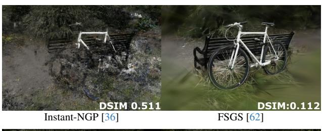
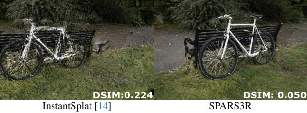
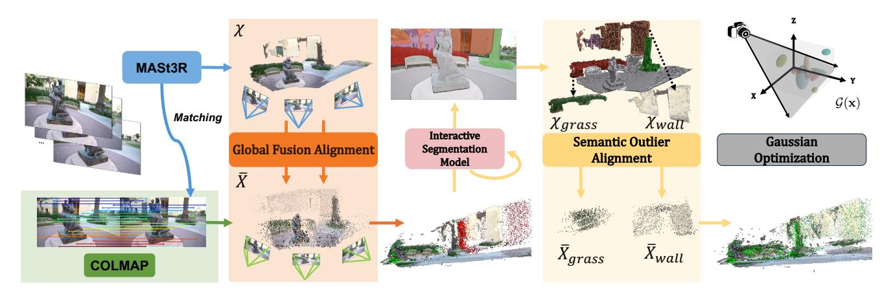
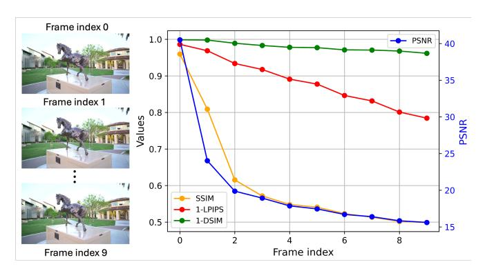
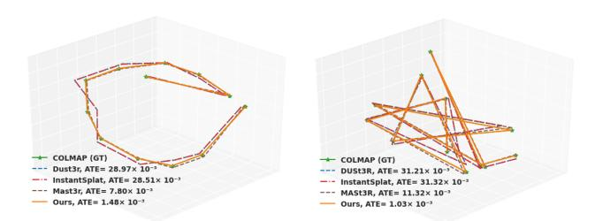
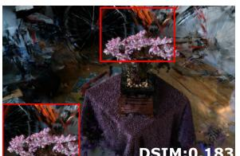
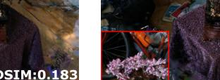
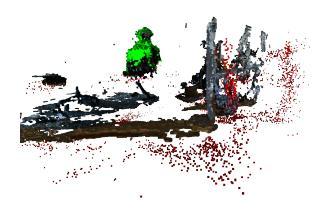
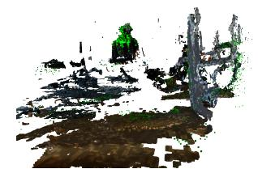
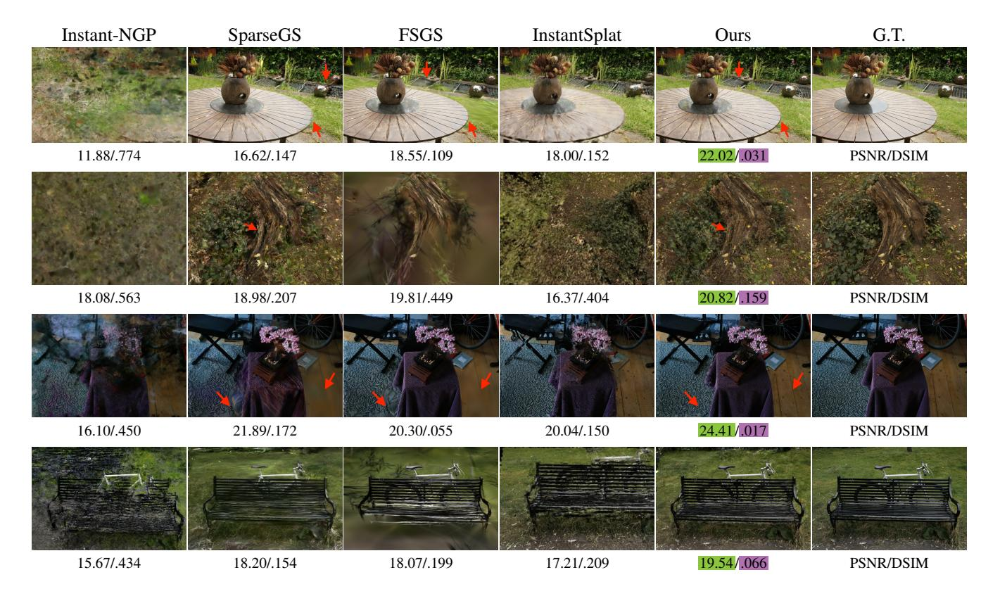

# <span id="page-0-2"></span>SPARS3R: Semantic Prior Alignment and Regularization for Sparse 3D Reconstruction

Yutao Tang˚ Yuxiang Guo˚ Deming Li Cheng Peng Johns Hopkins University

{ytang67, yguo87, dli90, cpeng26}@jhu.edu

# Abstract

*Recent efforts in Gaussian-Splat-based Novel View Synthesis can achieve photorealistic rendering; however, such capability is limited in sparse-view scenarios due to sparse initialization and over-fitting floaters. Recent progress in depth estimation and alignment can provide dense point cloud with few views; however, the resulting pose accuracy is suboptimal. In this work, we present SPARS3R, which combines the advantages of accurate pose estimation from Structure-from-Motion and dense point cloud from depth estimation. To this end, SPARS3R first performs a Global Fusion Alignment process that maps a prior dense point cloud to a sparse point cloud from Structure-from-Motion based on triangulated correspondences. RANSAC is applied during this process to distinguish inliers and outliers. SPARS3R then performs a second, Semantic Outlier Alignment step, which extracts semantically coherent regions around the outliers and performs local alignment in these regions. Along with several improvements in the evaluation process, we demonstrate that SPARS3R can achieve photorealistic rendering with sparse images and significantly outperforms existing approaches.* [1](#page-0-0)

# 1. Introduction

Photorealistic scene reconstruction and Novel View Synthesis (NVS) from unposed 2D images is a challenging task with numerous applications in site modeling, autonomous driving, robotics, urban and agricultural planning, etc. The introduction of methods such as Neural Radiance Field (NeRF) [\[35\]](#page-9-0) and 3D Gaussian Splatting (3DGS) [\[24\]](#page-9-1) have introduced significant advances in rendering quality and efficiency based on dense multi-view imagery. However, applications of these methods still face issues in practical scenarios where a dense coverage of the scene is not available. Given sparse images, over-fitting the photometric ob-

<span id="page-0-1"></span>



Figure 1. A visualization of SPAS3R in comparison to current SoTA. Without additional prior, sparse NVS leads to incorrect geometry by Instant-NGP [\[36\]](#page-9-2). FSGS [\[62\]](#page-10-0) can be blurry due to sparse initialization and insufficient densification. InstantSplat [\[14\]](#page-8-0) relies on DUSt3R [\[51\]](#page-10-1) initialization with suboptimal poses. Our method, SPARS3R, can reliably render details in the foreground and background with accurate poses.

jectives to an incorrect geometry is a common issue in NVS. Various constraints, such as semantic consistent loss [\[23\]](#page-9-3), depth and novel-view regularization [\[12,](#page-8-1) [39,](#page-9-4) [50\]](#page-10-2), frequency regularization [\[56\]](#page-10-3), and ray entropy minimization [\[25\]](#page-9-5) have been introduced to improve upon NeRF. These methods often lead to significant computation overhead due to the costly patch rendering from ray-tracing. More recently, Gaussian-Splatting-based approaches have further improved sparse NVS by leveraging the explicit representation and fast differentiable rasterization. Depth regularization [\[30\]](#page-9-6), Gaussian floater pruning [\[54\]](#page-10-4), and proximitybased Gaussian densification strategy [\[62\]](#page-10-0) have been proposed to constrain and guide the scene structures. As demonstrated in Fig. [1,](#page-0-1) despite improved geometry, these approaches tend to produce overly smooth rendering in the

<sup>\*</sup>Equal contribution.

<span id="page-0-0"></span><sup>1</sup>Code: <https://github.com/snldmt/SPARS3R>

<span id="page-1-0"></span>background. This issue can be attributed to a sparse initial point cloud, particularly in the background regions. Furthermore, the additional constraints, e.g. based on monocular depth prior, are oftentimes imperfect, leading to noisy gradients that prevent proper densification in sparse regions.

One potential solution to address this conundrum is to initialize Gaussian optimization with a denser point cloud to help disambiguate shape and radiance. To this end, recent advances in two-view depth estimation, particularly DUSt3R [\[51\]](#page-10-1) and MASt3R [\[29\]](#page-9-7), have shown the impressive ability to construct a dense point cloud from a pre-trained prior model. In theory, such a point cloud can be directly used to optimize a Gaussian-Splat radiance field [\[14\]](#page-8-0). In practice, camera calibration obtained from multi-view depth alignment is often suboptimal due to the difficulties in estimating an accurate depth map. If left uncorrected, the Gaussian optimization process will generate floaters to compensate the suboptimal calibration, prompting strategies to prevent densification as a stopgap measure [\[14\]](#page-8-0). In comparison, camera calibration based on Structure-from-Motion, e.g., COLMAP [\[45\]](#page-9-8), is fast and accurate with an appropriate feature matching model. Instead of aligning dense depth, SfM takes confident correspondences and performs triangulation with RANSAC [\[15\]](#page-8-2) to reject outliers. In a sparse-view setting, such a process can be repeated numerous times to further improve accuracy.

To address sparse point cloud initialization and pose inaccuracy in sparse-view NVS, we propose SPARS3R. SPARS3R composes of two stages: Global Fusion Alignment and Semantic Outlier Alignment. In Global Fusion Alignment, SPARS3R first obtains a dense point cloud from sparse views through DUSt3R [\[51\]](#page-10-1) or MASt3R [\[29\]](#page-9-7), and a sparse point cloud from COLMAP [\[45\]](#page-9-8). By taking the triangulated correspondences within images, SPARS3R fuses the dense point cloud onto the sparse point cloud through a global Procrustes Alignment process with RANSAC [\[15\]](#page-8-2). Since some points will yield large error due to local scale variations, a second Semantic Alignment process is introduced. Specifically, outliers from Global Fusion Alignment are identified and prompted through an Interactive Segmentation model, e.g. SAM [\[26\]](#page-9-9). The resulting semantic masks indicate regions within dense point cloud to be treated with local alignments. After transforming these regions to the SfM point cloud, we obtain a dense and pose-wise accurate point cloud as a strong prior for Gaussian optimization.

In summary, our contributions can be summarized as:

- 1. We propose a Gloabl Fusion Alignment approach, which transforms a prior dense point cloud onto a reference SfM sparse point cloud, putting dense initialization and accurate camera poses in the same coordinate frame.
- 2. To address outliers that cannot be aligned accurately due to depth discrepancies, we propose a Semantic Outlier Alignment step. This step extracts semantically similar

- regions around the outliers to perform local alignment, resulting in a dense point cloud with minimum transformation error.
- 3. We evaluate the overall method, SPARS3R, on three popular benchmark datasets and find significant quantitative and visual improvements compared to current SoTA methods.

# 2. Related Work

### 2.1. 3D Models for Synthesizing Novel Views

Photorealistic scene reconstruction and novel view synthesis is a long-standing task in computer vision and graphics. Neural Radiance Field (NeRF) [\[35\]](#page-9-0) proposes to model a scene implicitly with multi-layer perceptron (MLP) by mapping 3D coordinates and view direction to color and density, then rendering pixel value via alpha blending. Since NeRF's introduction, numerous work has sought to improve its efficiency [\[5,](#page-8-3) [16,](#page-8-4) [20,](#page-8-5) [36,](#page-9-2) [44,](#page-9-10) [47\]](#page-10-5), quality [\[1–](#page-8-6) [3,](#page-8-7) [7,](#page-8-8) [49\]](#page-10-6), and extension to dynamic and in-the-wild [\[4,](#page-8-9) [6,](#page-8-10) [8,](#page-8-11) [17,](#page-8-12) [34,](#page-9-11) [42,](#page-9-12) [43,](#page-9-13) [46,](#page-9-14) [53,](#page-10-7) [57\]](#page-10-8) scenarios. Recently, 3D Gaussian Splatting (3DGS) [\[24\]](#page-9-1) has emerged as an efficient alternative, offering improved rendering quality over NeRF. Unlike NeRF, 3DGS represents scenes with explicit 3D Gaussians kernels and uses a differentiable rasterization technique. Following its introduction, many methods have emerged to reduce the computational cost [\[13,](#page-8-13) [21,](#page-8-14) [28,](#page-9-15) [37,](#page-9-16) [38\]](#page-9-17) and enhance quality [\[9,](#page-8-15) [33,](#page-9-18) [40,](#page-9-19) [55,](#page-10-9) [60,](#page-10-10) [61\]](#page-10-11) of 3DGS.

### 2.2. Gaussian-Splatting-based Sparse-View NVS

While 3DGS performs well with dense view support, its effectiveness decreases in practical settings with sparse inputs. Many approaches address this through depth constraints. FSGS [\[62\]](#page-10-0) uses a Proximity-guided Gaussian Unpooling to mitigate the sparse initialization issue and introduces pseudo-views during training to avoid overfitting. DRGS [\[11\]](#page-8-16) and SparseGS [\[54\]](#page-10-4) add a depth regularization term to enforce consistency between estimated and monocular depths while promoting smoothness. DNGS [\[31\]](#page-9-20) refines depth regularization by prioritizing local depth variations. CoherentGS [\[41\]](#page-9-21) initializes Gaussians from monocular depth estimation and improves coherence through an optical flow constraint. InstantSplat [\[14\]](#page-8-0) is a concurrent work that directly uses DUSt3R to produce dense point clouds and introduces a camera pose optimization strategy; densification of Gaussians is disabled to prevent the introduction of floaters due to suboptimal poses.

### 3. Methods

### 3.1. Preliminary

DUSt3R [\[51\]](#page-10-1) is a two-view depth estimation method that produces dense 3D point clouds from image pairs. Specifically, given an image pair I 1 and I 2 , DUSt3R generates

<span id="page-2-3"></span><span id="page-2-0"></span>

Figure 2. SPARS3R combines a prior dense point cloud  $\chi$  and a sparse SfM point cloud  $\bar{\mathbf{X}}$ . The prior  $\chi$  often has inferior depth accuracy compared to  $\bar{\mathbf{X}}$ . SPARS3R first globally aligns all points in  $\chi$  onto  $\bar{\mathbf{X}}$ , based on shared correspondences. Inliers and outliers are identified through alignment error. SPARS3R then extracts the semantically relevant 2D regions around the outliers to move local regions of  $\chi$  in groups, producing a dense point cloud  $\chi^*$  that is depth-wise and pose-wise accurate. By providing  $\chi^*$  for Gaussian optimization, SPARS3R achieves photorealistic rendering under sparse-view condition.

dense pointmaps  $\mathbf{X}^{1,1}$  and  $\mathbf{X}^{2,1} \in \mathbb{R}^{H \times W \times 3}$ . A pointmap,  $e.g.~\mathbf{X}^{1,1}$ , provides a mapping from each pixel (u,v) in image  $I^1$  to a corresponding 3D point  $\mathbf{X}^{1,1}(u,v)$  under the coordinate system of image  $I^1$ , giving dense 2D-to-3D correspondences. Given K>2 input images, DUSt3R [51] aggregates across all pairwise pointmap predictions by globally aligning pairwise pointmaps into a unified point cloud  $\chi$ . This alignment process also produces camera parameters  $\{W(n),J(n)\}$ , which are the world-to-camera transformation matrix and the Jacobian of the affine approximation of the projective transformation for view  $I^n$ . As such, the relationship between a pixel (u,v) on  $I^n$  and its 3D point  $\chi_i$  can be expressed as follows:

$$x_i = [u, v]^T = J(n)W(n)\chi_i$$
 (1)

<span id="page-2-1"></span>Building on this, MASt3R [29] incorporates an additional matching head that generates discriminative local feature descriptors and pixel-level correspondences across paired images. We note that while MASt3R [29] uses this feature correspondence during its multi-depth alignment, the estimated poses are oftentimes inaccurate due to smooth depth predictions.

#### 3.2. SPARS3R

As show in Fig. 2, SPARS3R builds upon the advancement in DUSt3R [51] and MASt3R [29] as a pre-trained 3D prior for sparse-view reconstruction. Firstly, SPARS3R performs SfM based on image correspondences, either from MASt3R [29] or other feature matching methods. SPARS3R then aligns the dense point cloud produced by MASt3R via rigid transformations in two stages: Global Fusion Alignment and Semantic Outlier Alignment.

### 3.2.1. Global Fusion Alignment

While DUSt3R [51] and MASt3R [29] can generate dense 3D points from sparse images, it does not estimate accurate or detailed depth through its pointmap formulation. As a result, the camera calibration obtained from such smooth depths is suboptimal and will degrade the fidelity of scene reconstructions. To construct a better point cloud prior, we propose to align MASt3R's point cloud with that from a SfM pipeline, which is more reliable based on selective correspondences. This alignment process begins by identifying matching points between the SfM and MASt3R point clouds, denoted as  $\bar{\mathbf{X}} \in \mathbb{R}^{\bar{N} \times 3}$  and  $\chi \in \mathbb{R}^{N \times 3}$ , respectively. A visibility indicator  $V \in \mathbb{R}^{N \times 3} \to \mathbb{R}^{\widetilde{N} \times 3}$  denotes if an SfM point  $\bar{\mathbf{X}}_i$  is visible with respect to a view  $I^n$ . To simplify the process, we first find the image that has the highest number of visible SfM points:

$$n^* = \underset{n}{\arg\max} |V(\bar{\mathbf{X}}, n)|, \ \widetilde{N} = |V(\bar{\mathbf{X}}, n^*)|$$
 (2)

Similar to Eq. (1), we can obtain the pixel-to-3D relationship of  $(\bar{u}, \bar{v})$  and  $V(\bar{\mathbf{X}}, n^*)_i$  through estimated  $\overline{W}$  and  $\bar{J}$  from SfM. The correspondence between a point  $V(\bar{\mathbf{X}}, n^*)_i$  and a point in  $\chi$  can be established through a forward-backward projection:

<span id="page-2-2"></span>
$$\{\bar{x}_i\}_{i=1}^{\widetilde{N}}, \ \bar{x}_i = [\bar{u}, \bar{v}]^T = \bar{J}(n^*)\bar{W}(n^*)V(\bar{\mathbf{X}}, n^*)_i,$$
  
 $\bar{\chi}_i = W^{-1}(n^*)J^{-1}(n^*)\bar{x}_i$  (3)

We denote the set of projected 2D SfM points as  $\{\bar{x}_i\}_{i=1}^{\widetilde{N}}$ , and the set of 3D points that correspond to the same pixel in  $\chi$  as  $\bar{\chi}$ . With these identified correspondences, we can apply

<span id="page-3-2"></span>Procrustes Analysis [22] to estimate a global rigid transformation, optimizing for scale, rotation, and translation. During this process, RANSAC is applied to filter outliers, excluding their influence on the estimation. Specifically, we minimize the following objective to get the optimal global transformation based on Algorithm 1:

<span id="page-3-1"></span>
$$s_0, R_0, t_0 = \underset{s, R, t}{\arg\min} \sum_{i=1}^{\widetilde{N}} \| sR\bar{\chi}_i + t - V(\bar{\mathbf{X}}, n^*)_i \|^2.$$
 (4)

#### Algorithm 1 RANSAC Alignment

```
1: Input: Matched MASt3R points \bar{\chi} and SfM points V(\bar{\mathbf{X}}, n^*), sample size n, error threshold \epsilon, number of iterations R
```

```
2: Output: Best parameters (s_0, R_0, t_0), inlier set \mathcal{I}, outlier set \mathcal{O}, outlier SfM set \mathcal{P}_O
```

```
3: Initialize: num_inliers \leftarrow 0, (\hat{s_0}, \hat{R_0}, \hat{t_0}) \leftarrow \varnothing, \hat{\mathcal{I}} \leftarrow \varnothing, \hat{\mathcal{O}} \leftarrow \varnothing, \hat{\mathcal{P}}_O \leftarrow \varnothing, Iterations \leftarrow 0
```

```
4: while Iterations < R do
```

```
5: Randomly select n points as a sample set S \subset \overline{\chi}
6: Estimate (\hat{s_0}, \hat{R_0}, \hat{t_0}) on sample set S by minimizing
```

```
6: Estimate (\hat{s_0}, \hat{R_0}, \hat{t_0}) on sample set \mathcal{S} by minimizing \sum_{i \in \mathcal{S}} e(\bar{\chi}_i, \hat{s_0}, \hat{R_0}, \hat{t_0}, V(\bar{\mathbf{X}}, n^*)_i) (Eq. (4))
```

```
for each point \bar{\chi}_i do
```

```
8: if e(\bar{\chi}_i, \hat{s_0}, \hat{R_0}, \hat{t_0}, V(\bar{\mathbf{X}}, n^*)_i) < \epsilon then
```

9: Add 
$$\bar{\chi}_i$$
 to inlier set  $\hat{\mathcal{I}}$ 

10: **els** 

7:

11: Add  $\bar{\chi}_i$  to outlier set  $\hat{\mathcal{O}}$  and add  $V(\bar{\mathbf{X}}, n^*)_i$  to outlier SfM set  $\hat{\mathcal{P}}_{\mathcal{O}}$ 

12: end if

13: end for

14: **if**  $|\mathcal{I}| > \text{num\_inliers then}$ 

Update: num\_inliers 
$$\leftarrow |\hat{\mathcal{I}}|, (s_0, R_0, t_0) \leftarrow (\hat{s_0}, \hat{R_0}, \hat{t_0}), \mathcal{I} \leftarrow \hat{\mathcal{I}}, \mathcal{O} \leftarrow \hat{\mathcal{O}}, \mathcal{P}_O \leftarrow \hat{\mathcal{P}}_O$$

16: **end i**!

15:

17: Iterations  $\leftarrow$  Iterations +1

18: end while

<span id="page-3-0"></span>19: **return**  $(s_0, R_0, t_0), \mathcal{I}, \mathcal{O}, \mathcal{P}_O$ 

After this, we extract an inlier set  $\mathcal{I}$ , an outlier set  $\mathcal{O}$  and a corresponding outlier SfM set  $\mathcal{P}_O$  from RANSAC with an empirical threshold. As shown in Fig. 2, the global transformation recovered from Eq. 4 often leaves large amount of outliers btween  $\bar{\mathbf{X}}$  and  $\chi$ , particularly for objects that are far apart from the foreground. We observe that depth generated from DUSt3R [51] or MASt3R [29] has a strong bias towards smoothness between objects, despite local coherence. Therefore, we only apply the global  $s_0$ ,  $R_0$ ,  $t_0$  on inliers  $\mathcal{I}$ , and handle  $\mathcal{O}$  through a secondary Semantic Outlier Alignment step.

#### 3.2.2. Semantic Outlier Alignment

The key challenge in aligning outliers from  $\chi$  to  $\bar{\mathbf{X}}$  is that,  $\mathcal{P}_O$  only provides sparse correspondences to  $\chi$ , which has a 3D point for every pixel. As such, some heuristics need to be developed to group regions of  $\chi$  to move based on  $\mathcal{P}_O$ . Based on the observation that geometric inconsistencies between  $\chi$  and  $\bar{\mathbf{X}}$  tend to occur between objects and not within objects, we introduce an Interactive Segmentation Model (ISM) to group  $\mathcal{P}_O$  into a series of masks in an iterative manner.

First, we randomly select a point from the outlier SfM set,  $X_k \in \mathcal{P}_O$ . Similar to Eq. (3), we can get the projected 2D point  $x_k$  to prompt ISM, producing a binary mask  $m_k \in \mathbb{R}^{H \times W}$ . We further define a threshold T, which describes the desired correspondences to estimate a local alignment. If the number of outliers within  $m_k$  is greater than T, i.e.  $|m_k \cap \mathcal{P}_O| > T$ , then we keep  $m_k$  as it is and exclude within-mask outliers from being selected in the next iteration. Otherwise, we use all the outliers within the produced mask to prompt ISM again to update  $m_k$  until the above criterion is met or no further correspondences can be included, in which case we discard the local mask and the x within. We repeat the above process until no point is left, eventually obtaining a set of semantically coherent masks around the outliers,  $\{m_k\}_{k=1}^M$ . This iterative process can be denoted as

$$\begin{aligned} & \text{Init}: m_k = \text{ISM}\left(\left\{x_k \in \mathcal{P}_O \backslash \bigcup_{j=1}^{k-1} m_j\right\}\right) \\ & \text{Then,} \ m_k = \begin{cases} m_k, & \text{if } |m_k \bigcap \mathcal{P}_O| > T \\ & \text{ISM}(m_k \bigcap \mathcal{P}_O), & \text{otherwise} \end{cases} \end{aligned}$$

Based on the outlier masks  $\{m_k\}_{k=1}^M$ , we extract the within-mask outlier set  $\mathcal{O}_k = m_k \cap \mathcal{O}$  where their corresponding SfM points  $\bar{\mathbf{X}}_i \in m_k \cap \mathcal{P}_O$ . We then estimate a local rigid transformation within each mask as follows:

$$s_k, R_k, t_k = \underset{s, R, t}{\operatorname{arg\,min}} \sum_{i \in \mathcal{O}_k} \left\| sR\chi_i + t - \bar{\mathbf{X}}_i \right\|^2. \tag{6}$$

Finally, we apply all  $\{s_k,R_k,t_k\}$  to transform  $\chi$  to the coordinate space of  $\bar{\mathbf{X}}$ . To disambiguate inlier and outlier regions, we construct a  $m_0 = -\left(\bigcup_{k=1}^M m_k\right)$ , to indicate inlier regions, where - is the logical NOT operator. The global transformation to all  $\chi$  within  $m_0$  and the individual local transformation to  $\chi$  within each  $m_k, k \neq 0$  are applied accordingly, resulting in the final SfM-aligned point cloud,  $\chi^*$ .

$$\chi^* = \bigcup_{k=0}^{M} \{ s_k R_k \chi_i + t_k | \chi_i \in m_k \}$$
 (7)

To obtain the final dense and pose-wise accurate point cloud  $\mathcal{X}$  as prior, we concatenate the final SfM-aligned point

<span id="page-4-2"></span>cloud with that of SfM, i.e.

$$\mathcal{X} = \chi^* \left( \ \ \right) \bar{\mathbf{X}} \tag{8}$$

#### 3.2.3. Gaussian Optimization

The SPARS3R constructed  $\mathcal{X}$  can be directly used as the initialization for any Gaussian Splatting-based optimization method. Here we use Splatfacto, developed under the NeRFStudio framework [48]; the Gaussian optimization loss is:

$$\mathcal{L} = \lambda_1 \|\tilde{C} - C\|_1 + \lambda_2 \text{D-SSIM}(\tilde{C}, C), \tag{9}$$

where  $\tilde{C}$  and C denote our rendered and the groundtruth RGB image, D-SSIM denotes the structural similarity loss.

### 4. Experiments

Experiments are performed on three popular benchmark datasets. Tanks and Temples [27] contains 8 scenes captured in video format. Following InstantSplat [14], We uniformly sample 24 images with alternating indices for train and test split. MVimgNet [59] is an object-centric dataset that consists of 7 scenes. These scenes are captured from a consistent height covering 180° field of view. We apply the same sampling and train-test split procedure as for Tanks and Template. Mip-NeRF 360 [2] comprises of 9 scenes with 360° views and greater pose variation between the scenes, including diverse heights and distances. The increased variability, combined with sparsity, adds complexity to accurate pose estimation and scene reconstruction. For this dataset, we follow the test set outlined in MipNeRF360 [2] and uniformly sample 12 images from the original training set to construct a sparse-view set.

All sparse-view input images go through a COLMAP [45] for camera calibration. Specifically, we use feature matching results from MASt3R [29] for SfM triangulation. Since sparse-view registration can be unstable due to limited pairs, we perform multiple SfMs and pick the outcome that maximizes successful triangulation per image.

#### 4.1. Sparse NVS Evaluation

Accurately and holistically evaluating sparse NVS should involve many practical considerations. Various NeRF-based approaches [12, 23, 25, 39, 50, 56, 58] have assumed perfect camera poses, i.e. calibration results from dense views, for sparse-view scenarios, which is unrealistic. Gaussian-Splatting-based methods rely heavily on SfM point cloud, further necessitating the separation of train and test views from the registration stage. Previous approaches [62] have tried to perform re-triangulation based on known train poses, but do not account for pose inaccuracy in sparse-view registration. InstantSplat [14] applies Procrustes Alignment [22] between the camera poses from

train-images-only calibration and the ground-truth poses to initialize test camera poses. While such alignment process removes the involvement of practically inaccessible information, camera alignment error leads to significant disruption in common pixel-based rendering metrics, e.g. PSNR and SSIM [52].

<span id="page-4-1"></span>

Figure 3. Evaluation of different metrics to camera pose shift. We extract a sequence of images with a small pose change at each step and set the first frame as the reference. PSNR, SSIM, LPIPS, and DSIM are computed. DSIM shows robustness to small pose shifts by the flattest line.

<span id="page-4-0"></span>

| Mip-NeRF 360                                    | $E_R(\mu) \downarrow$          | $E_T(\mu) \downarrow$             |
|-------------------------------------------------|--------------------------------|-----------------------------------|
| Procrustes Alignment + RANSAC + Rotation Points | 0.196<br>0.179<br><b>0.156</b> | 0.0144<br><b>0.0114</b><br>0.0117 |

Table 1. Improvements over Procrustes Alignment baseline in average rotation error  $E_R$  and translation error  $E_T$ . Incorporating rotation points further minimizes the overall error.

We improve upon the previous camera alignment process in two ways. Firstly, instead of relying on camera position only, we sample three additional points  $P_{\text{rotation}} \in \mathbb{R}^{3 \times 3}$  per camera along the unit direction vectors in rotation matrix  $R_{\text{camera}} \in \mathbb{R}^{3 \times 3}$  at camera position  $T_{\text{camera}} \in \mathbb{R}^{1 \times 3}$ .

$$P_{\text{rotation}} = \left(s_{\text{cloud}} R_{\text{camera}} + T_{\text{camera}}\right)^T, \tag{10}$$

where the scale of the camera cloud, denoted by  $s_{\rm cloud} = \sqrt{\sigma_x^2 + \sigma_y^2 + \sigma_z^2}$ , where  $\sigma_x$ ,  $\sigma_y$ , and  $\sigma_z$  are the standard deviations of all camera positions along x, y, and z axes, respectively. These four points per camera allow camera alignment to align camera rotations and translations. Secondly, we add RANSAC [15] in the alignment process, minimizing the influence of outliers. We measure the alignment rotation error  $E_R$  by the angular difference between two rotations represented by quaternions.

$$E_R = 2 \cdot \arccos\left(\frac{\operatorname{abs}(q_1 \cdot q_2)}{\|q_1\| \cdot \|q_2\|}\right),\tag{11}$$

<span id="page-5-3"></span><span id="page-5-0"></span>

| Setting                                             |  | PSNR SSIM LPIPS DSIM   |  |
|-----------------------------------------------------|--|------------------------|--|
| Initialization: SfM [45]                            |  |                        |  |
| 3DGS [24]                                           |  | 16.6 0.388 0.458 0.232 |  |
| Initialization: MASt3R [29]                         |  |                        |  |
| 3DGS [24]                                           |  | 15.9 0.293 0.463 0.229 |  |
| + Global Fusion Alignment                           |  | 18.6 0.486 0.330 0.130 |  |
| + Semantic Outlier Alignment 18.9 0.500 0.327 0.127 |  |                        |  |

Table 2. Ablation on key components of SPARS3R. The results are shown using PSNR, SSIM, LPIPS and DSIM based on the MipNeRF360 [\[2\]](#page-8-17).

and the translation error E<sup>T</sup> is computed by the Euclidean norm }¨} between translation vectors. As shown in Tab. [1,](#page-4-0) these two methods improve camera alignment accuracy in both rotation and translation. Beyond accurate camera pose alignment, test pose optimization can also be applied between rendered and ground-truth images to minimize the pose error; however, such process is time-consuming and can get stuck if the initial displacement is too large, as is sometimes the case in InstantSplat [\[14\]](#page-8-0).

We also propose to use DreamSim [\[18\]](#page-8-18) (DSIM) as an additional metric to assess render quality. DSIM seeks to represent human perceptual similarity by finetuning a combination of embeddings from visual foundation models based on human evaluations. As demonstrated in Fig. [3,](#page-4-1) given several ground-truth images with small pose differences, PSNR and SSIM metric drop *significantly* with slight pose perturbation and cannot express the quality of the render. Despite also measuring perceptual similarity, LPIPS is not as pose-shift invariant as DSIM, likely due to the patchbased convolutional design. In comparison, DSIM is the most pose-shift invariant metric out of the four. More details on the evaluation and metrics improvements can be found in the Supplemental Material.

Implementation Details. We employ Segment-Anything Model [\[26\]](#page-9-9) as the segmentation model in Semantic Outlier Alignment. The weights for the loss terms are λ<sup>1</sup> " 0.8, λ<sup>2</sup> " 0.2. For fair implementation and comparison, we employ test pose optimization for *all* baselines and SPARS3R for 500 steps to maximally remove the effect of shifted camera pose. All baselines are run until convergence.

# 4.2. Ablation Studies

We compare the different components in SPARS3R to demonstrate their effectiveness on the Mip-NeRF 360 [\[2\]](#page-8-17) dataset:

- SfM-initialized 3DGS: Optimizing 3DGS on a sparse SfM point cloud and SfM-estimated camera poses.
- MASt3R-initialized 3DGS: Optimizing 3DGS on a MASt3R-produced dense point cloud and camera poses.
- Global Fusion Alignment: Aligning the MASt3Rproduced dense point cloud onto SfM point cloud with a global transform. Poses are taken from SfM.

<span id="page-5-1"></span>

Figure 4. The trajectory of the camera poses estimated from different approaches for Bonsai and Stump in MipNeRF360 [\[2\]](#page-8-17).

<span id="page-5-2"></span>

|                       |       |       |       |       | MipsNeRF360 Tanks & Temples MVimgNet |  |  |
|-----------------------|-------|-------|-------|-------|--------------------------------------|--|--|
| Methods               | RPEt  | RPEr  | RPEt  | RPEr  | RPEt RPEr                            |  |  |
| DUSt3R [51]           | 2.075 | 2.584 | 0.570 | 0.143 | 0.438 0.421                          |  |  |
| MASt3R [29]           | 1.186 | 1.49  | 0.241 | 0.248 | 0.208 0.304                          |  |  |
| InstantSplat [14]     | 2.049 | 2.555 | 0.151 | 0.081 | 0.264 0.311                          |  |  |
| COLMAP + MASt3R 0.252 |       | 0.412 | 0.161 | 0.093 | 0.075 0.078                          |  |  |

Table 3. Quantitative evaluation of pose accuracy across three datasets, Relative Translation Error (RPEt) and Relative Rotation Error (RPEr) are calculated based on the normalized poses.

• Semantic Outlier Alignment (SPARS3R): The full SPARS3R pipeline that aligns outliers through their 2D semantic masks.

As shown in Tab. [2,](#page-5-0) given only 12 images, sparse NVS is challenging both in registration and reconstruction. Specifically, we observe that the 3DGS based on SfM initialization performs better than MASt3R initialization. Clearly, render quality is affected if poses are inaccurate, despite locally coherent dense point cloud. The introduction of Global Fusion Alignment improves upon the naive baselines from either initializations by combining accurate pose from SfM and dense point cloud from MASt3R. For scenes that do not have significant depth discrepancies, Global Fusion Alignment works well. In scenarios such as the Bonsai scene in Fig. [5,](#page-6-0) MASt3R's relative depth between the table and the wall is inaccurate; therefore, Global Fusion Alignment alone leads to a broken geometry of the background. In comparison, our Semantic Outlier Alignment provide piece-wise alignments on the background to address this relative discrepancy. Quantitatively, we observe a 1.4 dB improvement on the Bonsai scene.

Pose Accuracy. As shown in Fig. [4](#page-5-1) and Tab. [3,](#page-5-2) we visualize the pose accuracy from different calibration approaches. Both DUSt3R [\[51\]](#page-10-1) and MASt3R [\[29\]](#page-9-7) have significantly larger pose error compared to COLMAP [\[45\]](#page-9-8) with MASt3R feature matching outputs. InstantSplat [\[14\]](#page-8-0) uses DUSt3R [\[51\]](#page-10-1)'s dense point cloud and pose estimation and attempts to improve pose through a training pose optimization approach similar to BARF [\[32\]](#page-9-24). While there is some success in bringing down pose error in the *Tanks and*

<span id="page-6-2"></span><span id="page-6-1"></span>

| Methods           | MipsNeRF360 [2] |       |       | Tanks & Temples [27] |       |       | MVimgNet [59] |       |       |       |       |       |
|-------------------|-----------------|-------|-------|----------------------|-------|-------|---------------|-------|-------|-------|-------|-------|
|                   | PSNR            | SSIM  | LPIPS | DSIM                 | PSNR  | SSIM  | LPIPS         | DSIM  | PSNR  | SSIM  | LPIPS | DSIM  |
| Instant-NGP [36]  | 14.82           | 0.294 | 0.678 | 0.524                | 15.28 | 0.451 | 0.389         | 0.254 | 13.28 | 0.426 | 0.892 | 0.892 |
| 3DGS [24]         | 16.57           | 0.388 | 0.458 | 0.232                | 21.07 | 0.730 | 0.194         | 0.070 | 21.24 | 0.673 | 0.234 | 0.064 |
| FSGS [62]         | 17.60           | 0.443 | 0.558 | 0.243                | 25.72 | 0.845 | 0.111         | 0.023 | 23.43 | 0.760 | 0.212 | 0.042 |
| SparseGS [54]     | 16.66           | 0.405 | 0.461 | 0.210                | 20.28 | 0.727 | 0.202         | 0.075 | 20.56 | 0.672 | 0.248 | 0.072 |
| DRGS [10]         | 16.88           | 0.401 | 0.649 | 0.300                | 21.46 | 0.723 | 0.289         | 0.078 | 21.70 | 0.641 | 0.422 | 0.071 |
| CF-3DGS [19]      | 13.27           | 0.250 | 0.698 | 0.509                | 18.99 | 0.606 | 0.296         | 0.127 | 15.43 | 0.408 | 0.545 | 0.325 |
| InstantSplat [14] | 16.23           | 0.359 | 0.543 | 0.233                | 26.97 | 0.874 | 0.115         | 0.013 | 23.22 | 0.734 | 0.248 | 0.028 |
| SPARS3R           | 18.85           | 0.500 | 0.327 | 0.127                | 29.90 | 0.919 | 0.047         | 0.007 | 25.85 | 0.820 | 0.114 | 0.011 |

Table 4. Quantitative comparison of different NVS methods on three popular benchmark datasets, totaling 24 scenes. All methods are run on the same registrations and updated with test pose optimization.

<span id="page-6-0"></span>



Global Fusion Alignment (GFA) Semantic Outlier Align (SOA)





Aligned point cloud from GFA Aligned point cloud from SOA

Figure 5. Visual comparison of SPARS3R with and without SOA. While the dense bonsai in the foreground is aligned with the sparse point cloud, depth differences are obvious. SOA successfully fixes such gap.

*Temples* dataset, such training pose optimization does not work as well in the more challenging datasets. This highlights the difficulty in improving camera calibration jointly with dense forward render, considering the loss landscape is highly nonlinear based on pixel-wise metrics.

### 4.3. Quantitative and Visual Evaluation

We quantitatively compare SPARS3R against various NVS methods in Tab. [4.](#page-6-1) Instant-NGP [\[36\]](#page-9-2) and 3DGS [\[24\]](#page-9-1) are two mainstream NVS methods based on implicit and explicit scene representations. Specifically, 3DGS leverages SfM points from registration as the starting point for scene optimization, while NeRF [\[35\]](#page-9-0) based methods rely only on poses. Colmap-Free 3DGS [\[19\]](#page-8-20) also does not rely on prior registration and optimizes cameras along with reconstruction. We find that both Instant-NGP and CF-3DGS perform significantly worse than other methods that use a prior SfM point cloud.

Among methods that are designed for sparse NVS,

DRGS [\[11\]](#page-8-16),SparseGS [\[54\]](#page-10-4), and FSGS [\[62\]](#page-10-0) leverage monocular depth prior to gain more geometric information of the scene. DRGS applies an additional smoothness constraint, which leads to high PSNR values but worse LPIPS and DSIM performances. SparseGS additionally applies a Score Distillation Sampling Loss, which generates novel views and constrained them through a prior generative model. Its results are sharper than DRGS, but more noisy, leading to worse PSNR. FSGS seeks to address the sparse point cloud issue in sparse-view NVS by modifying the densification algorithm in 3DGS. More Gaussians are encouraged between the space of two existing Gaussians, allowing representative areas to densify quicker. FSGS has overall better metrics than SparseGS and DRGS; however, it still encounters issues in regions where few initializations are available, e.g. the background of the scene. As shown in Fig. [6](#page-7-0) and in Fig. [1,](#page-0-1) this leads to various blurry regions. InstantSplat [\[14\]](#page-8-0) is a concurrent work that uses prior depth estimation from DUSt3R [\[51\]](#page-10-1) and the dense point cloud to help with sparseview NVS. While the initialized point cloud is much denser than FSGS, InstantSplat also inherits the suboptimal poses produced by DUSt3R. The incorrect geometry limits the effectiveness of densification in 3DGS and can lead to generation of floaters; to ameliorate this problem, InstantSplat disables Gaussian densification and optimizes the scene with few steps. As shown in Tab. [3](#page-5-2) and Tab. [4,](#page-6-1) on the MipNeRF360 and MVimgNet dataset, where pose accuracy from DUSt3R is limited, InstantSplat performs on-par with FSGS despite using a denser prior point cloud. As shown in Fig. [6,](#page-7-0) we observe that the Gaussians tend to be noisy on the surface. In the Stump and Bicycle scenes, InstantSplat's results cannot be rigidly aligned well with the groundtruth test poses due to the large offset to begin with.

Our SPARS3R method improves upon DUSt3R and MASt3R's prior point cloud by adjusting it based on conventional SfM calibration approaches. Since SfM only triangulates based on confident keypoints, its pose and depth estimation performance, particularly under sparse-view scenario, is more reliable. As shown in Tab. [4,](#page-6-1) SPARS3R con-

<span id="page-7-1"></span><span id="page-7-0"></span>

Figure 6. Visual comparisons of different NVS methods on MipNeRF360 [\[2\]](#page-8-17) dataset. Zooming in on the visualizations is recommended to show differences in detail. More visualizations for other datasets are available in the Supplemental Material.

sistently improves upon previous best approach by an average of 2.7 dB. SPARS3R is stable in its optimization process and does not generate additional floaters with more iterations. As seen in Fig. [5,](#page-6-0) SPARS3R produces rendering with smooth surfaces in the foreground, and sharp details in the background. For more visualization and flythrough of the scene, please refer to the Supplemental Material section.

### 4.4. Limitations

While SPARS3R significantly improves upon previous SoTA, there are also several limitations worth noting. Firstly, SPARS3R relies on a well-performing semantic segmentation model to group outliers; as such, if the segmentation model is very sensitive, i.e. separating a connected surface into multiple disjointed parts, some of these parts may lack sufficient SfM support for alignment. If the segmentation model produces masks that group multiple areas with disparate depth together, the local alignments are also less effective similar to the global alignment. Secondly, nonrigid transform between two point clouds are worth further investigation. While SPARS3R's piece-wise rigid transform based on semantic relationship is fast and addresses the inaccurate inter-object depth estimation, a non-rigid formulation may be more generalizable.

# 5. Conclusion

We present SPARS3R, a scene reconstruction and NVS method that can achieve high-quality rendering with sparse input images. We demonstrate that existing methods lead to blurry rendering due to sparse point cloud initialization. Recent progress in generating a dense point cloud from prior depth estimation model, while promising, can lead to noisy pose estimation. To address these issues, SPARS3R combines the advantages of both by proposing a two-step alignment approach. The first step computes a global transformation matrix between the dense point cloud from depth prior and a reference SfM point cloud. The second step takes the semantic regions of the outlier points from the first step and performs successive local alignments. This approach successfully addresses the depth estimation errors within the prior dense point cloud and demonstrates that the updated point cloud leads to significantly better performances in sparse-view NVS. We also introduce several improvements in the evaluation process to better represent the practical limitations in sparse-view registration and reconstruction. In the future, we hope to further improve the smoothness of our alignment process, e.g. by exploring potential non-rigid transformation approaches.

# 6. Acknowledgement

This research is based upon work supported by the Office of the Director of National Intelligence (ODNI), Intelligence Advanced Research Projects Activity (IARPA), via IARPA R&D Contract No. 140D0423C0076. The views and conclusions contained herein are those of the authors and should not be interpreted as necessarily representing the official policies or endorsements, either expressed or implied, of the ODNI, IARPA, or the U.S. Government. The U.S. Government is authorized to reproduce and distribute reprints for Governmental purposes notwithstanding any copyright annotation thereon.

# References

- <span id="page-8-6"></span>[1] Jonathan T Barron, Ben Mildenhall, Matthew Tancik, Peter Hedman, Ricardo Martin-Brualla, and Pratul P Srinivasan. Mip-nerf: A multiscale representation for anti-aliasing neural radiance fields. In *Proceedings of the IEEE/CVF international conference on computer vision*, pages 5855–5864, 2021. [2](#page-1-0)
- <span id="page-8-17"></span>[2] Jonathan T Barron, Ben Mildenhall, Dor Verbin, Pratul P Srinivasan, and Peter Hedman. Mip-nerf 360: Unbounded anti-aliased neural radiance fields. In *Proceedings of the IEEE/CVF conference on computer vision and pattern recognition*, pages 5470–5479, 2022. [5,](#page-4-2) [6,](#page-5-3) [7,](#page-6-2) [8](#page-7-1)
- <span id="page-8-7"></span>[3] Jonathan T Barron, Ben Mildenhall, Dor Verbin, Pratul P Srinivasan, and Peter Hedman. Zip-nerf: Anti-aliased grid-based neural radiance fields. In *Proceedings of the IEEE/CVF International Conference on Computer Vision*, pages 19697–19705, 2023. [2](#page-1-0)
- <span id="page-8-9"></span>[4] Ang Cao and Justin Johnson. Hexplane: A fast representation for dynamic scenes. In *Proceedings of the IEEE/CVF Conference on Computer Vision and Pattern Recognition*, pages 130–141, 2023. [2](#page-1-0)
- <span id="page-8-3"></span>[5] Anpei Chen, Zexiang Xu, Andreas Geiger, Jingyi Yu, and Hao Su. Tensorf: Tensorial radiance fields. In *European conference on computer vision*, pages 333–350. Springer, 2022. [2](#page-1-0)
- <span id="page-8-10"></span>[6] Jiahao Chen, Yipeng Qin, Lingjie Liu, Jiangbo Lu, and Guanbin Li. Nerf-hugs: Improved neural radiance fields in non-static scenes using heuristics-guided segmentation. In *Proceedings of the IEEE/CVF Conference on Computer Vision and Pattern Recognition*, pages 19436–19446, 2024. [2](#page-1-0)
- <span id="page-8-8"></span>[7] Tianlong Chen, Peihao Wang, Zhiwen Fan, and Zhangyang Wang. Aug-nerf: Training stronger neural radiance fields with triple-level physically-grounded augmentations. In *Proceedings of the IEEE/CVF Conference on Computer Vision and Pattern Recognition*, pages 15191–15202, 2022. [2](#page-1-0)
- <span id="page-8-11"></span>[8] Xingyu Chen, Qi Zhang, Xiaoyu Li, Yue Chen, Ying Feng, Xuan Wang, and Jue Wang. Hallucinated neural radiance fields in the wild. In *Proceedings of the IEEE/CVF Conference on Computer Vision and Pattern Recognition*, pages 12943–12952, 2022. [2](#page-1-0)
- <span id="page-8-15"></span>[9] Kai Cheng, Xiaoxiao Long, Kaizhi Yang, Yao Yao, Wei Yin, Yuexin Ma, Wenping Wang, and Xuejin Chen. Gaussianpro:

- 3d gaussian splatting with progressive propagation. In *Fortyfirst International Conference on Machine Learning*, 2024. [2](#page-1-0)
- <span id="page-8-19"></span>[10] Jaeyoung Chung, Jeongtaek Oh, and Kyoung Mu Lee. Depth-regularized optimization for 3d gaussian splatting in few-shot images. In *Proceedings of the IEEE/CVF Conference on Computer Vision and Pattern Recognition*, pages 811–820, 2024. [7](#page-6-2)
- <span id="page-8-16"></span>[11] Jaeyoung Chung, Jeongtaek Oh, and Kyoung Mu Lee. Depth-regularized optimization for 3d gaussian splatting in few-shot images. In *Proceedings of the IEEE/CVF Conference on Computer Vision and Pattern Recognition*, pages 811–820, 2024. [2,](#page-1-0) [7](#page-6-2)
- <span id="page-8-1"></span>[12] Kangle Deng, Andrew Liu, Jun-Yan Zhu, and Deva Ramanan. Depth-supervised nerf: Fewer views and faster training for free. In *Proceedings of the IEEE/CVF Conference on Computer Vision and Pattern Recognition*, pages 12882– 12891, 2022. [1,](#page-0-2) [5](#page-4-2)
- <span id="page-8-13"></span>[13] Zhiwen Fan, Kevin Wang, Kairun Wen, Zehao Zhu, Dejia Xu, and Zhangyang Wang. Lightgaussian: Unbounded 3d gaussian compression with 15x reduction and 200+ fps. *arXiv preprint arXiv:2311.17245*, 2023. [2](#page-1-0)
- <span id="page-8-0"></span>[14] Zhiwen Fan, Wenyan Cong, Kairun Wen, Kevin Wang, Jian Zhang, Xinghao Ding, Danfei Xu, Boris Ivanovic, Marco Pavone, Georgios Pavlakos, et al. Instantsplat: Unbounded sparse-view pose-free gaussian splatting in 40 seconds. *arXiv preprint arXiv:2403.20309*, 2, 2024. [1,](#page-0-2) [2,](#page-1-0) [5,](#page-4-2) [6,](#page-5-3) [7](#page-6-2)
- <span id="page-8-2"></span>[15] Martin A Fischler and Robert C Bolles. Random sample consensus: a paradigm for model fitting with applications to image analysis and automated cartography. *Communications of the ACM*, 24(6):381–395, 1981. [2,](#page-1-0) [5](#page-4-2)
- <span id="page-8-4"></span>[16] Sara Fridovich-Keil, Alex Yu, Matthew Tancik, Qinhong Chen, Benjamin Recht, and Angjoo Kanazawa. Plenoxels: Radiance fields without neural networks. In *Proceedings of the IEEE/CVF conference on computer vision and pattern recognition*, pages 5501–5510, 2022. [2](#page-1-0)
- <span id="page-8-12"></span>[17] Sara Fridovich-Keil, Giacomo Meanti, Frederik Rahbæk Warburg, Benjamin Recht, and Angjoo Kanazawa. K-planes: Explicit radiance fields in space, time, and appearance. In *Proceedings of the IEEE/CVF Conference on Computer Vision and Pattern Recognition*, pages 12479–12488, 2023. [2](#page-1-0)
- <span id="page-8-18"></span>[18] Stephanie Fu, Netanel Tamir, Shobhita Sundaram, Lucy Chai, Richard Zhang, Tali Dekel, and Phillip Isola. Dreamsim: Learning new dimensions of human visual similarity using synthetic data, 2023. [6](#page-5-3)
- <span id="page-8-20"></span>[19] Yang Fu, Sifei Liu, Amey Kulkarni, Jan Kautz, Alexei A. Efros, and Xiaolong Wang. Colmap-free 3d gaussian splatting. In *Proceedings of the IEEE/CVF Conference on Computer Vision and Pattern Recognition (CVPR)*, pages 20796– 20805, 2024. [7](#page-6-2)
- <span id="page-8-5"></span>[20] Stephan J Garbin, Marek Kowalski, Matthew Johnson, Jamie Shotton, and Julien Valentin. Fastnerf: High-fidelity neural rendering at 200fps. In *Proceedings of the IEEE/CVF international conference on computer vision*, pages 14346– 14355, 2021. [2](#page-1-0)
- <span id="page-8-14"></span>[21] Sharath Girish, Kamal Gupta, and Abhinav Shrivastava. Eagles: Efficient accelerated 3d gaussians with lightweight encodings. *arXiv preprint arXiv:2312.04564*, 2023. [2](#page-1-0)

- <span id="page-9-22"></span>[22] John C Gower. Generalized procrustes analysis. *Psychometrika*, 40:33–51, 1975. [4,](#page-3-2) [5](#page-4-2)
- <span id="page-9-3"></span>[23] Ajay Jain, Matthew Tancik, and Pieter Abbeel. Putting nerf on a diet: Semantically consistent few-shot view synthesis. In *Proceedings of the IEEE/CVF International Conference on Computer Vision*, pages 5885–5894, 2021. [1,](#page-0-2) [5](#page-4-2)
- <span id="page-9-1"></span>[24] Bernhard Kerbl, Georgios Kopanas, Thomas Leimkuhler, ¨ and George Drettakis. 3d gaussian splatting for real-time radiance field rendering. *ACM Trans. Graph.*, 42(4):139–1, 2023. [1,](#page-0-2) [2,](#page-1-0) [6,](#page-5-3) [7](#page-6-2)
- <span id="page-9-5"></span>[25] Mijeong Kim, Seonguk Seo, and Bohyung Han. Infonerf: Ray entropy minimization for few-shot neural volume rendering. In *Proceedings of the IEEE/CVF Conference on Computer Vision and Pattern Recognition*, pages 12912– 12921, 2022. [1,](#page-0-2) [5](#page-4-2)
- <span id="page-9-9"></span>[26] Alexander Kirillov, Eric Mintun, Nikhila Ravi, Hanzi Mao, Chloe Rolland, Laura Gustafson, Tete Xiao, Spencer Whitehead, Alexander C. Berg, Wan-Yen Lo, Piotr Dollar, and ´ Ross Girshick. Segment anything. *arXiv:2304.02643*, 2023. [2,](#page-1-0) [6](#page-5-3)
- <span id="page-9-23"></span>[27] Arno Knapitsch, Jaesik Park, Qian-Yi Zhou, and Vladlen Koltun. Tanks and temples: Benchmarking large-scale scene reconstruction. *ACM Transactions on Graphics (ToG)*, 36 (4):1–13, 2017. [5,](#page-4-2) [7](#page-6-2)
- <span id="page-9-15"></span>[28] Joo Chan Lee, Daniel Rho, Xiangyu Sun, Jong Hwan Ko, and Eunbyung Park. Compact 3d gaussian representation for radiance field. In *Proceedings of the IEEE/CVF Conference on Computer Vision and Pattern Recognition*, pages 21719– 21728, 2024. [2](#page-1-0)
- <span id="page-9-7"></span>[29] Vincent Leroy, Yohann Cabon, and Jer´ ome Revaud. Ground- ˆ ing image matching in 3d with mast3r. *arXiv preprint arXiv:2406.09756*, 2024. [2,](#page-1-0) [3,](#page-2-3) [4,](#page-3-2) [5,](#page-4-2) [6](#page-5-3)
- <span id="page-9-6"></span>[30] Jiahe Li, Jiawei Zhang, Xiao Bai, Jin Zheng, Xin Ning, Jun Zhou, and Lin Gu. Dngaussian: Optimizing sparse-view 3d gaussian radiance fields with global-local depth normalization. In *Proceedings of the IEEE/CVF Conference on Computer Vision and Pattern Recognition*, pages 20775–20785, 2024. [1](#page-0-2)
- <span id="page-9-20"></span>[31] Jiahe Li, Jiawei Zhang, Xiao Bai, Jin Zheng, Xin Ning, Jun Zhou, and Lin Gu. Dngaussian: Optimizing sparse-view 3d gaussian radiance fields with global-local depth normalization. In *Proceedings of the IEEE/CVF Conference on Computer Vision and Pattern Recognition*, pages 20775–20785, 2024. [2](#page-1-0)
- <span id="page-9-24"></span>[32] Chen-Hsuan Lin, Wei-Chiu Ma, Antonio Torralba, and Simon Lucey. Barf: Bundle-adjusting neural radiance fields. In *Proceedings of the IEEE/CVF international conference on computer vision*, pages 5741–5751, 2021. [6](#page-5-3)
- <span id="page-9-18"></span>[33] Tao Lu, Mulin Yu, Linning Xu, Yuanbo Xiangli, Limin Wang, Dahua Lin, and Bo Dai. Scaffold-gs: Structured 3d gaussians for view-adaptive rendering. In *Proceedings of the IEEE/CVF Conference on Computer Vision and Pattern Recognition*, pages 20654–20664, 2024. [2](#page-1-0)
- <span id="page-9-11"></span>[34] Ricardo Martin-Brualla, Noha Radwan, Mehdi SM Sajjadi, Jonathan T Barron, Alexey Dosovitskiy, and Daniel Duckworth. Nerf in the wild: Neural radiance fields for unconstrained photo collections. In *Proceedings of the IEEE/CVF*

- *conference on computer vision and pattern recognition*, pages 7210–7219, 2021. [2](#page-1-0)
- <span id="page-9-0"></span>[35] Ben Mildenhall, Pratul P Srinivasan, Matthew Tancik, Jonathan T Barron, Ravi Ramamoorthi, and Ren Ng. Nerf: Representing scenes as neural radiance fields for view synthesis. *Communications of the ACM*, 65(1):99–106, 2021. [1,](#page-0-2) [2,](#page-1-0) [7](#page-6-2)
- <span id="page-9-2"></span>[36] Thomas Muller, Alex Evans, Christoph Schied, and Alexan- ¨ der Keller. Instant neural graphics primitives with a multiresolution hash encoding. *ACM transactions on graphics (TOG)*, 41(4):1–15, 2022. [1,](#page-0-2) [2,](#page-1-0) [7](#page-6-2)
- <span id="page-9-16"></span>[37] KL Navaneet, Kossar Pourahmadi Meibodi, Soroush Abbasi Koohpayegani, and Hamed Pirsiavash. Compgs: Smaller and faster gaussian splatting with vector quantization. In *European Conference on Computer Vision*, 2024. [2](#page-1-0)
- <span id="page-9-17"></span>[38] Simon Niedermayr, Josef Stumpfegger, and Rudiger West- ¨ ermann. Compressed 3d gaussian splatting for accelerated novel view synthesis. In *Proceedings of the IEEE/CVF Conference on Computer Vision and Pattern Recognition*, pages 10349–10358, 2024. [2](#page-1-0)
- <span id="page-9-4"></span>[39] Michael Niemeyer, Jonathan T Barron, Ben Mildenhall, Mehdi SM Sajjadi, Andreas Geiger, and Noha Radwan. Regnerf: Regularizing neural radiance fields for view synthesis from sparse inputs. In *Proceedings of the IEEE/CVF Conference on Computer Vision and Pattern Recognition*, pages 5480–5490, 2022. [1,](#page-0-2) [5](#page-4-2)
- <span id="page-9-19"></span>[40] Michael Niemeyer, Fabian Manhardt, Marie-Julie Rakotosaona, Michael Oechsle, Daniel Duckworth, Rama Gosula, Keisuke Tateno, John Bates, Dominik Kaeser, and Federico Tombari. Radsplat: Radiance field-informed gaussian splatting for robust real-time rendering with 900+ fps. *arXiv preprint arXiv:2403.13806*, 2024. [2](#page-1-0)
- <span id="page-9-21"></span>[41] Avinash Paliwal, Wei Ye, Jinhui Xiong, Dmytro Kotovenko, Rakesh Ranjan, Vikas Chandra, and Nima Khademi Kalantari. Coherentgs: Sparse novel view synthesis with coherent 3d gaussians. In *European Conference on Computer Vision*, pages 19–37. Springer, 2025. [2](#page-1-0)
- <span id="page-9-12"></span>[42] Keunhong Park, Utkarsh Sinha, Jonathan T Barron, Sofien Bouaziz, Dan B Goldman, Steven M Seitz, and Ricardo Martin-Brualla. Nerfies: Deformable neural radiance fields. In *Proceedings of the IEEE/CVF International Conference on Computer Vision*, pages 5865–5874, 2021. [2](#page-1-0)
- <span id="page-9-13"></span>[43] Albert Pumarola, Enric Corona, Gerard Pons-Moll, and Francesc Moreno-Noguer. D-nerf: Neural radiance fields for dynamic scenes. In *Proceedings of the IEEE/CVF Conference on Computer Vision and Pattern Recognition*, pages 10318–10327, 2021. [2](#page-1-0)
- <span id="page-9-10"></span>[44] Christian Reiser, Songyou Peng, Yiyi Liao, and Andreas Geiger. Kilonerf: Speeding up neural radiance fields with thousands of tiny mlps. In *Proceedings of the IEEE/CVF international conference on computer vision*, pages 14335– 14345, 2021. [2](#page-1-0)
- <span id="page-9-8"></span>[45] Johannes Lutz Schonberger and Jan-Michael Frahm. ¨ Structure-from-motion revisited. In *Conference on Computer Vision and Pattern Recognition (CVPR)*, 2016. [2,](#page-1-0) [5,](#page-4-2) [6](#page-5-3)
- <span id="page-9-14"></span>[46] Ruizhi Shao, Zerong Zheng, Hanzhang Tu, Boning Liu, Hongwen Zhang, and Yebin Liu. Tensor4d: Efficient neural

- 4d decomposition for high-fidelity dynamic reconstruction and rendering. In *Proceedings of the IEEE/CVF Conference on Computer Vision and Pattern Recognition*, pages 16632– 16642, 2023. [2](#page-1-0)
- <span id="page-10-5"></span>[47] Cheng Sun, Min Sun, and Hwann-Tzong Chen. Direct voxel grid optimization: Super-fast convergence for radiance fields reconstruction. In *Proceedings of the IEEE/CVF conference on computer vision and pattern recognition*, pages 5459– 5469, 2022. [2](#page-1-0)
- <span id="page-10-12"></span>[48] Matthew Tancik, Ethan Weber, Evonne Ng, Ruilong Li, Brent Yi, Terrance Wang, Alexander Kristoffersen, Jake Austin, Kamyar Salahi, Abhik Ahuja, et al. Nerfstudio: A modular framework for neural radiance field development. In *ACM SIGGRAPH 2023 Conference Proceedings*, pages 1–12, 2023. [5](#page-4-2)
- <span id="page-10-6"></span>[49] Dor Verbin, Peter Hedman, Ben Mildenhall, Todd Zickler, Jonathan T Barron, and Pratul P Srinivasan. Ref-nerf: Structured view-dependent appearance for neural radiance fields. In *2022 IEEE/CVF Conference on Computer Vision and Pattern Recognition (CVPR)*, pages 5481–5490. IEEE, 2022. [2](#page-1-0)
- <span id="page-10-2"></span>[50] Guangcong Wang, Zhaoxi Chen, Chen Change Loy, and Ziwei Liu. Sparsenerf: Distilling depth ranking for few-shot novel view synthesis. In *Proceedings of the IEEE/CVF International Conference on Computer Vision*, pages 9065–9076, 2023. [1,](#page-0-2) [5](#page-4-2)
- <span id="page-10-1"></span>[51] Shuzhe Wang, Vincent Leroy, Yohann Cabon, Boris Chidlovskii, and Jerome Revaud. Dust3r: Geometric 3d vision made easy. In *Proceedings of the IEEE/CVF Conference on Computer Vision and Pattern Recognition*, pages 20697– 20709, 2024. [1,](#page-0-2) [2,](#page-1-0) [3,](#page-2-3) [4,](#page-3-2) [6,](#page-5-3) [7](#page-6-2)
- <span id="page-10-15"></span>[52] Zhou Wang, Alan C Bovik, Hamid R Sheikh, and Eero P Simoncelli. Image quality assessment: from error visibility to structural similarity. *IEEE transactions on image processing*, 13(4):600–612, 2004. [5](#page-4-2)
- <span id="page-10-7"></span>[53] Tianhao Wu, Fangcheng Zhong, Andrea Tagliasacchi, Forrester Cole, and Cengiz Oztireli. Dˆ 2nerf: Self-supervised decoupling of dynamic and static objects from a monocular video. *Advances in neural information processing systems*, 35:32653–32666, 2022. [2](#page-1-0)
- <span id="page-10-4"></span>[54] Haolin Xiong, Sairisheek Muttukuru, Rishi Upadhyay, Pradyumna Chari, and Achuta Kadambi. Sparsegs: Realtime 360 tzdegu sparse view synthesis using gaussian splatting. *arXiv preprint arXiv:2312.00206*, 2023. [1,](#page-0-2) [2,](#page-1-0) [7](#page-6-2)
- <span id="page-10-9"></span>[55] Zhiwen Yan, Weng Fei Low, Yu Chen, and Gim Hee Lee. Multi-scale 3d gaussian splatting for anti-aliased rendering. In *Proceedings of the IEEE/CVF Conference on Computer Vision and Pattern Recognition*, pages 20923–20931, 2024. [2](#page-1-0)
- <span id="page-10-3"></span>[56] Jiawei Yang, Marco Pavone, and Yue Wang. Freenerf: Improving few-shot neural rendering with free frequency regularization. In *Proceedings of the IEEE/CVF conference on computer vision and pattern recognition*, pages 8254–8263, 2023. [1,](#page-0-2) [5](#page-4-2)
- <span id="page-10-8"></span>[57] Yifan Yang, Shuhai Zhang, Zixiong Huang, Yubing Zhang, and Mingkui Tan. Cross-ray neural radiance fields for novelview synthesis from unconstrained image collections. In *Proceedings of the IEEE/CVF International Conference on Computer Vision*, pages 15901–15911, 2023. [2](#page-1-0)

- <span id="page-10-14"></span>[58] Alex Yu, Vickie Ye, Matthew Tancik, and Angjoo Kanazawa. pixelnerf: Neural radiance fields from one or few images. In *Proceedings of the IEEE/CVF conference on computer vision and pattern recognition*, pages 4578–4587, 2021. [5](#page-4-2)
- <span id="page-10-13"></span>[59] Xianggang Yu, Mutian Xu, Yidan Zhang, Haolin Liu, Chongjie Ye, Yushuang Wu, Zizheng Yan, Chenming Zhu, Zhangyang Xiong, Tianyou Liang, et al. Mvimgnet: A large-scale dataset of multi-view images. In *Proceedings of the IEEE/CVF conference on computer vision and pattern recognition*, pages 9150–9161, 2023. [5,](#page-4-2) [7](#page-6-2)
- <span id="page-10-10"></span>[60] Zehao Yu, Anpei Chen, Binbin Huang, Torsten Sattler, and Andreas Geiger. Mip-splatting: Alias-free 3d gaussian splatting. In *Proceedings of the IEEE/CVF Conference on Computer Vision and Pattern Recognition*, pages 19447–19456, 2024. [2](#page-1-0)
- <span id="page-10-11"></span>[61] Zheng Zhang, Wenbo Hu, Yixing Lao, Tong He, and Hengshuang Zhao. Pixel-gs: Density control with pixelaware gradient for 3d gaussian splatting. *arXiv preprint arXiv:2403.15530*, 2024. [2](#page-1-0)
- <span id="page-10-0"></span>[62] Zehao Zhu, Zhiwen Fan, Yifan Jiang, and Zhangyang Wang. Fsgs: Real-time few-shot view synthesis using gaussian splatting. In *European Conference on Computer Vision*, pages 145–163. Springer, 2025. [1,](#page-0-2) [2,](#page-1-0) [5,](#page-4-2) [7](#page-6-2)